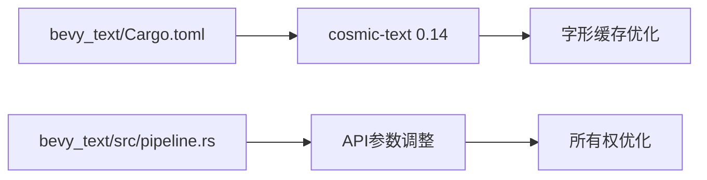

+++
title = "#18651 Update cosmic-text to 0.14"
date = "2025-04-27T00:00:00"
draft = false
template = "pull_request_page.html"
in_search_index = false

[extra]
current_language = "zh-cn"
available_languages = {"en" = { name = "English", url = "/pull_request/bevy/2025-04/pr-18651-en-20250427" }, "zh-cn" = { name = "中文", url = "/pull_request/bevy/2025-04/pr-18651-zh-cn-20250427" }}
labels = ["D-Trivial", "C-Dependencies", "A-Text"]
+++

# Update cosmic-text to 0.14

## Basic Information
- **Title**: Update cosmic-text to 0.14  
- **PR Link**: https://github.com/bevyengine/bevy/pull/18651  
- **Author**: kristoff3r  
- **Status**: MERGED  
- **Labels**: D-Trivial, C-Dependencies, S-Ready-For-Final-Review, A-Text  
- **Created**: 2025-03-31T20:50:56Z  
- **Merged**: 2025-04-26T21:55:48Z  
- **Merged By**: mockersf  

## Description Translation
### 目标  
新版本 cosmic-text 已发布，我们需要跟进更新。

### 解决方案  
升级依赖版本。

### 测试验证  
代码正常编译，文本示例运行正常。

## The Story of This Pull Request

### 依赖维护的常规升级
本次PR的核心任务是维护性升级文本处理库cosmic-text到0.14版本。作为Bevy引擎的文本处理基础组件，cosmic-text的版本更新直接影响文本渲染功能的质量和性能。

开发者遵循依赖管理的最佳实践，在cosmic-text发布新版本后及时跟进更新。虽然表面看只是版本号的改动，但实际包含两个关键技术点：

1. **API兼容性适配**：新版本cosmic-text对`set_rich_text`方法的参数类型进行调整，要求传入`Attrs`的引用而非值类型
2. **功能继承**：保留`shape-run-cache`特性以维持原有的字形缓存优化

### 具体实现分析
在`bevy_text`模块的Cargo.toml中，版本号从0.13更新到0.14：

```toml
# Before:
cosmic-text = { version = "0.13", features = ["shape-run-cache"] }

# After: 
cosmic-text = { version = "0.14", features = ["shape-run-cache"] }
```

对应的代码层调整体现在文本管道处理逻辑中。原先直接将`Attrs::new()`作为值传递的方式改为传递引用：

```rust
// Before:
buffer.set_rich_text(
    font_system,
    spans_iter,
    Attrs::new(),  // 值类型参数
    Shaping::Advanced,
    Some(justify.into()),
);

// After:
buffer.set_rich_text(
    font_system,
    spans_iter,
    &Attrs::new(),  // 改为引用
    Shaping::Advanced,
    Some(justify.into()),
);
```

这个改动反映了Rust所有权系统的最佳实践：避免不必要的值拷贝，通过引用传递提高内存使用效率。新版本API的调整可能是为了支持更复杂的属性配置场景。

### 技术影响与验证
升级后的测试验证着重于：
1. 编译时兼容性：确保无breaking changes
2. 运行时稳定性：文本渲染功能保持正常
3. 性能基准：维持原有的字形缓存优化（通过保留shape-run-cache特性）

尽管改动范围小，但保持依赖更新对于维护安全补丁、性能优化和新功能接入至关重要。特别在文本渲染这种核心模块，及时跟进上游改进有助于提升整个引擎的稳定性和渲染质量。

## Visual Representation



## Key Files Changed

### 1. crates/bevy_text/Cargo.toml
**变更说明**：更新cosmic-text依赖版本至0.14，保持shape-run-cache特性  
**代码对比**：
```toml
# Before:
cosmic-text = { version = "0.13", features = ["shape-run-cache"] }

# After:
cosmic-text = { version = "0.14", features = ["shape-run-cache"] }
```

### 2. crates/bevy_text/src/pipeline.rs
**变更说明**：适配cosmic-text 0.14的API变更，将Attrs参数改为引用传递  
**代码对比**：
```rust
// Before:
buffer.set_rich_text(..., Attrs::new(), ...);

// After:
buffer.set_rich_text(..., &Attrs::new(), ...);
```

## Further Reading
1. [cosmic-text 0.14 Release Notes](https://github.com/pop-os/cosmic-text/releases/tag/v0.14.0)
2. [Rust Borrowing and References](https://doc.rust-lang.org/book/ch04-02-references-and-borrowing.html)
3. [Bevy Text Rendering Architecture](https://bevyengine.org/learn/book/features/text/)