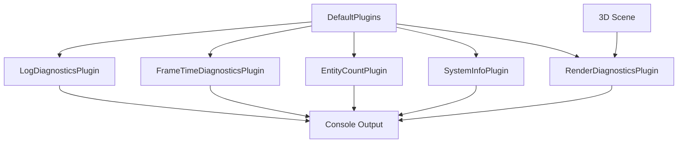

+++
title = "#18652 Fix issues in log_diagnostics example"
date = "2025-04-02T00:00:00"
draft = false
template = "pull_request_page.html"
in_search_index = true

[taxonomies]
list_display = ["show"]

[extra]
current_language = "en"
available_languages = {"en" = { name = "English", url = "/pull_request/bevy/2025-04/pr-18652-en-20250402" }, "zh-cn" = { name = "中文", url = "/pull_request/bevy/2025-04/pr-18652-zh-cn-20250402" }}
labels = ["C-Examples", "D-Straightforward"]
+++

# #18652 Fix issues in log_diagnostics example

## Basic Information
- **Title**: Fix issues in log_diagnostics example
- **PR Link**: https://github.com/bevyengine/bevy/pull/18652
- **Author**: kristoff3r
- **Status**: MERGED
- **Labels**: `C-Examples`, `S-Ready-For-Final-Review`, `X-Uncontroversial`, `D-Straightforward`
- **Created**: 2025-03-31T22:43:36Z
- **Merged**: 2025-04-01T09:12:15Z
- **Merged By**: alice-i-cecile

## Description Translation
# Objective

Adopts / builds on top of #18435.

The `log_diagnostics` example has bit-rotted and accumulated multiple issues:
-  It didn't explain the ordering constraint on DefaultPlugins, as noted by the original PR
- Apparently `AssetCountDiagnosticsPlugin` no longer exists (?!). I couldn't figure out when or why it was removed, maybe it got missed in Assets v2?
- The comments didn't explain what kind of info you get by the various plugins, making you do work to figure it out
- ~As far as I can tell `RenderDiagnosticsPlugin` currently doesn't register any diagnostics in the traditional sense, but is only focused on rendering spans? At least it doesn't print anything extra when added for me, so having it here is misleading.~ It didn't print anything because there was nothing to render in this example

## Solution

- Make all plugins be commented in to prevent further bit-rot
- Remove reference to the missing plugin
- Add extra comments describing the diagnostics in more detail
- Add something to render so we get render diagnostics

## Testing

Run the example, see relevant diagnostics printed out

## The Story of This Pull Request

The `log_diagnostics.rs` example had become outdated due to API changes and incomplete documentation. Three main issues needed resolution: 

1. **Plugin Dependency Ordering**: The example required specific plugin initialization order but didn't explain why. Diagnostics plugins depend on systems from `DefaultPlugins` like the time tracking system, but this constraint wasn't documented.

2. **Missing Asset Diagnostics**: The removed `AssetCountDiagnosticsPlugin` still appeared in comments, creating confusion. This plugin was likely deprecated during Bevy's Assets v2 migration but wasn't properly removed from documentation.

3. **Insufficient Rendering Context**: The `RenderDiagnosticsPlugin` appeared non-functional because the example lacked renderable entities. Without actual rendering operations, this plugin had no diagnostics to report.

The solution focused on clarity and completeness:

```rust
.add_plugins((
    DefaultPlugins,
    LogDiagnosticsPlugin::default(),
    FrameTimeDiagnosticsPlugin::default(),
    bevy::diagnostic::EntityCountDiagnosticsPlugin,
    bevy::diagnostic::SystemInformationDiagnosticsPlugin,
    bevy_render::diagnostic::RenderDiagnosticsPlugin,
))
```
Key changes included replacing the obsolete asset plugin with `EntityCountDiagnosticsPlugin` and adding detailed comments explaining each plugin's purpose. The explicit note about plugin ordering prevents initialization errors:

```rust
// The diagnostics plugins need to be added after DefaultPlugins 
// as they use e.g. the time plugin for timestamps
```

To validate rendering diagnostics, a 3D scene was added:
```rust
fn setup(...) {
    commands.spawn((
        Mesh3d(meshes.add(Circle::new(4.0))),
        MeshMaterial3d(materials.add(Color::WHITE)),
        Transform::from_rotation(Quat::from_rotation_x(-PI/2)),
    ));
    // Additional entities...
}
```
This scene provides necessary rendering workloads for `RenderDiagnosticsPlugin` to monitor pipeline statistics and GPU performance metrics.

The updated example now demonstrates:
- Core diagnostic collection patterns
- Proper plugin initialization sequence
- Clear documentation of each plugin's output
- Practical integration of rendering diagnostics

## Visual Representation



## Key Files Changed

### `examples/diagnostics/log_diagnostics.rs` (+48/-14)
1. **Plugin Configuration**
   - Added detailed comments explaining each diagnostic plugin
   - Removed deprecated `AssetCountDiagnosticsPlugin`
   - Enforced correct plugin ordering through documentation

```rust
// Before:
// .add_plugins(DefaultPlugins)
// .add_plugin(LogDiagnosticsPlugin::default())

// After:
.add_plugins((
    DefaultPlugins,
    LogDiagnosticsPlugin::default(),
    FrameTimeDiagnosticsPlugin::default(),
    bevy::diagnostic::EntityCountDiagnosticsPlugin,
    // ... other plugins with explanations
))
```

2. **Scene Setup**
   - Added 3D entities to ensure rendering occurs
   - Enabled collection of GPU-related diagnostics

```rust
// Added spawn commands for:
// - Circular base mesh
// - Cube entity
// - Lighting
// - Camera
```

## Further Reading
- [Bevy Diagnostics Guide](https://bevyengine.org/learn/book/getting-started/diagnostics/)
- [ECS Plugin System Documentation](https://docs.rs/bevy/latest/bevy/app/struct.Plugin.html)
- [Rendering Pipeline Architecture](https://bevyengine.org/learn/book/getting-started/rendering/)