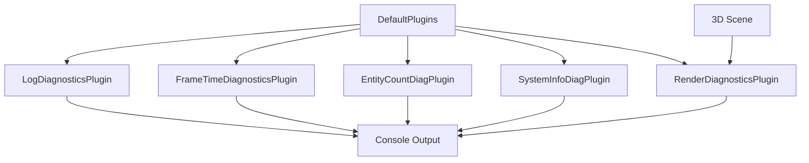

+++
title = "#18652 Fix issues in log_diagnostics example"
date = "2025-04-02T00:00:00"
draft = false
template = "pull_request_page.html"
in_search_index = false

[extra]
current_language = "zh-cn"
available_languages = {"en" = { name = "English", url = "/pull_request/bevy/2025-04/pr-18652-en-20250402" }, "zh-cn" = { name = "中文", url = "/pull_request/bevy/2025-04/pr-18652-zh-cn-20250402" }}
labels = ["C-Examples", "D-Straightforward"]
+++

# #18652 Fix issues in log_diagnostics example

## Basic Information
- **Title**: Fix issues in log_diagnostics example
- **PR Link**: https://github.com/bevyengine/bevy/pull/18652
- **Author**: kristoff3r
- **Status**: MERGED
- **Labels**: `C-Examples`, `S-Ready-For-Final-Review`, `X-Uncontroversial`, `D-Straightforward`
- **Created**: 2025-03-31T22:43:36Z
- **Merged**: 2025-04-01T08:12:15Z
- **Merged By**: alice-i-cecile

## Description Translation
该PR的目标是修复`log_diagnostics`示例中的多个累积问题。主要改动包括：
1. 添加插件顺序的明确说明
2. 移除已不存在的`AssetCountDiagnosticsPlugin`
3. 增强各诊断插件的功能注释
4. 添加基本3D场景以保证渲染诊断正常工作

## The Story of This Pull Request

### 问题背景与技术挑战
`log_diagnostics.rs`示例文件长期存在三个关键问题：
1. **插件顺序约束未说明**：原有的注释未明确说明`DefaultPlugins`必须优先于诊断插件加载，这与Bevy的时间系统（time system）实现相关
2. **废弃插件引用**：示例中引用了已移除的`AssetCountDiagnosticsPlugin`，这会导致编译错误
3. **诊断信息不完整**：由于示例缺少实际渲染内容，`RenderDiagnosticsPlugin`无法输出有效诊断信息

### 解决方案与实现细节
开发者通过以下具体改动解决问题：

**1. 明确插件加载顺序**
```rust
.add_plugins((
    // The diagnostics plugins need to be added after DefaultPlugins as they use e.g. the time plugin for timestamps.
    DefaultPlugins,
    LogDiagnosticsPlugin::default(),
    FrameTimeDiagnosticsPlugin::default(),
    // ...其他插件
))
```
新增注释明确诊断插件必须位于`DefaultPlugins`之后，因为后者提供时间戳等基础设施。

**2. 移除废弃插件**
```rust
// 删除原有错误引用
- bevy::diagnostic::AssetCountDiagnosticsPlugin,
+ bevy::diagnostic::EntityCountDiagnosticsPlugin,
```
将`AssetCountDiagnosticsPlugin`替换为`EntityCountDiagnosticsPlugin`，后者提供实体数量统计功能。

**3. 增强注释说明**
```rust
// 新增功能描述注释
// Adds frame time, FPS and frame count diagnostics.
FrameTimeDiagnosticsPlugin::default(),
// Adds an entity count diagnostic.
bevy::diagnostic::EntityCountDiagnosticsPlugin,
// Adds cpu and memory usage diagnostics for systems and the entire game process.
bevy::diagnostic::SystemInformationDiagnosticsPlugin,
```
每个插件现在都有明确的功能说明，帮助开发者快速理解各诊断模块的作用。

**4. 添加基础渲染场景**
```rust
fn setup(...) {
    // 添加圆形基座、立方体、光源和相机
    commands.spawn((
        Mesh3d(meshes.add(Circle::new(4.0))),
        MeshMaterial3d(materials.add(Color::WHITE)),
        Transform::from_rotation(Quat::from_rotation_x(-std::f32::consts::FRAC_PI_2)),
    ));
    // ...其他实体
}
```
通过创建简单的3D场景，确保渲染系统有实际内容可处理，从而触发`RenderDiagnosticsPlugin`的输出。

### 技术洞察与影响
该PR展示了Bevy诊断系统的几个关键设计模式：
1. **插件顺序依赖**：诊断插件通常依赖于`DefaultPlugins`提供的基础设施（如时间戳）
2. **条件性诊断输出**：渲染相关诊断仅在存在实际渲染操作时才会产生输出
3. **模块化设计**：通过组合不同的诊断插件（如`SystemInformationDiagnosticsPlugin`），开发者可以灵活配置所需的监控指标

修改后的示例现在能够稳定输出以下诊断信息：
- 帧时间/FPS（来自`FrameTimeDiagnosticsPlugin`）
- 实体数量（来自`EntityCountDiagnosticsPlugin`）
- 系统资源使用情况（来自`SystemInformationDiagnosticsPlugin`）
- 渲染管线指标（来自`RenderDiagnosticsPlugin`）

## Key Files Changed

### `examples/diagnostics/log_diagnostics.rs` (+48/-14)
1. **插件配置重构**
```rust
// 修改前：
.add_plugins(DefaultPlugins)
.add_plugin(LogDiagnosticsPlugin::default())
.add_plugin(FrameTimeDiagnosticsPlugin)

// 修改后：
.add_plugins((
    DefaultPlugins,
    LogDiagnosticsPlugin::default(),
    FrameTimeDiagnosticsPlugin::default(),
    bevy::diagnostic::EntityCountDiagnosticsPlugin,
    bevy::diagnostic::SystemInformationDiagnosticsPlugin,
    bevy_render::diagnostic::RenderDiagnosticsPlugin,
))
```
使用元组语法统一管理插件加载顺序，提升可读性。

2. **场景构建增强**
```rust
// 新增立方体生成逻辑：
commands.spawn((
    Mesh3d(meshes.add(Cuboid::new(1.0, 1.0, 1.0))),
    MeshMaterial3d(materials.add(Color::srgb_u8(124, 144, 255))),
    Transform::from_xyz(0.0, 0.5, 0.0),
));
```
通过添加具体3D对象，确保渲染系统正常运行。

## Visual Representation



## Further Reading
1. [Bevy Diagnostics 官方文档](https://docs.rs/bevy/latest/bevy/diagnostic/index.html)
2. [ECS 模式下的性能监控最佳实践](https://github.com/bevyengine/bevy/discussions/18542)
3. [Bevy 插件系统设计解析](https://bevy-cheatbook.github.io/programming/plugins.html)