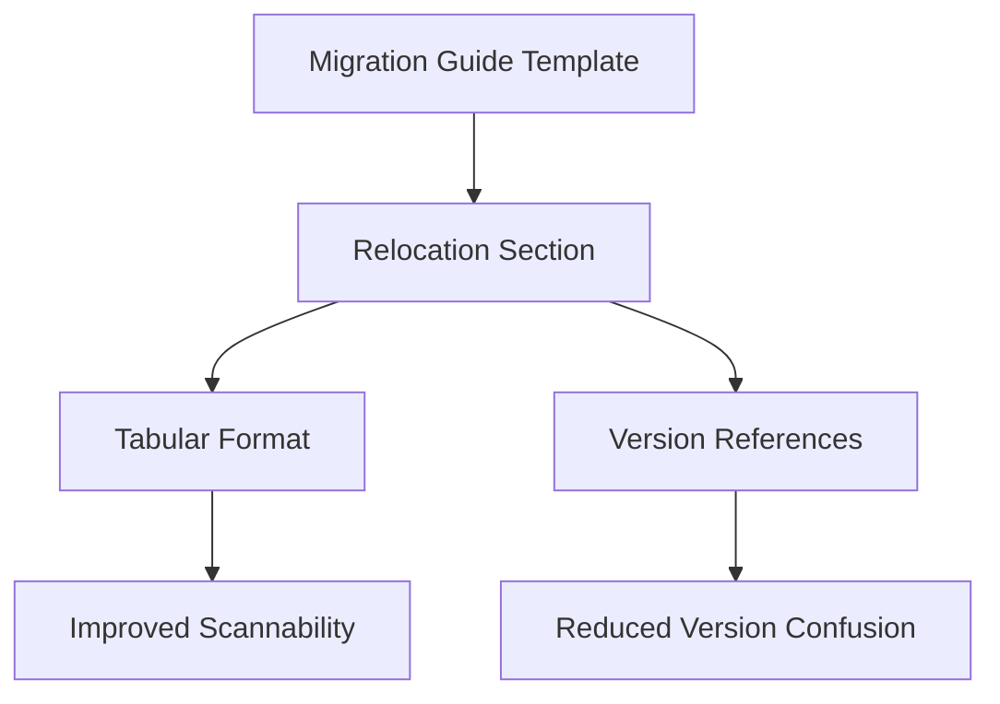

+++
title = "#18654 Add Advice for Relocations to Migration Guide Template"
date = "2025-04-01T00:00:00"
draft = false
template = "pull_request_page.html"
in_search_index = true

[taxonomies]
list_display = ["show"]

[extra]
current_language = "en"
available_languages = {"en" = { name = "English", url = "/pull_request/bevy/2025-04/pr-18654-en-20250401" }, "zh-cn" = { name = "中文", url = "/pull_request/bevy/2025-04/pr-18654-zh-cn-20250401" }}
labels = ["C-Docs", "A-Meta", "D-Straightforward"]
+++

# #18654 Add Advice for Relocations to Migration Guide Template

## Basic Information
- **Title**: Add Advice for Relocations to Migration Guide Template
- **PR Link**: https://github.com/bevyengine/bevy/pull/18654
- **Author**: bushrat011899
- **Status**: MERGED
- **Labels**: `C-Docs`, `A-Meta`, `S-Ready-For-Final-Review`, `X-Uncontroversial`, `D-Straightforward`
- **Created**: 2025-04-01T05:34:21Z
- **Merged**: 2025-04-01T07:12:45Z
- **Merged By**: cart

## Description Translation
# Objective

Relocations are a fairly common form of migration, and a tabular format can make reading an otherwise repetitive list much easier. This should be included in the migration guide template. 

## Solution

- Added a dot-point highlighting a tabular format for relocations, with an explanation.
- Added a dot-point indicating migrations should be written WRT the currently published version of a crate.
- Fixed some formatting in an adjacent dot-point.

## Testing

- CI


## The Story of This Pull Request

The PR addresses a documentation challenge in Bevy's migration process. When developers move types or modules between locations (relocations), existing migration guides often listed these changes as individual bullet points. While functional, this approach became cumbersome when multiple related items were relocated, leading to repetitive and hard-to-scan content.

The core insight driving this change was recognizing that tabular presentation could better handle relocation listings. Tables provide immediate visual comparison between old and new paths, reducing cognitive load for readers. This is particularly valuable when upgrading projects with numerous relocated items, as users can quickly scan the table rather than parse multiple similar bullet points.

The implementation focused on enhancing the migration guide template with two key improvements:

1. **Standardized Table Format**: Added explicit guidance to use markdown tables for relocation documentation. The template now includes an example table structure showing old/new paths, ensuring consistency across future migration guides.

2. **Version Awareness**: Introduced a requirement to reference the currently published crate version when writing migration steps. This prevents confusion that might arise if guides were accidentally written against unreleased or in-development API states.

The changes manifest in the template's "Style Guide" section through:

```markdown
- When moving items to a new module or crate, consider a simple table listing
  the moved items and the before and after paths.
  For example, _`Foo` has been moved from `bar::foo` to `baz`_ could be written:
  
  **Relocations**
  
  | Item                         | Old Path                       | New Path                       |
  | ---------------------------- | ------------------------------ | ------------------------------ |
  | `Foo`                        | `bar::foo`                     | `baz`                          |
```

This concrete example demonstrates the recommended pattern while maintaining flexibility - the "consider" wording allows alternative formats when appropriate. The adjacent formatting fix (not shown in diffs) likely addressed inconsistent indentation or markdown syntax in nearby examples, maintaining overall document integrity.

The impact of these changes is twofold. First, it reduces maintenance overhead for guide authors by providing a clear pattern for common scenarios. Second, it improves the end-user experience through more scannable documentation, potentially reducing upgrade errors and support requests.

A subtle but important technical consideration is the explicit mention of docs.rs references. By tying migration instructions to published documentation snapshots, this guidance helps prevent temporal coupling between migration guides and active development branches. This becomes crucial when multiple versions are supported concurrently.

## Visual Representation



## Key Files Changed

### File: `release-content/migration_guides_template.md`

**Changes:**
1. Added table-based relocation documentation example
2. Added docs.rs version reference guidance
3. Fixed adjacent codeblock formatting

**Key Modifications:**
```markdown
# Before:
- The `crate::old_module` module is now `crate::new_module`. Update your imports.

# After:
- Make sure to reference the currently published version of a crate when writing a migration guide.
  See [docs.rs](https://docs.rs/) for a quick reference to the existing public API.
- When moving items to a new module or crate, consider a simple table listing
  the moved items and the before and after paths.
  For example, _`Foo` has been moved from `bar::foo` to `baz`_ could be written:
  
  **Relocations**
  
  | Item                         | Old Path                       | New Path                       |
  | ---------------------------- | ------------------------------ | ------------------------------ |
  | `Foo`                        | `bar::foo`                     | `baz`                          |
```

These changes directly support the PR's goal of improving relocation documentation patterns while maintaining compatibility with existing guide structures.

## Further Reading

1. Bevy's Migration Guide Philosophy: https://bevyengine.org/learn/book/migration-guides/
2. Rust API Guidelines on Documentation: https://rust-lang.github.io/api-guidelines/documentation.html
3. Technical Writing for Developers (MDN Guide): https://developer.mozilla.org/en-US/docs/MDN/Writing_guidelines