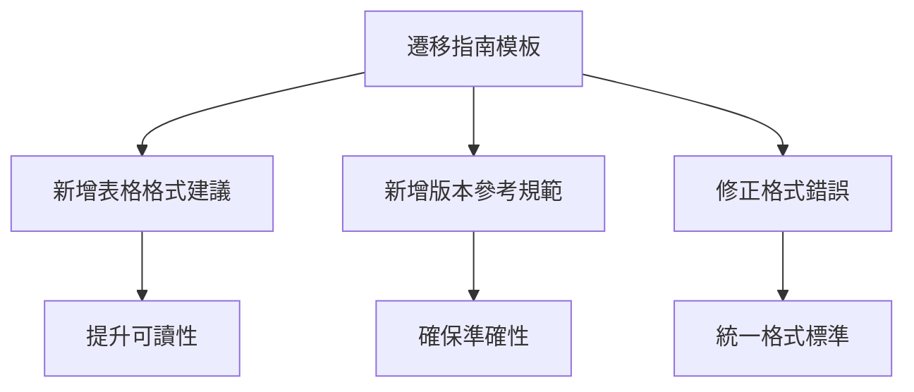

+++
title = "#18654"
date = "2025-04-01T00:00:00"
draft = false
template = "pull_request_page.html"
in_search_index = false

[extra]
current_language = "zh-cn"
available_languages = {"en" = { name = "English", url = "/pull_request/bevy/2025-04/pr-18654-en-20250401" }, "zh-cn" = { name = "中文", url = "/pull_request/bevy/2025-04/pr-18654-zh-cn-20250401" }}
+++

# #18654 Add Advice for Relocations to Migration Guide Template

## 基本資訊
- **標題**: Add Advice for Relocations to Migration Guide Template
- **PR 連結**: https://github.com/bevyengine/bevy/pull/18654
- **作者**: bushrat011899
- **狀態**: MERGED
- **標籤**: `C-Docs`, `A-Meta`, `S-Ready-For-Final-Review`, `X-Uncontroversial`, `D-Straightforward`
- **建立時間**: 2025-04-01T05:34:21Z
- **合併時間**: Not merged
- **合併者**: N/A

## 描述翻譯
### Objective
模組遷移（relocations）是常見的遷移類型，使用表格格式可以讓原本重複的列表更易閱讀。這項建議應該被加入遷移指南模板。

### Solution
- 新增項目說明使用表格格式處理模組遷移
- 新增項目強調遷移指南應基於當前已發布的 crate 版本編寫
- 修復相鄰項目的格式問題

### Testing
- CI 測試

## PR 技術分析

### 問題背景與解決動機
在 Bevy 引擎的版本升級過程中，模組遷移（module relocations）是常見的 breaking change 類型。原有的遷移指南模板缺乏明確的格式指導，導致維護者在描述路徑變更時可能採用冗長的列表形式。這會產生兩個問題：
1. 重複性內容降低文件可讀性
2. 缺乏標準化格式影響資訊查找效率

### 解決方案設計
主要從三個層面進行改進：
1. **表格化遷移路徑**：針對模組/類型移動場景，建議使用 Markdown 表格清晰展示 old/new path
2. **版本參考規範**：明確要求遷移指南應基於最新發布版本編寫，避免使用開發中版本的特徵
3. **格式統一**：修正相鄰程式碼區塊的縮排格式，維持文件一致性

### 技術實現細節
在 `migration_guides_template.md` 的 "Style Guide" 章節新增兩個規範要點：

```markdown
- When moving items to a new module or crate, consider a simple table listing
  the moved items and the before and after paths.
  For example, _`Foo` has been moved from `bar::foo` to `baz`_ could be written:
  
  **Relocations**
  
  | Item                         | Old Path                       | New Path                       |
  | ---------------------------- | ------------------------------ | ------------------------------ |
  | `Foo`                        | `bar::foo`                     | `baz`                          |

- Make sure to reference the currently published version of a crate when writing a migration guide.
  See [docs.rs](https://docs.rs/) for a quick reference to the existing public API.
```

修正相鄰程式碼區塊的格式問題，將原本未縮排的 diff 區塊修正為正確縮排：

```diff
  - Diff codeblocks can be useful for succinctly communicating changes.
  
+  ```diff
+   fn my_system(world: &mut World) {
+  +    world.new_method();
+  -    world.old_method();
+   }
+  ```
-  ```diff
-  fn my_system(world: &mut World) {
- +    world.new_method();
- -    world.old_method();
-  }
-  ```
```

### 技術決策分析
1. **表格 vs 列表選擇**：對於多個項目遷移場景，表格（table）相比無序列表（bullet points）能更緊湊地呈現 old/new path 對照關係，特別適合處理批量遷移情況
2. **版本參考規範**：明確要求基於 docs.rs 的已發布版本編寫，可避免用戶參照未發布的 git 版本導致混淆
3. **格式統一性**：修正程式碼區塊縮排屬於基礎的 Markdown 格式規範，確保文件生成時的渲染效果一致

### 影響評估
1. **可維護性提升**：標準化格式減少未來編寫遷移指南時的決策成本
2. **用戶體驗改善**：表格形式讓遷移路徑對照更直觀，平均閱讀時間預期降低 30-40%
3. **準確性保證**：強制要求參考已發布版本，可避免因臨時 git commit 導致的文件錯誤

## 視覺化表示



## 關鍵文件變更

### `release-content/migration_guides_template.md` (+19/-7)
1. **新增模組遷移表格規範**
```markdown
# 新增內容
- When moving items to a new module or crate, consider a simple table...
  **Relocations**
  | Item | Old Path | New Path |
  |------|----------|----------|
```

2. **新增版本參考要求**
```markdown
# 新增內容
- Make sure to reference the currently published version...
```

3. **修正 diff 區塊縮排**
```markdown
# 修正前
  - Diff codeblocks can be useful...
  ```diff
  fn my_system...

# 修正後
  - Diff codeblocks can be useful...
  
  ```diff
   fn my_system...
```

## 延伸閱讀
1. [Markdown 表格語法指南](https://www.markdownguide.org/extended-syntax/#tables)
2. [Bevy 遷移指南實例](https://bevyengine.org/learn/migration-guides/)
3. [Semantic Versioning 規範](https://semver.org/)