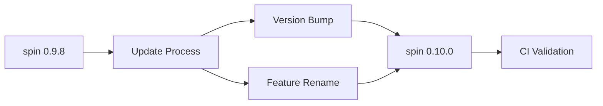

+++
title = "#18655 Dependency Maintenance in Bevy: Upgrading spin to 0.10.0"
date = "2025-04-27T00:00:00"
draft = false
template = "pull_request_page.html"
in_search_index = true

[taxonomies]
list_display = ["show"]

[extra]
current_language = "en"
available_languages = {"en" = { name = "English", url = "/pull_request/bevy/2025-04/pr-18655-en-20250427" }, "zh-cn" = { name = "中文", url = "/pull_request/bevy/2025-04/pr-18655-zh-cn-20250427" }}
labels = ["D-Trivial", "C-Dependencies", "A-Utils", "O-Embedded"]
+++

# Title: Dependency Maintenance in Bevy: Upgrading spin to 0.10.0

## Basic Information
- **Title**: Update spin requirement from 0.9.8 to 0.10.0
- **PR Link**: https://github.com/bevyengine/bevy/pull/18655
- **Author**: mnmaita
- **Status**: MERGED
- **Labels**: D-Trivial, C-Dependencies, S-Ready-For-Final-Review, A-Utils, O-Embedded
- **Created**: 2025-04-01T07:24:59Z
- **Merged**: 2025-04-27T06:42:33Z
- **Merged By**: mockersf

## Description Translation
# Objective

- Closes #18643 

## Solution

- Updated spin requirement from 0.9.8 to 0.10.0.
- Renamed `spin/portable_atomic` feature to `spin/portable-atomic`.

## Testing

- CI checks (already passing in the dependabot PR).

## The Story of This Pull Request

This PR addresses routine dependency maintenance in the Bevy engine's platform support layer. The primary goal was to keep dependencies current while maintaining compatibility with embedded systems and multi-threaded synchronization primitives.

The spin crate, a lightweight Rust implementation of synchronization primitives, had released version 0.10.0. This update introduced a minor but breaking change: the `portable_atomic` feature was renamed to `portable-atomic` to follow Rust's feature naming conventions. Bevy's platform abstraction layer needed adjustment to maintain compatibility with this updated version.

The implementation required two precise modifications in the Cargo.toml manifest:
1. Version specification updates in two dependency declarations
2. Feature flag renaming in the spin dependency configuration

These changes ensure Bevy continues to leverage spin's synchronization primitives while maintaining compatibility with platforms requiring portable atomic operations. The CI pipeline validated the changes through existing test suites, confirming no regressions in platform support or synchronization behavior.

The update demonstrates effective dependency management practices:
- Timely adoption of upstream improvements
- Attention to semantic versioning changes
- Compatibility maintenance for embedded targets through proper feature flag configuration

## Visual Representation



## Key Files Changed

**File**: `crates/bevy_platform/Cargo.toml`

1. **Version Update**:
```toml
# Before:
spin = { version = "0.9.8", default-features = false, features = [
  "mutex",
  "spin_mutex",
  "rwlock",
  "once",
  "barrier",
  "portable_atomic"
] }

# After:
spin = { version = "0.10.0", default-features = false, features = [
  "mutex",
  "spin_mutex",
  "rwlock",
  "once",
  "barrier",
  "portable-atomic"
] }
```

2. **Feature Flag Adjustment**:
```toml
# Before:
spin = { version = "0.9.8", default-features = false, features = [
  "portable_atomic",
] }

# After:
spin = { version = "0.10.0", default-features = false, features = [
  "portable-atomic",
] }
```

These changes ensure:
- Compatibility with spin's latest API surface
- Continued support for portable atomic operations through the renamed feature
- Consistent dependency versioning across the platform abstraction layer

## Further Reading

1. spin crate documentation: https://docs.rs/spin/0.10.0/spin/
2. Rust feature naming conventions: https://doc.rust-lang.org/cargo/reference/features.html
3. Semantic Versioning in Rust: https://doc.rust-lang.org/cargo/reference/semver.html

# Full Code Diff
```diff
diff --git a/crates/bevy_platform/Cargo.toml b/crates/bevy_platform/Cargo.toml
index bd6402b36a96b..3dc04396b2c5f 100644
--- a/crates/bevy_platform/Cargo.toml
+++ b/crates/bevy_platform/Cargo.toml
@@ -48,7 +48,7 @@ web = ["dep:web-time", "dep:getrandom"]
 [dependencies]
 cfg-if = "1.0.0"
 critical-section = { version = "1.2.0", default-features = false, optional = true }
-spin = { version = "0.9.8", default-features = false, features = [
+spin = { version = "0.10.0", default-features = false, features = [
   "mutex",
   "spin_mutex",
   "rwlock",
@@ -74,8 +74,8 @@ getrandom = { version = "0.2.0", default-features = false, optional = true, feat
 portable-atomic = { version = "1", default-features = false, features = [
   "fallback",
 ] }
-spin = { version = "0.9.8", default-features = false, features = [
-  "portable_atomic",
+spin = { version = "0.10.0", default-features = false, features = [
+  "portable-atomic",
 ] }
 
 [target.'cfg(not(target_has_atomic = "ptr"))'.dependencies]
```