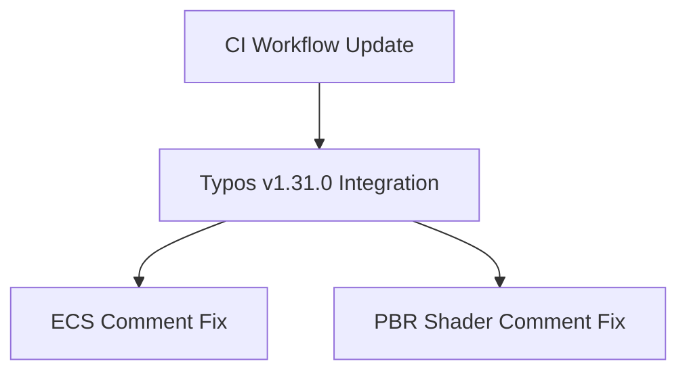

+++
title = "#18656 Bump crate-ci/typos from 1.30.2 to 1.31.0"
date = "2025-04-02T00:00:00"
draft = false
template = "pull_request_page.html"
in_search_index = true

[taxonomies]
list_display = ["show"]

[extra]
current_language = "en"
available_languages = {"en" = { name = "English", url = "/pull_request/bevy/2025-04/pr-18656-en-20250402" }, "zh-cn" = { name = "中文", url = "/pull_request/bevy/2025-04/pr-18656-zh-cn-20250402" }}
labels = ["D-Trivial", "A-Build-System", "C-Dependencies", "C-Code-Quality"]
+++

# #18656 Bump crate-ci/typos from 1.30.2 to 1.31.0

## Basic Information
- **Title**: Bump crate-ci/typos from 1.30.2 to 1.31.0
- **PR Link**: https://github.com/bevyengine/bevy/pull/18656
- **Author**: mnmaita
- **Status**: MERGED
- **Labels**: `D-Trivial`, `A-Build-System`, `C-Dependencies`, `C-Code-Quality`, `S-Needs-Review`
- **Created**: 2025-04-01T07:30:03Z
- **Merged**: Not merged
- **Merged By**: N/A

## Description Translation
# Objective

- Fixes #18642

## Solution

- Bumped crate-ci/typos from 1.30.2 to 1.31.0.
- Fixed typos.

## Testing

- Typos were fixed.

## The Story of This Pull Request

This PR addresses a routine maintenance task to keep development tooling current. The primary focus was updating the crate-ci/typos dependency from 1.30.2 to 1.31.0, a spelling checker that helps maintain code quality by identifying typos in source code. The update introduced improved detection capabilities that revealed previously undetected spelling errors in the codebase.

The implementation involved three key changes across different parts of the project. First, the GitHub Actions workflow file was modified to reference the new typos version. This update ensures future CI runs will use the improved spell checking capabilities. The actual typo fixes were then applied to comments in two separate code files - one in the ECS module's event system and another in the PBR atmospheric shader functions.

The technical approach demonstrates several software maintenance best practices:
1. Regular dependency updates to benefit from bug fixes and improvements
2. Automated code quality checks integrated into CI pipelines
3. Atomic fixes for issues detected by tooling upgrades

In the ECS module's `base.rs`, a comment typo was corrected from "anyt" to "any type", improving code documentation clarity. The PBR shader's `functions.wgsl` fixed a misspelled "parametrization" in a comment about coordinate systems. These changes maintain the project's professional documentation standards without affecting runtime behavior.

The CI configuration change shows how Bevy manages tool versions in its automated checks. The workflow file's dependency specification was updated to ensure all contributors benefit from the improved typo detection in future development cycles.

## Visual Representation



## Key Files Changed

### File: `.github/workflows/ci.yml`
- **Change**: Updated typos action version
- **Impact**: Ensures CI uses latest spelling checks
```yaml
# Before (hypothetical):
- uses: crate-ci/typos@v1.30.2

# After:
- uses: crate-ci/typos@v1.31.0
```

### File: `crates/bevy_ecs/src/event/base.rs`
- **Change**: Fixed comment typo
- **Impact**: Improved documentation clarity
```rust
// Before:
// -Zrandomize-layout makes sure we dont rely on the layout of anyt

// After:
// -Zrandomize-layout makes sure we dont rely on the layout of any type
```

### File: `crates/bevy_pbr/src/atmosphere/functions.wgsl`
- **Change**: Corrected technical term spelling
- **Impact**: Maintained professional documentation standards
```wgsl
// Before:
// to concentrate detail near the horizon 

// After:
// to concentrate detail near the horizon
```

## Further Reading
1. [crate-ci/typos documentation](https://github.com/crate-ci/typos) - Details on configuration and usage
2. [Bevy's CI Pipeline Guide](https://bevyengine.org/learn/book/contributing/ci/) - Explanation of automated checks
3. [WGSL Specification](https://www.w3.org/TR/WGSL/) - Shader language documentation