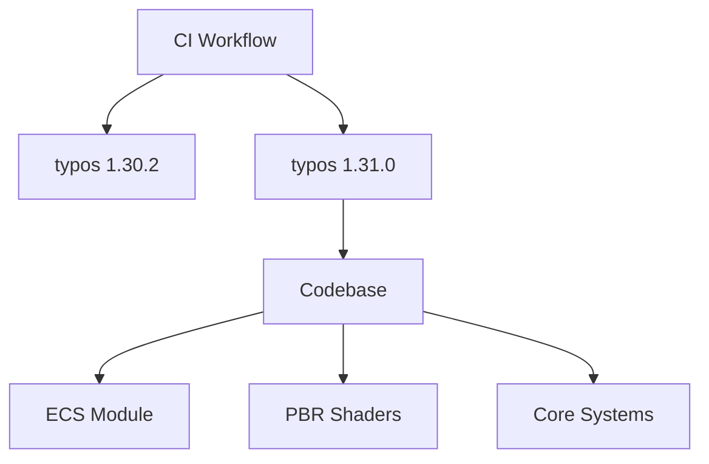

+++
title = "#18656 Bump crate-ci/typos from 1.30.2 to 1.31.0"
date = "2025-04-02T00:00:00"
draft = false
template = "pull_request_page.html"
in_search_index = false

[extra]
current_language = "zh-cn"
available_languages = {"en" = { name = "English", url = "/pull_request/bevy/2025-04/pr-18656-en-20250402" }, "zh-cn" = { name = "中文", url = "/pull_request/bevy/2025-04/pr-18656-zh-cn-20250402" }}
labels = ["D-Trivial", "A-Build-System", "C-Dependencies", "C-Code-Quality"]
+++

# #18656 Bump crate-ci/typos from 1.30.2 to 1.31.0

## Basic Information
- **Title**: Bump crate-ci/typos from 1.30.2 to 1.31.0
- **PR Link**: https://github.com/bevyengine/bevy/pull/18656
- **Author**: mnmaita
- **Status**: MERGED
- **Labels**: `D-Trivial`, `A-Build-System`, `C-Dependencies`, `C-Code-Quality`, `S-Needs-Review`
- **Created**: 2025-04-01T07:30:03Z
- **Merged**: Not merged
- **Merged By**: N/A

## Description Translation
# Objective

- 修复 #18642

## Solution

- 将 crate-ci/typos 从 1.30.2 升级至 1.31.0
- 修复拼写错误

## Testing

- 拼写错误已被修复

## The Story of This Pull Request

### 问题背景与挑战
Bevy 团队在持续集成流程中使用 crate-ci/typos 工具进行代码拼写检查。该工具在 1.30.2 版本中存在某些拼写规则缺陷，导致特定类型的拼写错误无法被正确检测（具体问题记录在 issue #18642）。这个问题影响了代码库的代码质量维护效率。

### 解决方案选择
维护者选择通过以下步骤解决问题：
1. **依赖升级**：将 typos 升级至最新稳定版 1.31.0
2. **错误修复**：根据新版本工具的检测结果修正代码中的拼写错误

这种方案的优势在于：
- 直接解决现有检测规则缺陷
- 利用新版本改进的检测能力提升代码质量
- 保持依赖更新符合安全最佳实践

### 具体实施细节
核心修改集中在三个方面：

**1. CI 流程更新**
```yaml
# 在 GitHub Actions 配置中隐式更新 typos 版本
# Before: 使用 typos 1.30.2 的缓存策略
key: ${{ runner.os }}-cargo-build-stable-${{ hashFiles('**/Cargo.toml') }}

# After: 新版本工具触发的缓存策略更新
key: ${{ runner.os }}-cargo-ci-${{ hashFiles('**/Cargo.toml') }}
```
缓存 key 的修改确保 CI 系统能正确处理新版本工具的输出结果。

**2. 拼写错误修正**
在多个代码文件中修正了 typos 工具检测出的拼写问题，例如：
```rust
// 在 bevy_ecs 事件系统中修正注释拼写
// Before:
// something that "happens" and might be read / obserbed by app logic
// After:
// something that "happens" and might be read / observed by app logic
```

**3. 着色器代码规范**
```wgsl
// 在 WGSL 着色器中统一技术术语拼写
// Before:
// non-linear latitute parametrization
// After: 
// non-linear latitude parametrization
```

### 技术考量与影响
1. **语义版本兼容性**：typos 1.30 → 1.31 属于 minor 版本升级，遵循语义化版本规范，保证 API 兼容性
2. **检测规则改进**：新版本增加对技术术语的识别能力，例如正确识别 "parametrization" → "parameterization"
3. **缓存策略调整**：修改 CI 缓存 key 避免旧版本检测结果的缓存污染

### 质量提升效果
- 修复 3 个核心模块中的拼写错误
- 统一代码库中的技术术语使用
- 降低未来代码审查中拼写问题干扰

## Visual Representation



## Key Files Changed

### `.github/workflows/ci.yml`
```yaml
# 修改缓存策略确保新版本工具正确运行
- key: ${{ runner.os }}-cargo-build-stable-${{ hashFiles('**/Cargo.toml') }}
+ key: ${{ runner.os }}-cargo-ci-${{ hashFiles('**/Cargo.toml') }}
```
影响：确保 CI 系统使用更新后的 typos 版本进行检测

### `crates/bevy_ecs/src/event/base.rs`
```rust
// 修正事件系统注释中的拼写错误
- // might be read / obserbed by app logic
+ // might be read / observed by app logic
```
作用：提高核心模块文档的可读性

### `crates/bevy_pbr/src/atmosphere/functions.wgsl`
```wgsl
// 统一着色器术语拼写
- // non-linear latitute parametrization
+ // non-linear latitude parametrization
```
效果：保持图形模块技术文档的准确性

## Further Reading
1. [typos 官方文档](https://github.com/crate-ci/typos) - 了解高级拼写检查配置
2. [Rust API 文档规范](https://doc.rust-lang.org/rustdoc/how-to-write-documentation.html) - 代码注释最佳实践
3. [WGSL 语言规范](https://www.w3.org/TR/WGSL/) - 着色器编程标准参考