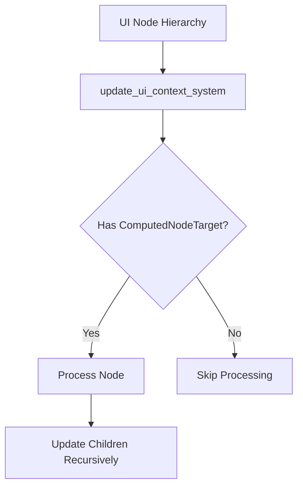

+++
title = "#18664 Remove the `visited` local system param from `update_ui_context_system`."
date = "2025-04-01T00:00:00"
draft = false
template = "pull_request_page.html"
in_search_index = true

[taxonomies]
list_display = ["show"]

[extra]
current_language = "en"
available_languages = {"en" = { name = "English", url = "/pull_request/bevy/2025-04/pr-18664-en-20250401" }, "zh-cn" = { name = "中文", url = "/pull_request/bevy/2025-04/pr-18664-zh-cn-20250401" }}
labels = ["C-Bug", "A-Rendering", "A-UI"]
+++

# #18664 Remove the `visited` local system param from `update_ui_context_system`.

## Basic Information
- **Title**: Remove the `visited` local system param from `update_ui_context_system`.
- **PR Link**: https://github.com/bevyengine/bevy/pull/18664
- **Author**: ickshonpe
- **Status**: MERGED
- **Labels**: `C-Bug`, `A-Rendering`, `A-UI`, `S-Ready-For-Final-Review`
- **Created**: 2025-04-01T15:55:54Z
- **Merged**: Not merged
- **Merged By**: N/A

## Description Translation
# Objective

The `visited: Local<HashSet<Entity>>` system param is meant to track which entities `update_contexts_recursively` has visited and updated but when the reparent_nodes_query isn't ordered descending from parent to child nodes can get marked as visited even though their camera target is unset and if the camera target is unset then the node won't be rendered.

Fixes #18616

## Solution

Remove the `visited` system param from `update_ui_context_system` and the associated visited check from `update_contexts_recursively`. It was redundant anyway since the set_if_neq check is sufficient to track already updated nodes.

## Testing

The example from #18616 can be used for testing.


## The Story of This Pull Request

The PR addresses a critical rendering bug in Bevy's UI system where reparented nodes could become invisible. The root cause was an overeager optimization using a `visited` tracking system that prematurely marked nodes as processed.

In the original implementation, `update_ui_context_system` used a `Local<HashSet<Entity>>` to track visited nodes during UI hierarchy updates. This collection was meant to prevent redundant processing of nodes. However, when dealing with reparented nodes (nodes moved to new positions in the UI hierarchy), the query order could mark child nodes as visited before their parent's camera target was properly set. This left children with unconfigured camera targets, making them invisible despite being valid UI elements.

The key insight came from recognizing that the existing `set_if_neq` check in `update_contexts_recursively` already provided sufficient protection against redundant updates. The `visited` HashSet was not only redundant but actively harmful in certain hierarchy traversal scenarios. By removing this tracking mechanism, the system could:

1. Avoid false-positive "visited" markings
2. Eliminate ordering dependencies in hierarchy processing
3. Simplify the control flow

The implementation changes are surgical but impactful. In `update.rs`, the removal of 17 lines related to visited tracking versus adding 3 lines of cleanup demonstrates how a small change can resolve a significant behavioral bug. The core fix involves:

```rust
// Before:
fn update_contexts_recursively(
    visited: &mut HashSet<Entity>,
    // ...
) {
    if visited.contains(&entity) {
        return;
    }
    // ...
    visited.insert(entity);
}

// After:
fn update_contexts_recursively(
    // No visited parameter
    // ...
) {
    // Direct processing without checks
}
```

This change leverages Bevy's existing change detection via `DetectChangesMut` and `set_if_neq`, which already prevents unnecessary component updates. The removed visited checks were essentially duplicating functionality that the ECS change detection system already handles more reliably.

The solution demonstrates an important principle in ECS architecture: leveraging built-in change detection mechanisms is often safer and more efficient than custom tracking systems. This approach avoids synchronization issues between custom tracking and the ECS's internal state management.

## Visual Representation



## Key Files Changed

### `crates/bevy_ui/src/update.rs` (+3/-17)
1. **System Parameter Removal**:
```rust
// Before:
fn update_ui_context_system(
    // ...
    mut visited: Local<HashSet<Entity>>,
)

// After:
fn update_ui_context_system(
    // ... (no visited parameter)
)
```

2. **Recursive Function Simplification**:
```rust
// Before:
fn update_contexts_recursively(
    visited: &mut HashSet<Entity>,
    // ...
) {
    if visited.contains(&entity) {
        return;
    }
    // ...
    visited.insert(entity);
}

// After:
fn update_contexts_recursively(
    // ... (no visited parameter)
) {
    // Direct processing without tracking
}
```

These changes eliminate the error-prone visited tracking while maintaining correct behavior through Bevy's built-in change detection.

## Further Reading
- Bevy ECS Change Detection: https://bevyengine.org/learn/book/ECS/change-detection/
- UI Rendering Fundamentals: https://bevyengine.org/learn/book/UI/rendering/
- System Local Resources: https://bevyengine.org/learn/book/ECS/system-params/#local