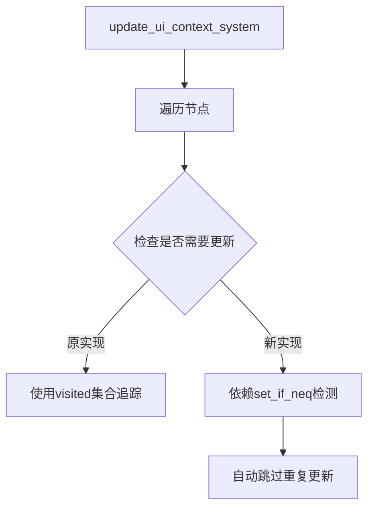

+++
title = "#18664 Remove the `visited` local system param from `update_ui_context_system`."
date = "2025-04-01T00:00:00"
draft = false
template = "pull_request_page.html"
in_search_index = false

[extra]
current_language = "zh-cn"
available_languages = {"en" = { name = "English", url = "/pull_request/bevy/2025-04/pr-18664-en-20250401" }, "zh-cn" = { name = "中文", url = "/pull_request/bevy/2025-04/pr-18664-zh-cn-20250401" }}
labels = ["C-Bug", "A-Rendering", "A-UI"]
+++

# #18664 Remove the `visited` local system param from `update_ui_context_system`.

## Basic Information
- **Title**: Remove the `visited` local system param from `update_ui_context_system`.
- **PR Link**: https://github.com/bevyengine/bevy/pull/18664
- **Author**: ickshonpe
- **Status**: MERGED
- **Labels**: `C-Bug`, `A-Rendering`, `A-UI`, `S-Ready-For-Final-Review`
- **Created**: 2025-04-01T15:55:54Z
- **Merged**: Not merged
- **Merged By**: N/A

## Description Translation
### 目标
`visited: Local<HashSet<Entity>>` 系统参数原本用于追踪 `update_contexts_recursively` 已访问和更新的实体。但当 `reparent_nodes_query` 没有按照从父节点到子节点的降序排列时，节点可能被错误标记为已访问（即使它们的相机目标未设置），导致节点无法渲染。

修复 #18616

### 解决方案
移除 `update_ui_context_system` 中的 `visited` 系统参数及相关检查。`set_if_neq` 检查本身已足够追踪已更新的节点，该参数变得冗余。

### 测试
使用 #18616 中的示例进行验证

## The Story of This Pull Request

### 问题背景与上下文
在 Bevy 的 UI 系统中，存在一个关键缺陷：当节点发生重新父级化（reparenting）时，某些情况下子节点可能无法正确渲染。这个问题源于 `update_ui_context_system` 中使用 `Local<HashSet<Entity>>` 来追踪已访问节点的实现方式。

具体来说，当 `reparent_nodes_query` 的查询顺序不是严格按照父节点到子节点的降序时，可能出现以下问题：
1. 子节点被先标记为已访问
2. 父节点的 `camera_target` 未正确设置
3. 子节点因此无法获得有效的渲染上下文
4. 由于已被标记为 visited，后续不再处理这些节点

这个问题在 issue #18616 中被报告，表现为某些 UI 元素在特定操作后消失。

### 解决方案与技术实现
核心思路是移除冗余的状态追踪机制。原代码中的 `visited` 集合和 `set_if_neq` 检查存在功能重叠：

```rust
// 原实现中的关键代码
if visited.contains(&entity) {
    continue;
}
visited.insert(entity);

// 与下面的 set_if_neq 形成重复检查
commands.entity(entity).set_if_neq(ComputedNodeTarget(camera_target));
```

修改后的实现完全依赖 `set_if_neq` 的内置变更检测机制：
1. 移除 `visited` 局部变量及其所有相关检查
2. 依赖 `set_if_neq` 的自动优化：当新值与现有值相同时，不执行任何操作
3. 简化递归逻辑，消除查询顺序依赖

### 技术洞察与架构影响
这个修改体现了 Bevy ECS 系统的两个核心特性：

1. **变更检测（Change Detection）**  
   `set_if_neq` 内部使用 `DetectChangesMut` trait，自动比较新旧值，仅在需要时更新组件。这比手动维护 HashSet 更高效可靠。

2. **系统执行顺序（System Ordering）**  
   原实现对查询顺序的隐式依赖违反了 ECS 的设计原则。新方案通过消除这种依赖，使代码更符合 Bevy 的 data-driven 架构理念。

### 性能与正确性考量
虽然移除了提前短路（early-exit）的逻辑，但由于以下因素，性能影响可以忽略：
- `set_if_neq` 的比较操作非常高效
- 减少了 HashSet 的插入/查询开销
- 避免了错误标记导致的重复渲染问题

在正确性方面，这个修改：
- 修复了父子节点更新顺序敏感的问题
- 消除了潜在的状态同步错误
- 使系统行为更可预测

## Visual Representation



## Key Files Changed

### File: `crates/bevy_ui/src/update.rs`
**修改内容**：移除 `visited` 相关代码（共删除17行，新增3行）

关键代码变更：
```rust
// 修改前：包含 visited 参数
fn update_contexts_recursively(
    visited: &mut HashSet<Entity>,
    commands: &mut Commands,
    // ...其他参数
) {
    if visited.contains(&entity) {
        continue;
    }
    visited.insert(entity);
}

// 修改后：移除 visited 相关逻辑
fn update_contexts_recursively(
    commands: &mut Commands,
    // ...其他参数（不含visited）
) {
    // 直接执行更新，依赖 set_if_neq 检测
    commands.entity(entity).set_if_neq(ComputedNodeTarget(camera_target));
}
```

**影响**：
- 简化递归更新逻辑
- 消除查询顺序依赖
- 减少内存分配（不再需要 HashSet）

## Further Reading
1. [Bevy ECS Change Detection 文档](https://bevyengine.org/learn/book/implementation/change-detection/)
2. [SystemParam 特性详解](https://github.com/bevyengine/bevy/blob/main/docs/plugins_guidelines.md#system-params)
3. [Entity Component System 设计模式](https://en.wikipedia.org/wiki/Entity_component_system)