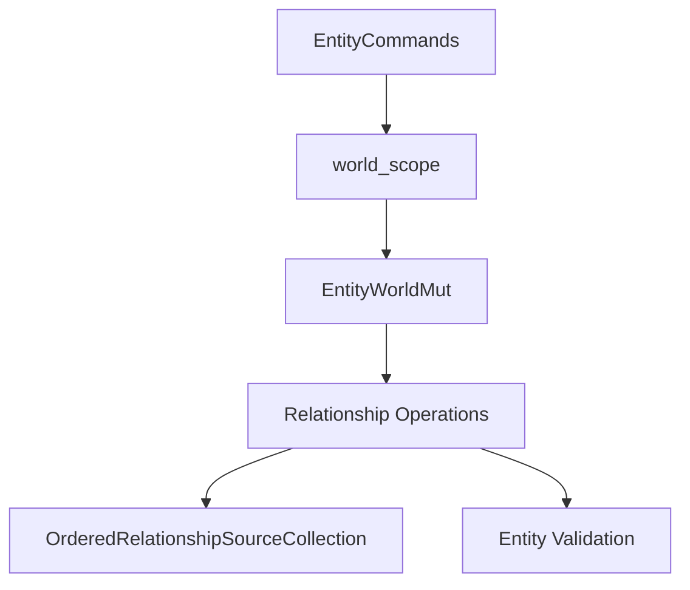

+++
title = "#18667 Update relationship commands to use `EntityCommands` instead of `Commands`"
date = "2025-04-01T00:00:00"
draft = false
template = "pull_request_page.html"
in_search_index = true

[taxonomies]
list_display = ["show"]

[extra]
current_language = "en"
available_languages = {"en" = { name = "English", url = "/pull_request/bevy/2025-04/pr-18667-en-20250401" }, "zh-cn" = { name = "中文", url = "/pull_request/bevy/2025-04/pr-18667-zh-cn-20250401" }}
labels = ["C-Bug", "A-ECS", "C-Code-Quality", "D-Straightforward"]
+++

# #18667 Update relationship commands to use `EntityCommands` instead of `Commands`

## Basic Information
- **Title**: Update relationship commands to use `EntityCommands` instead of `Commands`
- **PR Link**: https://github.com/bevyengine/bevy/pull/18667
- **Author**: JaySpruce
- **Status**: MERGED
- **Labels**: `C-Bug`, `A-ECS`, `C-Code-Quality`, `S-Ready-For-Final-Review`, `X-Uncontroversial`, `D-Straightforward`
- **Created**: 2025-04-01T17:40:18Z
- **Merged**: Not merged
- **Merged By**: N/A

## Description Translation
These should use `EntityCommands` so that the entity existence check is hooked up to the default error handler, rather than only panicking.

## The Story of This Pull Request

### The Problem and Context
The Bevy engine's Entity Component System (ECS) contained relationship management methods that used raw `Commands` for entity operations. While functional, this approach bypassed the built-in entity existence validation provided by `EntityCommands`. This could lead to inconsistent error handling - some operations might panic while others might fail silently when referencing invalid entities. The core issue was ensuring consistent validation for entity relationship operations across the ECS APIs.

### The Solution Approach
The PR migrates relationship commands from using `Commands` to `EntityCommands` to leverage their built-in entity validation. This required refactoring several key methods in the relationship system to:
1. Use `EntityWorldMut` for scoped world access
2. Employ `EntityCommands` for command execution
3. Maintain existing functionality while improving error handling

### The Implementation
The primary changes occurred in `related_methods.rs`, where relationship-building methods were updated to use entity-scoped commands. Key modifications include:

**1. Entity-scoped command execution**
```rust
// Before: Using raw Commands
pub fn with_related<R: Relationship>(&mut self, func: impl FnOnce(&mut Commands)) {
    let parent = self.id();
    self.commands().add(move |world: &mut World| {
        func(&mut world.commands());
    });
}

// After: Using EntityWorldMut's world_scope
pub fn with_related<R: Relationship>(
    &mut self,
    func: impl FnOnce(&mut RelatedSpawner<R>),
) -> &mut Self {
    let parent = self.id();
    self.world_scope(|world| {
        func(&mut RelatedSpawner::new(world, parent));
    });
    self
}
```

**2. Batch relationship operations with validation**
```rust
pub fn add_related<R: Relationship>(&mut self, related: &[Entity]) -> &mut Self {
    let id = self.id();
    self.world_scope(|world| {
        for related in related {
            // Now using entity_mut which performs existence check
            world.entity_mut(*related).insert(R::from(id));
        }
    });
    self
}
```

**3. Index-aware insertion with ordering**
```rust
pub fn insert_related<R: Relationship>(/* ... */) {
    // Uses OrderedRelationshipSourceCollection to maintain
    // insertion order while performing existence checks
    world.entity_mut(*related).insert(R::from(id));
}
```

### Technical Insights
The key technical improvements include:
- **Entity Validation**: `EntityCommands` automatically checks entity existence through `EntityWorldMut::world_scope`
- **Command Scoping**: Each operation is now tied to a specific entity context, preventing accidental cross-entity modifications
- **Order Preservation**: The `insert_related` method maintains collection order using `OrderedRelationshipSourceCollection`

### The Impact
These changes provide:
1. Consistent error handling for invalid entity references
2. Safer relationship operations through entity-scoped commands
3. Maintained performance through direct world access in scoped contexts
4. Clearer API boundaries between entity-specific and general commands

## Visual Representation



## Key Files Changed

### File: `crates/bevy_ecs/src/relationship/related_methods.rs`
1. **Key Changes**:
   - Migrated from `Commands` to `EntityWorldMut` for command execution
   - Implemented entity-scoped world access through `world_scope`
   - Added ordered relationship insertion logic

2. **Code Snippets**:
```rust
// Before: Raw command queue
self.commands().add(move |world: &mut World| {
    func(&mut world.commands());
});

// After: Scoped entity access
self.world_scope(|world| {
    func(&mut RelatedSpawner::new(world, parent));
});
```

3. **PR Relation**:
   - Core implementation of the entity command migration
   - Directly implements the error handling improvements
   - Maintains API compatibility while enhancing safety

## Further Reading
- [Bevy ECS Relationships Documentation](https://bevyengine.org/learn/book/ecs/relationships/)
- [EntityCommands vs Commands](https://bevy-cheatbook.github.io/programming/commands.html)
- [Rust Ownership and Borrowing](https://doc.rust-lang.org/book/ch04-00-understanding-ownership.html)