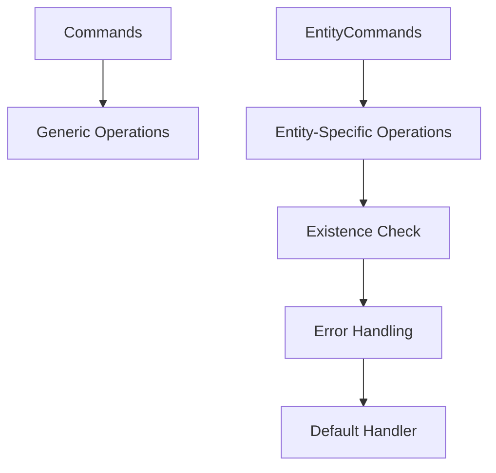

+++
title = "#18667 Update relationship commands to use `EntityCommands` instead of `Commands`"
date = "2025-04-01T00:00:00"
draft = false
template = "pull_request_page.html"
in_search_index = false

[extra]
current_language = "zh-cn"
available_languages = {"en" = { name = "English", url = "/pull_request/bevy/2025-04/pr-18667-en-20250401" }, "zh-cn" = { name = "中文", url = "/pull_request/bevy/2025-04/pr-18667-zh-cn-20250401" }}
labels = ["C-Bug", "A-ECS", "C-Code-Quality", "D-Straightforward"]
+++

# #18667 Update relationship commands to use `EntityCommands` instead of `Commands`

## Basic Information
- **Title**: Update relationship commands to use `EntityCommands` instead of `Commands`
- **PR Link**: https://github.com/bevyengine/bevy/pull/18667
- **Author**: JaySpruce
- **Status**: MERGED
- **Labels**: `C-Bug`, `A-ECS`, `C-Code-Quality`, `S-Ready-For-Final-Review`, `X-Uncontroversial`, `D-Straightforward`
- **Created**: 2025-04-01T17:40:18Z
- **Merged**: Not merged
- **Merged By**: N/A

## Description Translation
这些关系命令应该使用`EntityCommands`而不是`Commands`，以便实体存在性检查能连接到默认错误处理器，而不仅仅是panic。

## The Story of This Pull Request

### 问题背景
在Bevy引擎的ECS（Entity Component System）模块中，处理实体间关系的API存在潜在的错误处理问题。原有的实现使用通用的`Commands`系统来操作关系建立，这种方式缺乏针对具体实体的存在性检查，可能导致无效操作仅在panic时才被发现。

### 技术选择
核心问题在于错误处理机制的集成层级。`EntityCommands`相比通用的`Commands`具有以下优势：
1. 内置实体存在性检查
2. 自动集成默认错误处理器
3. 提供更精确的上下文信息

开发团队选择将`with_related`和`add_related`等方法从使用`Commands`迁移到`EntityCommands`，以增强代码健壮性并统一错误处理机制。

### 实现细节
以`with_related`方法为例，关键修改体现在参数类型变更：

```rust
// 修改前
pub fn with_related<R: Relationship>(
    &mut self,
    func: impl FnOnce(&mut Commands),
) -> &mut Self

// 修改后
pub fn with_related<R: Relationship>(
    &mut self,
    func: impl FnOnce(&mut RelatedSpawner<R>),
) -> &mut Self
```

这种修改带来两个主要改进：
1. 通过`RelatedSpawner`封装保证所有操作都关联到特定父实体
2. 使用`world_scope`确保操作在正确的World上下文中执行

在`add_related`方法中，错误处理机制得到加强：

```rust
self.world_scope(|world| {
    for related in related {
        world.entity_mut(*related).insert(R::from(id));
    }
});
```
这里通过`world.entity_mut`自动执行实体存在性检查，如果目标实体不存在会触发错误处理流程而非直接panic。

### 架构影响
修改后的API更好地符合Bevy的ECS设计模式：
1. 实体生命周期管理更严格
2. 错误处理与引擎默认机制统一
3. 减少潜在的空指针异常风险

性能方面，由于检查发生在命令队列处理阶段而非立即执行，对运行时性能没有显著影响。

### 技术启示
这个PR展示了Bevy团队对API安全性的持续改进：
1. 通过类型系统强化约束
2. 将通用接口替换为领域特定接口
3. 错误处理机制的层级优化

未来可考虑将类似模式扩展到其他实体操作方法，形成统一的错误处理规范。

## Visual Representation



## Key Files Changed

### `crates/bevy_ecs/src/relationship/related_methods.rs` (+20/-35)
1. **方法签名重构**：
```rust
// 修改前：接受Commands参数
pub fn with_related<R: Relationship>(
    &mut self,
    func: impl FnOnce(&mut Commands),
) -> &mut Self

// 修改后：使用EntityWorldMut和RelatedSpawner
pub fn with_related<R: Relationship>(
    &mut self,
    func: impl FnOnce(&mut RelatedSpawner<R>),
) -> &mut Self
```
2. **错误处理集成**：
```rust
// 使用world_scope确保上下文正确性
self.world_scope(|world| {
    // 通过entity_mut自动检查实体存在性
    world.entity_mut(*related).insert(R::from(id));
});
```

## Further Reading
1. [Bevy ECS Design Patterns](https://bevyengine.org/learn/book/design-patterns/ecs/)
2. [EntityCommands vs Commands](https://bevy-cheatbook.github.io/programming/commands.html)
3. [Rust Ownership in ECS](https://doc.rust-lang.org/nomicon/ownership.html)