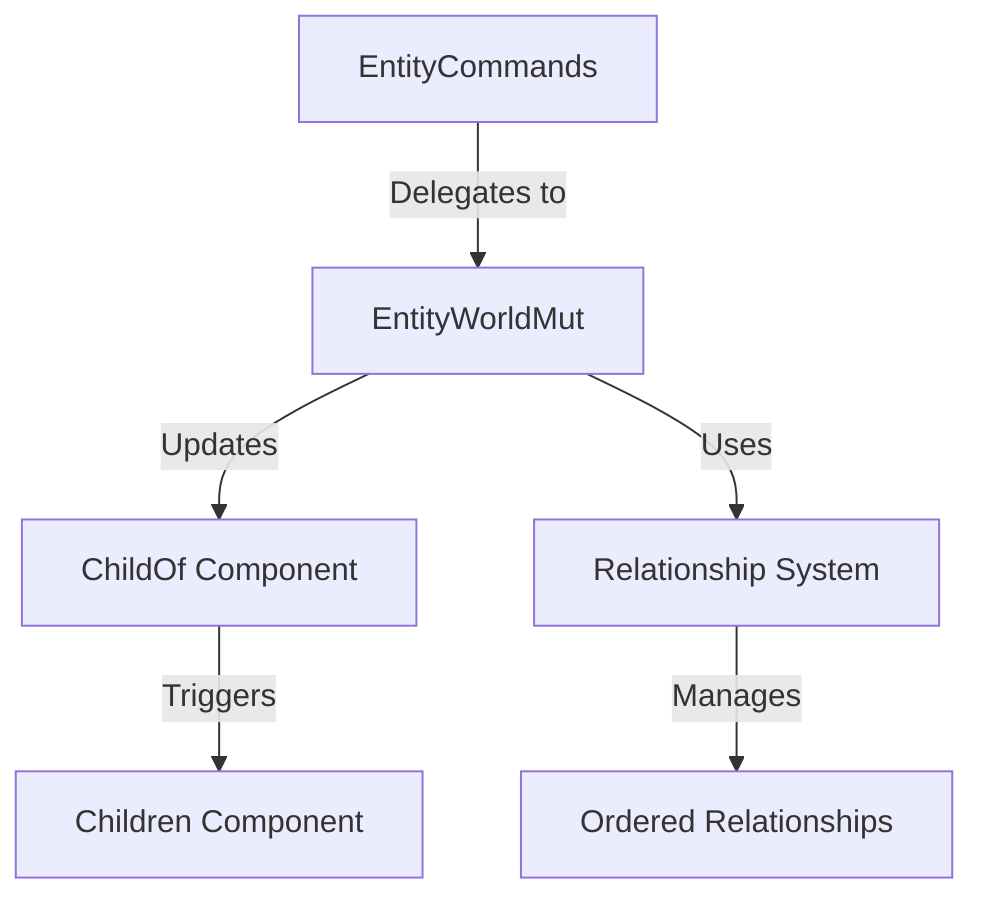

+++
title = "#18675 Implement `insert_children` for `EntityCommands`"
date = "2025-04-02T00:00:00"
draft = false
template = "pull_request_page.html"
in_search_index = true

[taxonomies]
list_display = ["show"]

[extra]
current_language = "en"
available_languages = {"en" = { name = "English", url = "/pull_request/bevy/2025-04/pr-18675-en-20250402" }, "zh-cn" = { name = "中文", url = "/pull_request/bevy/2025-04/pr-18675-zh-cn-20250402" }}
labels = ["A-ECS", "C-Usability"]
+++

# #18675 Implement `insert_children` for `EntityCommands`

## Basic Information
- **Title**: Implement `insert_children` for `EntityCommands`
- **PR Link**: https://github.com/bevyengine/bevy/pull/18675
- **Author**: JaySpruce
- **Status**: MERGED
- **Labels**: `A-ECS`, `C-Usability`, `S-Ready-For-Final-Review`
- **Created**: 2025-04-02T03:23:28Z
- **Merged**: Not merged
- **Merged By**: N/A

## Description Translation
Extension of #18409.

I was updating a migration guide for hierarchy commands and realized `insert_children` wasn't added to `EntityCommands`, only `EntityWorldMut`.

This adds that and `insert_related` (basically just some copy-and-pasting).

## The Story of This Pull Request

This PR addresses an API consistency gap in Bevy's Entity hierarchy management. During migration guide updates, the author discovered that while #18409 added `insert_children` to `EntityWorldMut`, it wasn't exposed through the more commonly used `EntityCommands` interface. 

The core problem stemmed from incomplete API surface alignment between immediate world mutation methods (`EntityWorldMut`) and deferred command queue operations (`EntityCommands`). Users working with command queues couldn't access the new insertion functionality, creating an inconsistent developer experience.

The solution follows established patterns in Bevy's API design. The author implemented mirror methods in `EntityCommands` that delegate to existing `EntityWorldMut` functionality through command queues. This approach maintains consistency with other hierarchy methods like `add_children`/`add_related` while preserving the deferred execution semantics of commands.

Key implementation details:

1. **Method Propagation**:
```rust
// In hierarchy.rs
impl<'w, 's, 'a> EntityCommands<'w, 's, 'a> {
    pub fn insert_children(&mut self, index: usize, children: &[Entity]) -> &mut Self {
        let parent = self.id();
        self.commands.add(move |world: &mut World| {
            world.entity_mut(parent).insert_children(index, children);
        });
        self
    }
}
```
This closure-based approach queues the insertion operation for later execution when commands are applied to the world.

2. **Relationship Handling**:
The `insert_related` implementation follows similar patterns for generic relationships:
```rust
// In related_methods.rs
impl<'w, 's, 'a> EntityCommands<'w, 's, 'a> {
    pub fn insert_related<R: Relationship>(
        &mut self,
        index: usize,
        related: &[Entity],
    ) -> &mut Self {
        let id = self.id();
        self.commands.add(move |world: &mut World| {
            world.entity_mut(id).insert_related::<R>(index, related);
        });
        self
    }
}
```
This generic implementation ensures consistent behavior across all relationship types while maintaining type safety.

The changes demonstrate Bevy's component-based architecture by:
- Leveraging existing `Relationship` infrastructure
- Maintaining clear separation between immediate and deferred operations
- Preserving ECS invariants through command queuing

Performance considerations are minimal since these changes only affect API surface, not core hierarchy management logic. The command-based approach aligns with Bevy's system parallelism model by deferring mutable operations.

## Visual Representation



## Key Files Changed

### `crates/bevy_ecs/src/hierarchy.rs` (+6/-0)
Added `insert_children` to EntityCommands:
```rust
impl<'w, 's, 'a> EntityCommands<'w, 's, 'a> {
    pub fn insert_children(&mut self, index: usize, children: &[Entity]) -> &mut Self {
        let parent = self.id();
        self.commands.add(move |world: &mut World| {
            world.entity_mut(parent).insert_children(index, children);
        });
        self
    }
}
```
Enables deferred child insertion via command queues.

### `crates/bevy_ecs/src/relationship/related_methods.rs` (+17/-0)
Added generic relationship insertion:
```rust
impl<'w, 's, 'a> EntityCommands<'w, 's, 'a> {
    pub fn insert_related<R: Relationship>(
        &mut self,
        index: usize,
        related: &[Entity],
    ) -> &mut Self {
        let id = self.id();
        self.commands.add(move |world: &mut World| {
            world.entity_mut(id).insert_related::<R>(index, related);
        });
        self
    }
}
```
Extends the pattern to all ordered relationships.

## Further Reading
- Bevy ECS Relationships Guide: https://bevyengine.org/learn/ecs-relationships/
- Entity Commands Documentation: https://docs.rs/bevy_ecs/latest/bevy_ecs/system/struct.EntityCommands.html
- Command Queue Architecture: https://bevy-cheatbook.github.io/programming/commands.html