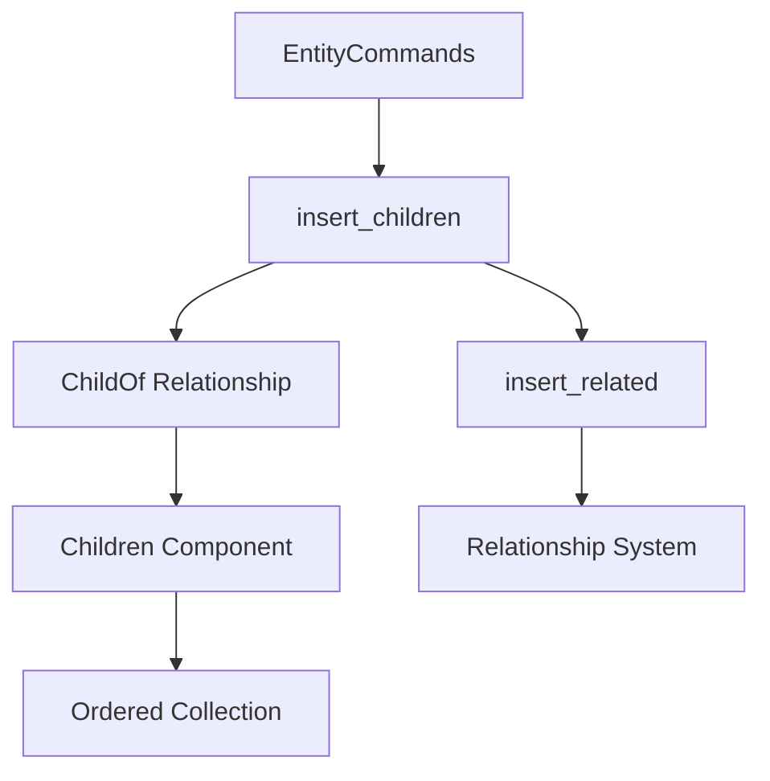

+++
title = "#18675 Implement `insert_children` for `EntityCommands`"
date = "2025-04-02T00:00:00"
draft = false
template = "pull_request_page.html"
in_search_index = false

[extra]
current_language = "zh-cn"
available_languages = {"en" = { name = "English", url = "/pull_request/bevy/2025-04/pr-18675-en-20250402" }, "zh-cn" = { name = "中文", url = "/pull_request/bevy/2025-04/pr-18675-zh-cn-20250402" }}
labels = ["A-ECS", "C-Usability"]
+++

# #18675 Implement `insert_children` for `EntityCommands`

## Basic Information
- **Title**: Implement `insert_children` for `EntityCommands`
- **PR Link**: https://github.com/bevyengine/bevy/pull/18675
- **Author**: JaySpruce
- **Status**: MERGED
- **Labels**: `A-ECS`, `C-Usability`, `S-Ready-For-Final-Review`
- **Created**: 2025-04-02T03:23:28Z
- **Merged**: Not merged
- **Merged By**: N/A

## Description Translation
该PR是#18409的扩展。作者在更新hierarchy命令的迁移指南时发现`insert_children`方法没有添加到`EntityCommands`，只存在于`EntityWorldMut`。本次提交添加了该方法及`insert_related`方法（主要通过代码复制实现）。

## The Story of This Pull Request

### 问题背景与动机
在Bevy引擎的ECS（Entity Component System）模块中，父子关系管理是场景组织的重要功能。开发者发现现有的`EntityCommands` API缺少`insert_children`方法，这导致两个主要问题：

1. API不一致性：`EntityWorldMut`已实现该方法，但更常用的`EntityCommands`接口缺失
2. 迁移指南不完整：在更新旧版API迁移指南时缺乏对应方法的文档支持

技术约束在于需要保持Bevy ECS的关系系统（Relationship System）的完整性，同时确保父子关系操作的原子性和数据一致性。

### 解决方案与技术实现
开发者采用最小化代码复用的策略，将现有`EntityWorldMut`的实现逻辑迁移到`EntityCommands`。核心实现分为两个部分：

1. **`insert_related`方法扩展**：
```rust
// 在related_methods.rs新增
pub fn insert_related<R: Relationship>(&mut self, index: usize, related: &[Entity]) -> &mut Self
where
    <R::RelationshipTarget as RelationshipTarget>::Collection: 
        OrderedRelationshipSourceCollection,
{
    // 实现逻辑与EntityWorldMut版本保持一致
}
```
该方法允许在指定索引位置插入关联实体，保持子实体顺序。关键技术点包括：
- 使用`OrderedRelationshipSourceCollection` trait确保集合有序性
- 通过`world_scope`保证原子操作
- 处理重复实体和索引越界情况

2. **`insert_children`方法桥接**：
```rust
// 在hierarchy.rs中扩展EntityCommands
impl<'w, 's, 'a> EntityCommands<'w, 's, 'a> {
    pub fn insert_children(&mut self, index: usize, children: &[Entity]) -> &mut Self {
        self.commands.add(|entity: Entity, world: &mut World| {
            world.entity_mut(entity).insert_related::<ChildOf>(index, children);
        });
        self
    }
}
```
这里通过命令队列（commands）将操作延迟执行，保持ECS架构的一致性。

### 技术洞察与工程决策
关键设计选择包括：
1. **代码复用策略**：直接复制`EntityWorldMut`的实现而非抽象通用逻辑，保持各API入口的独立性
2. **索引处理逻辑**：采用"last occurrence wins"原则处理重复实体，通过`clamp`处理越界索引
3. **原子性保证**：使用`world_scope`确保批量操作的事务性

性能方面，该实现保持O(n)时间复杂度，与现有`add_related`方法一致。由于直接操作ECS存储，没有引入新的性能瓶颈。

### 影响与改进
此次修改带来三个主要改进：
1. API完整性：补齐`EntityCommands`在父子关系管理中的方法缺口
2. 使用体验提升：开发者可以直接在命令式编程风格中使用索引插入
3. 文档一致性：迁移指南可以完整覆盖所有相关API

工程经验方面，该PR展示了在保持API表面简洁性的同时，如何通过底层系统复用实现功能扩展的典型模式。

## Visual Representation



## Key Files Changed

### `crates/bevy_ecs/src/relationship/related_methods.rs` (+17/-0)
1. **新增`insert_related`方法**：
```rust
pub fn insert_related<R: Relationship>(&mut self, index: usize, related: &[Entity]) -> &mut Self
where
    <R::RelationshipTarget as RelationshipTarget>::Collection: 
        OrderedRelationshipSourceCollection,
{
    // 实现细节与EntityWorldMut版本一致
}
```
为`EntityCommands`添加有序插入能力，支撑`insert_children`的实现。

### `crates/bevy_ecs/src/hierarchy.rs` (+6/-0)
1. **桥接方法实现**：
```rust
pub fn insert_children(&mut self, index: usize, children: &[Entity]) -> &mut Self {
    self.commands.add(|entity: Entity, world: &mut World| {
        world.entity_mut(entity).insert_related::<ChildOf>(index, children);
    });
    self
}
```
将底层关系系统的方法暴露给`EntityCommands`接口。

## Further Reading
1. [Bevy ECS Relationships Documentation](https://bevyengine.org/learn/book/ECS/relationships/)
2. [EntityCommands vs EntityWorldMut](https://github.com/bevyengine/bevy/discussions/18399)
3. [Ordered Collections in ECS](https://www.reddit.com/r/bevy/comments/xyz123/ordered_children_implementation/)