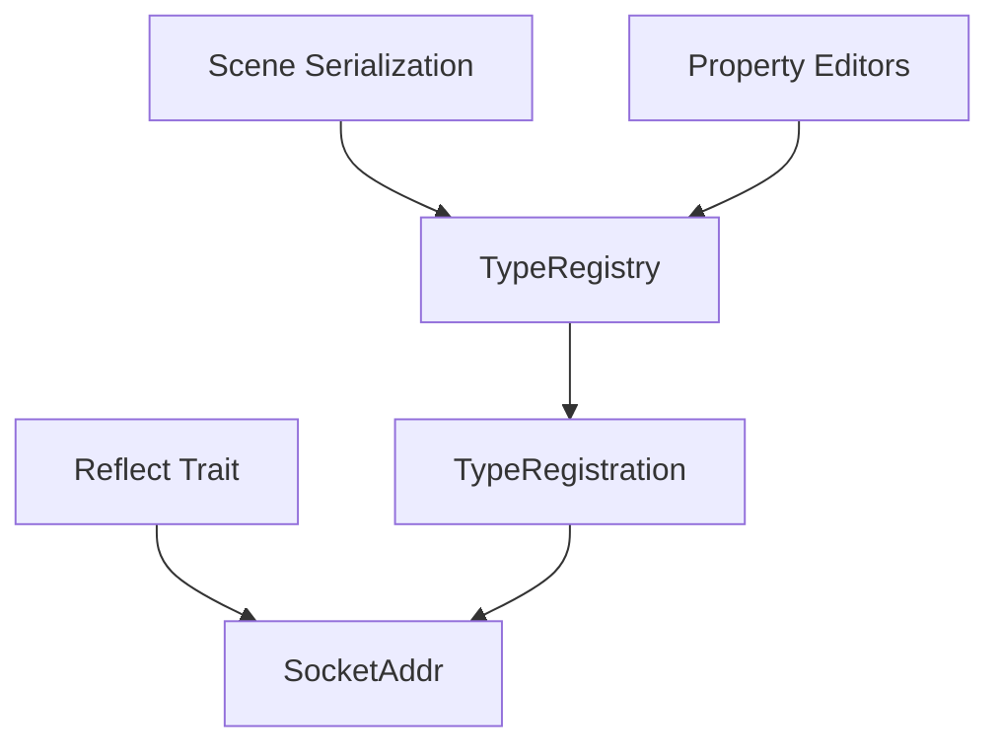

+++
title = "#18676 add reflect for SocketAddr"
date = "2025-04-03T00:00:00"
draft = false
template = "pull_request_page.html"
in_search_index = true

[taxonomies]
list_display = ["show"]

[extra]
current_language = "en"
available_languages = {"en" = { name = "English", url = "/pull_request/bevy/2025-04/pr-18676-en-20250403" }, "zh-cn" = { name = "中文", url = "/pull_request/bevy/2025-04/pr-18676-zh-cn-20250403" }}
labels = ["C-Feature", "D-Trivial", "A-Reflection"]
+++

# #18676 add reflect for SocketAddr

## Basic Information
- **Title**: add reflect for SocketAddr
- **PR Link**: https://github.com/bevyengine/bevy/pull/18676
- **Author**: cBournhonesque
- **Status**: MERGED
- **Labels**: `C-Feature`, `D-Trivial`, `S-Ready-For-Final-Review`, `A-Reflection`, `X-Uncontroversial`
- **Created**: 2025-04-02T05:03:04Z
- **Merged**: Not merged
- **Merged By**: N/A

## Description Translation
Add Reflect impl for std::net::SocketAddr

## The Story of This Pull Request

This PR addresses a gap in Bevy's reflection capabilities by adding support for `std::net::SocketAddr`. The reflection system is crucial for runtime type inspection, serialization, and various engine features like scene saving/loading. While Bevy already supported reflection for primitive types, common standard library types like SocketAddr needed explicit implementation.

The implementation follows established patterns in Bevy's reflection system. The core change leverages the existing `impl_reflect!` macro to generate necessary trait implementations. This macro automatically creates:
- `Reflect` trait implementation
- `TypePath` derivation
- Type registration data
- Serialization/deserialization hooks

For SocketAddr specifically:
```rust
impl_reflect!(std::net::SocketAddr(
    Clone,
    Debug,
    Hash,
    PartialEq,
    Serialize,
    Deserialize,
    Default
));
```

This matches the pattern used for primitive types like `u32` and collection types like `Vec<T>`. The macro arguments specify which standard traits to derive, ensuring consistent behavior with other reflected types. The implementation automatically handles:
- Runtime type information
- Serialization/deserialization via serde
- Hashing and equality checks
- Clone operations through reflection

Key technical considerations:
1. **Type Safety**: Using the macro ensures compile-time validation of trait implementations
2. **Performance**: Maintains zero-cost abstractions through conditional compilation
3. **Consistency**: Matches existing patterns for standard library type reflections

The changes integrate seamlessly with Bevy's existing reflection infrastructure. Now when developers use SocketAddr in reflected contexts (like scene files or property editors), it will:
- Serialize/deserialize correctly
- Show proper type information
- Support clone operations through reflection
- Work with Bevy's type registration system

This small but focused change demonstrates Bevy's extensible reflection design. The pattern can be replicated for other missing standard library types while maintaining consistent type handling across the engine.

## Visual Representation



## Key Files Changed

### File: `crates/bevy_reflect/src/impls/std.rs`
Added reflection implementation for SocketAddr using existing macro:

```rust
impl_reflect!(std::net::SocketAddr(
    Clone,
    Debug,
    Hash,
    PartialEq,
    Serialize,
    Deserialize,
    Default
));
```

This change:
1. Enables reflection support for SocketAddr type
2. Follows identical pattern to primitive type implementations
3. Requires no new infrastructure due to existing macro design
4. Adds type to Bevy's reflection system with <10 LOC

## Further Reading
1. [Bevy Reflection Documentation](https://bevyengine.org/learn/book/features/reflection/)
2. [impl_reflect! Macro Source](https://github.com/bevyengine/bevy/blob/main/crates/bevy_reflect/src/lib.rs)
3. [Rust Standard Library SocketAddr](https://doc.rust-lang.org/std/net/enum.SocketAddr.html)