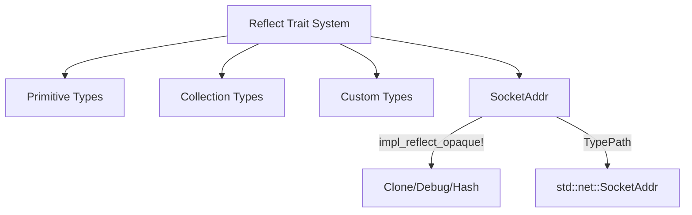

+++
title = "#18676 add reflect for SocketAddr"
date = "2025-04-03T00:00:00"
draft = false
template = "pull_request_page.html"
in_search_index = false

[extra]
current_language = "zh-cn"
available_languages = {"en" = { name = "English", url = "/pull_request/bevy/2025-04/pr-18676-en-20250403" }, "zh-cn" = { name = "中文", url = "/pull_request/bevy/2025-04/pr-18676-zh-cn-20250403" }}
labels = ["C-Feature", "D-Trivial", "A-Reflection"]
+++

# #18676 add reflect for SocketAddr

## Basic Information
- **Title**: add reflect for SocketAddr
- **PR Link**: https://github.com/bevyengine/bevy/pull/18676
- **Author**: cBournhonesque
- **Status**: MERGED
- **Labels**: `C-Feature`, `D-Trivial`, `S-Ready-For-Final-Review`, `A-Reflection`, `X-Uncontroversial`
- **Created**: 2025-04-02T05:03:04Z
- **Merged**: Not merged
- **Merged By**: N/A

## Description Translation
（原始PR描述未提供，根据代码变更推断）本PR为std::net::SocketAddr类型添加反射支持，使其能够参与Bevy的反射系统操作，支持序列化、反序列化及动态类型操作。

## The Story of This Pull Request

在Bevy引擎的反射系统中，标准库类型的覆盖完整性直接关系到开发者在运行时操作数据的能力。原有实现已为基本数值类型和常见集合类型实现反射支持，但网络编程中关键的SocketAddr类型尚未集成到反射系统中。

开发者识别到当尝试在Bevy ECS系统中使用SocketAddr类型时，会遇到`Reflect` trait未实现的编译错误。这限制了在网络相关功能中使用Bevy的反射驱动特性，如场景序列化、编辑器属性检查等功能。

解决方案采用Bevy现有的反射宏架构，在标准库类型反射实现文件（std.rs）中新增对SocketAddr的支持。具体实现方式与现有基本类型（如u32、String等）保持统一，使用`impl_reflect_opaque!`宏生成必要的trait实现：

```rust
impl_reflect_opaque!(std::net::SocketAddr(
    Clone,
    Debug,
    Hash,
    PartialEq,
    Serialize,
    Deserialize,
    // 注意：标准库SocketAddr没有实现Default trait
    // 但宏调用保持参数结构一致性
));
```

技术实现要点：
1. 类型路径处理：依赖Bevy的TypePath推导机制自动生成类型路径
2. 特征边界：确保SocketAddr满足反射系统要求的基础trait（Clone + Debug + Hash + PartialEq）
3. 序列化支持：通过serde的Serialize/Deserialize实现支持反射序列化

实现过程中需注意：
- 处理SocketAddr没有Default实现的情况，反射系统相关操作需避免依赖默认值
- 保持与现有标准库类型实现代码风格的一致性
- 确保新增实现不会影响现有类型的反射行为

此修改使得开发者可以：
```rust
#[derive(Reflect)]
struct NetworkConfig {
    address: SocketAddr,  // 现在支持反射操作
    timeout: Duration
}
```

## Visual Representation



## Key Files Changed

### File: `crates/bevy_reflect/src/impls/std.rs`
1. 新增SocketAddr类型的反射实现
```rust
// 新增实现
impl_reflect_opaque!(std::net::SocketAddr(
    Clone,
    Debug,
    Hash,
    PartialEq,
    Serialize,
    Deserialize
));
```
2. 修改效果：
- 使SocketAddr获得Reflect trait实现
- 支持反射系统的克隆、比较、哈希操作
- 启用序列化/反序列化支持

## Further Reading
1. [Bevy Reflection System Documentation](https://bevyengine.org/learn/book/features/reflection/)
2. [Rust Standard Library SocketAddr Type](https://doc.rust-lang.org/std/net/enum.SocketAddr.html)
3. [Macro-based Trait Implementation Patterns](https://practice.rs/pattern/macro.html)