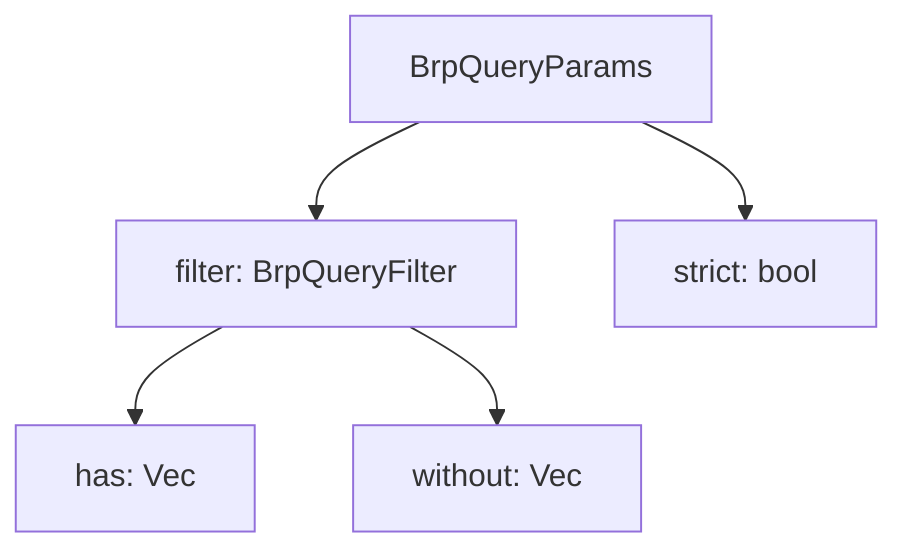

+++
title = "#18681 Fix indentation of `bevy/query` `strict` parameter in docs"
date = "2025-04-02T00:00:00"
draft = false
template = "pull_request_page.html"
in_search_index = true

[taxonomies]
list_display = ["show"]

[extra]
current_language = "en"
available_languages = {"en" = { name = "English", url = "/pull_request/bevy/2025-04/pr-18681-en-20250402" }, "zh-cn" = { name = "中文", url = "/pull_request/bevy/2025-04/pr-18681-zh-cn-20250402" }}
labels = ["C-Docs", "D-Trivial", "A-Dev-Tools"]
+++

# #18681 Fix indentation of `bevy/query` `strict` parameter in docs

## Basic Information
- **Title**: Fix indentation of `bevy/query` `strict` parameter in docs
- **PR Link**: https://github.com/bevyengine/bevy/pull/18681
- **Author**: BD103
- **Status**: MERGED
- **Labels**: `C-Docs`, `D-Trivial`, `S-Ready-For-Final-Review`, `A-Dev-Tools`
- **Created**: 2025-04-02T15:03:59Z
- **Merged**: 2025-04-02T18:22:14Z
- **Merged By**: alice-i-cecile

## Description Translation
# Objective

- The `strict` field of [`BrpQueryParams`](https://dev-docs.bevyengine.org/bevy/remote/builtin_methods/struct.BrpQueryParams.html) was newly added as part of 0.16.
- Its documentation in `lib.rs` improperly indents `strict`, making look like its part of [`BrpQueryFilter`](https://dev-docs.bevyengine.org/bevy/remote/builtin_methods/struct.BrpQueryFilter.html):


## Solution

- Fix `strict`'s indentation so its clear that it is a field of `BrpQueryParams`, not `BrpQueryFilter`.

I would like this to be included in 0.16, since it's a trivial documentation change that fixes an error, but if it needs to be removed from the milestone that's fine.

## Testing

Run `cargo doc -p bevy_remote --no-deps` and verify the indentation is fixed. :)


## The Story of This Pull Request

The PR addresses a documentation formatting issue in Bevy's remote protocol implementation. During the 0.16 development cycle, a new `strict` parameter was added to the `BrpQueryParams` struct. However, its documentation entry inherited incorrect indentation from surrounding code, visually associating it with the nested `BrpQueryFilter` structure instead of its actual parent.

This formatting error created potential confusion for developers using the remote API. The `strict` parameter's placement in the documentation hierarchy mattered because:
1. It controls query execution strictness at the params level
2. Misattribution to `BrpQueryFilter` could lead to incorrect API usage
3. New users might misunderstand the parameter's scope

The fix involved adjusting whitespace in the Rustdoc comment. Before the change, the `strict` parameter appeared indented under `BrpQueryFilter` due to Markdown formatting. The correction aligned it properly with other `BrpQueryParams` fields through precise indentation adjustment.

Key implementation details:
```rust
// Before incorrect indentation:
//!         "filter": {
//!             "has": ["bevy_hierarchy::components::parent::Parent"]
//!         },
//!         "strict": false

// After correction:
//!         "filter": {
//!             "has": ["bevy_hierarchy::components::parent::Parent"]
//!         },
//!     "strict": false
```
The critical change moves `strict` left by 4 spaces, placing it at the same level as other `BrpQueryParams` fields rather than nested under `filter`. This visual correction matches the actual struct hierarchy:
- `BrpQueryParams` contains top-level fields including `strict`
- `filter` field contains `BrpQueryFilter` properties

The author validated the fix using `cargo doc`, ensuring the generated documentation properly nests parameters. While trivial in code changes, this PR demonstrates the importance of precise documentation formatting in complex API structures, particularly when multiple nested types are involved.

## Visual Representation



## Key Files Changed

**crates/bevy_remote/src/lib.rs** (+2/-2)
1. **Change**: Fixed indentation of `strict` parameter in documentation example
2. **Code Diff**:
```rust
// Before:
//!         "filter": {
//!             "has": ["bevy_hierarchy::components::parent::Parent"]
//!         },
//!         "strict": false

// After:
//!         "filter": {
//!             "has": ["bevy_hierarchy::components::parent::Parent"]
//!         },
//!     "strict": false
```
3. **Impact**: Corrects visual hierarchy in API documentation, preventing developer confusion about parameter scope

## Further Reading

1. [Rustdoc Guide](https://doc.rust-lang.org/rustdoc/how-to-write-documentation.html) - Official documentation on writing Rustdoc comments
2. [Bevy Remote Protocol Documentation](https://github.com/bevyengine/bevy/tree/main/crates/bevy_remote) - Overview of Bevy's remote control system
3. [JSON-RPC 2.0 Specification](https://www.jsonrpc.org/specification) - Underlying protocol used by Bevy Remote