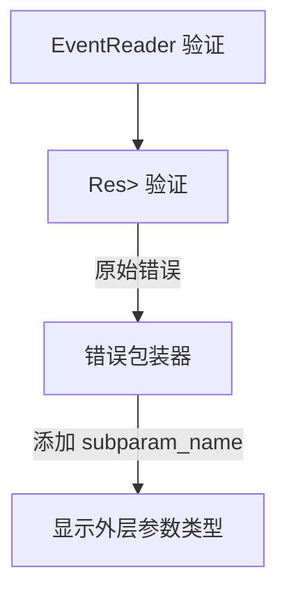

+++
title = "#18683 Improve error message for missing events"
date = "2025-04-02T00:00:00"
draft = false
template = "pull_request_page.html"
in_search_index = false

[extra]
current_language = "zh-cn"
available_languages = {"en" = { name = "English", url = "/pull_request/bevy/2025-04/pr-18683-en-20250402" }, "zh-cn" = { name = "中文", url = "/pull_request/bevy/2025-04/pr-18683-zh-cn-20250402" }}
labels = ["A-ECS", "C-Usability", "D-Straightforward"]
+++

# #18683 Improve error message for missing events

## Basic Information
- **Title**: Improve error message for missing events
- **PR Link**: https://github.com/bevyengine/bevy/pull/18683
- **Author**: chescock
- **Status**: MERGED
- **Labels**: `A-ECS`, `C-Usability`, `S-Ready-For-Final-Review`, `X-Uncontroversial`, `D-Straightforward`
- **Created**: 2025-04-02T15:31:38Z
- **Merged**: Not merged
- **Merged By**: N/A

## Description Translation
# Objective

改善 `Event(Reader|Writer|Mutator)` 的参数验证错误信息。

使用 `#[derive(SystemParam)]` 定义的系统参数（包括事件参数）当前会传播子参数的验证错误。错误信息包含失败参数的类型，因此结果错误中会显示子参数的类型而非派生参数的类型。

特别是 `EventReader<T>` 会报告来自 `Res<Events<T>>` 的错误，尽管用户根本没有该类型的参数！

这是对 #18593 的跟进。

## Solution

让通过 `#[derive]` 派生的系统参数在传播过程中映射错误，以报告外层参数类型。

为了继续提供上下文，向 `SystemParamValidationError` 添加一个字段，通过名称标识子参数，对于非 `#[derive]` 的参数则为空。

允许它们覆盖单个参数的失败消息。使用此功能将 "Resource does not exist" 转换为 "Event not initialized" 以适用于 `Event(Reader|Writer|Mutator)`。

## Showcase

当未调用 `add_event` 时，`EventReader<SomeEvent>` 参数的验证错误信息变化如下：

Before: 
```
Parameter `Res<Events<SomeEvent>>` failed validation: Resource does not exist
```

After
```
Parameter `EventReader<SomeEvent>::events` failed validation: Event not initialized
```

## The Story of This Pull Request

### 问题背景
在 Bevy ECS 的事件系统中，开发者使用 `EventReader<T>`、`EventWriter<T>` 和 `EventMutator<T>` 作为系统参数来访问事件。当事件资源 `Events<T>` 未初始化时，系统参数验证会产生令人困惑的错误信息。这是因为派生系统参数的验证错误会暴露内部使用的 `Res<Events<T>>` 类型，而不是开发者实际使用的参数类型。

### 技术挑战
核心问题在于错误传播机制：
1. 派生系统参数的验证错误直接传播子参数的错误
2. 错误信息中的类型与实际使用的参数类型不匹配
3. 现有机制无法自定义子参数的错误消息

例如，当 `EventReader<MyEvent>` 参数因缺少 `Events<MyEvent>` 资源而失败时，错误信息显示的是 `Res<Events<MyEvent>>` 的验证失败，这对开发者来说不够直观。

### 解决方案设计
PR 采用分层错误处理策略：
1. 在 `SystemParamValidationError` 中添加 `subparam_name` 字段
2. 修改 `#[derive(SystemParam)]` 的宏实现来包装子参数错误
3. 允许派生参数自定义子参数的验证消息

关键数据结构修改：
```rust
// 在 system_param.rs 中添加
pub struct SystemParamValidationError {
    pub param_type: TypeId,
    pub subparam_name: Option<&'static str>, // 新增字段
    pub message: &'static str,
}
```

### 实现细节
1. **错误包装机制**：当派生参数验证失败时，将子参数错误映射到外层参数类型
2. **自定义消息**：通过 `#[system_param(validation_message = "...")]` 属性覆盖默认消息
3. **名称追踪**：在宏展开时记录子参数名称用于错误报告

在事件参数中的具体应用：
```rust
// reader.rs 中的修改
pub struct EventReader<'w, 's, E: Event> {
    pub(super) reader: Local<'s, EventCursor<E>>,
    #[system_param(validation_message = "Event not initialized")] // 新增属性
    events: Res<'w, Events<E>>,
}
```

### 技术影响
1. **错误信息清晰度**：将通用资源错误转换为特定事件上下文
2. **开发者体验**：减少认知负荷，直接指出事件初始化问题
3. **可扩展性**：为其他派生系统参数提供错误定制模式

修改后的错误传播流程：


## Key Files Changed

### `crates/bevy_ecs/src/system/system_param.rs` (+60/-7)
- 新增错误映射逻辑
- 实现子参数名称追踪
- 修改验证错误结构

关键代码片段：
```rust
// Before:
fn validate(param_type: TypeId) -> Result<(), SystemParamValidationError> {
    // 直接返回子参数错误
}

// After:
fn validate(param_type: TypeId) -> Result<(), SystemParamValidationError> {
    // 包装错误并添加子参数名称
    child_error.map_err(|e| SystemParamValidationError {
        param_type: parent_type,
        subparam_name: Some("events"),
        message: e.message,
    })
}
```

### `crates/bevy_ecs/macros/src/lib.rs` (+35/-10)
- 扩展宏处理逻辑
- 支持 `validation_message` 属性
- 生成子参数名称信息

宏处理逻辑修改：
```rust
// 处理字段属性时新增
if let Some(msg) = find_validation_message(&field.attrs) {
    quote! { .override_message(#msg) }
}
```

### 事件相关文件 (`mutator.rs`, `reader.rs`, `writer.rs`)
- 添加验证消息属性

统一修改模式：
```rust
// 修改前:
#[system_param(...)]
events: Res<...>,

// 修改后:
#[system_param(validation_message = "Event not initialized")]
events: Res<...>,
```

## Further Reading
1. Bevy ECS System Param 文档: https://bevyengine.org/learn/book/ecs/system-params/
2. Rust 过程宏开发指南: https://doc.rust-lang.org/reference/procedural-macros.html
3. 错误处理最佳实践: https://rust-lang.github.io/api-guidelines/documentation.html#error-types-are-meaningful-and-well-behaved-c-good-err