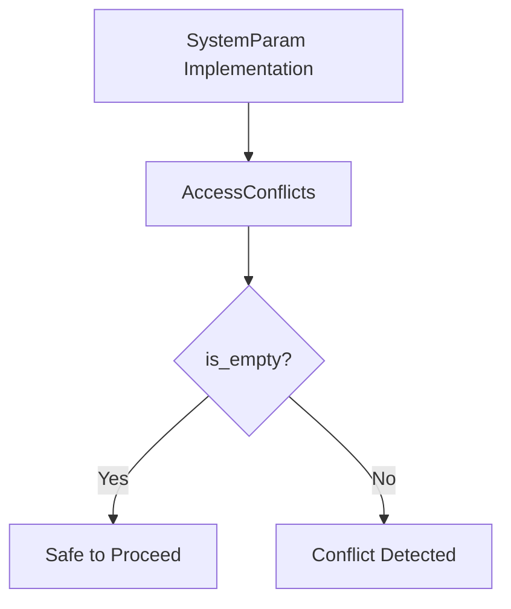

+++
title = "#18688 Make `AccessConflicts::is_empty` public"
date = "2025-04-28T00:00:00"
draft = false
template = "pull_request_page.html"
in_search_index = true

[taxonomies]
list_display = ["show"]

[extra]
current_language = "en"
available_languages = {"en" = { name = "English", url = "/pull_request/bevy/2025-04/pr-18688-en-20250428" }, "zh-cn" = { name = "中文", url = "/pull_request/bevy/2025-04/pr-18688-zh-cn-20250428" }}
labels = ["D-Trivial", "A-ECS"]
+++

# Make `AccessConflicts::is_empty` public

## Basic Information
- **Title**: Make `AccessConflicts::is_empty` public
- **PR Link**: https://github.com/bevyengine/bevy/pull/18688
- **Author**: angelthorns
- **Status**: MERGED
- **Labels**: D-Trivial, A-ECS, S-Ready-For-Final-Review
- **Created**: 2025-04-02T19:40:15Z
- **Merged**: 2025-04-28T22:08:44Z
- **Merged By**: mockersf

## Description Translation
# Objective

When implementing `SystemParam` for an object which contains a mutable reference to World, which cannot be derived due to a required lifetime parameter, it's necessary to check that there aren't any conflicts.

As far as I know, the is_empty method is the only way provided to check for no conflicts at all

## The Story of This Pull Request

The core challenge addressed in this PR stemmed from limitations in Bevy's ECS system when creating custom `SystemParam` implementations. Specifically, developers needing to implement system parameters containing mutable World references found themselves unable to properly validate access patterns due to the private visibility of a critical validation method.

In Bevy's ECS architecture, the `AccessConflicts` struct plays a key role in tracking potential system conflicts through its conflict detection mechanisms. The `is_empty` method serves as the primary indicator for whether any access conflicts exist. However, its previous `pub(crate)` visibility restricted usage to internal crate code, creating a barrier for external implementations that required conflict checking.

The solution emerged through a straightforward but impactful visibility modification. By changing the method's access modifier from `pub(crate)` to `pub`, developers gained the ability to:

1. Check for access conflicts when implementing custom system parameters
2. Validate safety conditions when working with direct World references
3. Maintain proper ECS safety invariants in external implementations

The implementation required careful consideration of Rust's visibility rules and Bevy's safety guarantees. While the code change itself was minimal, it involved:
- Verifying existing usage patterns
- Ensuring no breaking changes to public APIs
- Maintaining encapsulation of internal conflict tracking details

```rust
// Before (internal visibility)
pub(crate) fn is_empty(&self) -> bool { ... }

// After (public visibility with documentation)
/// Returns true if there are no conflicts present
pub fn is_empty(&self) -> bool { ... }
```

The added documentation comment clarifies the method's purpose while maintaining Bevy's standard for self-documenting code. This change preserves existing encapsulation of the `AccessConflicts` internals while exposing just enough surface area for external safety checks.

## Visual Representation



## Key Files Changed

### `crates/bevy_ecs/src/query/access.rs` (+2/-1)
**Change Summary**: Modified visibility and added documentation for `AccessConflicts::is_empty`

Before:
```rust
pub(crate) fn is_empty(&self) -> bool {
    match self {
        Self::All => false,
        Self::Individual(set) => set.is_empty(),
    }
}
```

After:
```rust
/// Returns true if there are no conflicts present
pub fn is_empty(&self) -> bool {
    match self {
        Self::All => false,
        Self::Individual(set) => set.is_empty(),
    }
}
```

This change enables external consumers of the `AccessConflicts` type to query its conflict status, which is essential when implementing custom system parameters that need to validate their access patterns against the ECS world state.

## Further Reading
1. [Bevy SystemParam Documentation](https://docs.rs/bevy-ecs/latest/bevy_ecs/system/trait.SystemParam.html)
2. [Rust Visibility Modifiers](https://doc.rust-lang.org/reference/visibility-and-privacy.html)
3. [Bevy ECS Access Control Patterns](https://bevyengine.org/learn/book/next/ecs/access/)