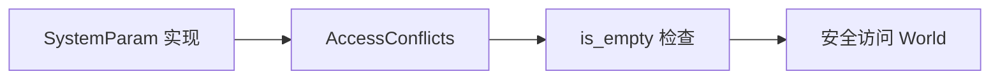

+++
title = "#18688 Make `AccessConflicts::is_empty` public"
date = "2025-04-28T00:00:00"
draft = false
template = "pull_request_page.html"
in_search_index = false

[extra]
current_language = "zh-cn"
available_languages = {"en" = { name = "English", url = "/pull_request/bevy/2025-04/pr-18688-en-20250428" }, "zh-cn" = { name = "中文", url = "/pull_request/bevy/2025-04/pr-18688-zh-cn-20250428" }}
labels = ["D-Trivial", "A-ECS"]
+++

# Make `AccessConflicts::is_empty` public

## Basic Information
- **Title**: Make `AccessConflicts::is_empty` public
- **PR Link**: https://github.com/bevyengine/bevy/pull/18688
- **Author**: angelthorns
- **Status**: MERGED
- **Labels**: D-Trivial, A-ECS, S-Ready-For-Final-Review
- **Created**: 2025-04-02T19:40:15Z
- **Merged**: 2025-04-28T22:08:44Z
- **Merged By**: mockersf

## Description Translation
### 目标

当为包含 World 可变引用（由于需要生命周期参数而无法自动派生）的对象实现 `SystemParam` 时，需要检查是否存在访问冲突。据我所知，`is_empty` 方法是目前唯一能完整检查无冲突的方法。

## The Story of This Pull Request

该 PR 解决的核心问题是如何在实现自定义 `SystemParam` 时安全地检查资源访问冲突。在 Bevy 的 ECS 架构中，当开发者需要创建包含 `World` 可变引用的系统参数时，必须确保该参数不会与其他系统产生资源访问冲突。原有的 `AccessConflicts::is_empty` 方法作为冲突检测的关键工具，其可见性被限制为 crate 内部（`pub(crate)`），导致外部实现 `SystemParam` 时无法进行必要的冲突验证。

解决方案直接而有效：将 `is_empty` 方法的可见性提升为公开（`pub`），并添加文档注释说明其用途。这个改动看似简单，却直接解决了开发者实现自定义系统参数时的关键痛点——缺乏官方提供的冲突检测接口。通过暴露这个方法，开发者现在可以：

1. 在实现 `SystemParam` 时主动检查访问冲突
2. 避免手动实现冲突检测逻辑可能引入的错误
3. 保持与 Bevy 内部冲突检测机制的一致性

技术实现层面，这个改动涉及两个关键修改点：可见性修饰符的调整和文档注释的添加。新的公共接口保持了原有实现的高效性——通过模式匹配快速判断冲突状态，时间复杂度为 O(1)。

```rust
// 修改后
pub fn is_empty(&self) -> bool {
    match self {
        Self::All => false,
        Self::Individual(set) => set.is_empty(),
    }
}
```

此修改对现有代码的影响极小，但为高级用例打开了新的可能性。特别是对于需要深度定制 ECS 交互模式的场景，开发者现在可以通过官方支持的 API 来实现安全的并发访问控制。

## Visual Representation



## Key Files Changed

### `crates/bevy_ecs/src/query/access.rs` (+2/-1)

**修改说明**：
1. 将 `is_empty` 方法的可见性从 crate 内部提升为公开
2. 添加文档注释说明方法用途

**代码对比**：
```rust
// 修改前
pub(crate) fn is_empty(&self) -> bool {
    match self {
        Self::All => false,
        Self::Individual(set) => set.is_empty(),
    }
}

// 修改后
/// Returns true if there are no conflicts present
pub fn is_empty(&self) -> bool {
    match self {
        Self::All => false,
        Self::Individual(set) => set.is_empty(),
    }
}
```

**关联性**：
- 公开此方法是实现 PR 目标的唯一必要修改
- 文档注释提高了 API 的可发现性和可维护性

## Further Reading

1. [Bevy ECS 系统参数文档](https://bevyengine.org/learn/book/next/ecs/system-params.html)
2. [Rust 可见性修饰符指南](https://doc.rust-lang.org/reference/visibility-and-privacy.html)
3. [Bevy 安全访问模式设计](https://github.com/bevyengine/bevy/blob/main/ARCHITECTURE.md#safety)

# Full Code Diff
diff --git a/crates/bevy_ecs/src/query/access.rs b/crates/bevy_ecs/src/query/access.rs
index 01e3713ad624d..a9cefc6996a08 100644
--- a/crates/bevy_ecs/src/query/access.rs
+++ b/crates/bevy_ecs/src/query/access.rs
@@ -952,7 +952,8 @@ impl AccessConflicts {
         }
     }
 
-    pub(crate) fn is_empty(&self) -> bool {
+    /// Returns true if there are no conflicts present
+    pub fn is_empty(&self) -> bool {
         match self {
             Self::All => false,
             Self::Individual(set) => set.is_empty(),