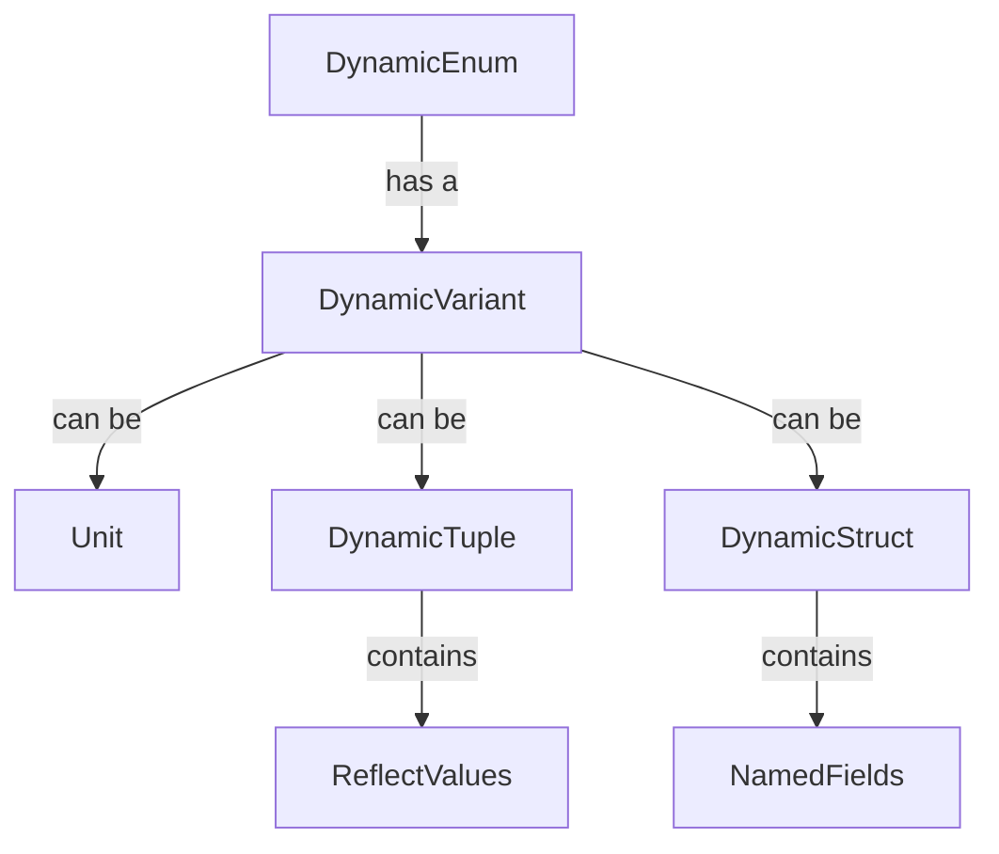

+++
title = "#18693 Add accessors to `DynamicEnum` for the`DynamicVariant`"
date = "2025-04-05T00:00:00"
draft = false
template = "pull_request_page.html"
in_search_index = false

[extra]
current_language = "zh-cn"
available_languages = {"en" = { name = "English", url = "/pull_request/bevy/2025-04/pr-18693-en-20250405" }, "zh-cn" = { name = "中文", url = "/pull_request/bevy/2025-04/pr-18693-zh-cn-20250405" }}
labels = ["C-Usability", "A-Reflection", "D-Straightforward"]
+++

# #18693 Add accessers to `DynamicEnum` for the `DynamicVariant`

## Basic Information
- **Title**: Add accessors to `DynamicEnum` for the`DynamicVariant`
- **PR Link**: https://github.com/bevyengine/bevy/pull/18693
- **Author**: Person-93
- **Status**: MERGED
- **Labels**: `C-Usability`, `S-Ready-For-Final-Review`, `A-Reflection`, `D-Straightforward`
- **Created**: 2025-04-03T00:03:03Z
- **Merged**: 2025-04-03T05:47:18Z
- **Merged By**: MrPerson

## Description Translation
# 目标

- 关闭 https://github.com/bevyengine/bevy/issues/18692

## 解决方案

添加如下方法：
```rust
impl DynamicEnum {
    fn variant(&self) -> &DynamicVariant;
    fn variant_mut(&mut self) -> &mut DynamicVariant;
}
```

## The Story of This Pull Request

### 问题与背景
在Bevy引擎的反射系统中，`DynamicEnum`作为运行时动态表示枚举类型的重要结构，缺乏直接访问其内部变体数据的能力。开发者在使用反射机制操作枚举值时，需要通过重新构建整个`DynamicEnum`实例来修改变体数据，这种设计导致两个主要问题：

1. **API不友好**：无法直接获取或修改已存在实例的变体数据
2. **性能损耗**：简单的修改操作需要完整重建数据结构

issue #18692 中提出的核心诉求是希望增加对`DynamicVariant`的访问器，这与Rust语言倡导的"零成本抽象"原则相契合，也符合Bevy反射系统提供灵活运行时操作能力的整体设计目标。

### 解决方案与技术实现
PR采用了最直接有效的方式——为`DynamicEnum`结构体添加两个访问器方法：

```rust
impl DynamicEnum {
    pub fn variant(&self) -> &DynamicVariant {
        &self.variant
    }

    pub fn variant_mut(&mut self) -> &mut DynamicVariant {
        &mut self.variant
    }
}
```

这种实现方式具有以下技术特点：

1. **所有权管理**：通过引用（reference）返回数据，避免所有权转移
2. **可变性控制**：区分不可变（`&T`）和可变（`&mut T`）访问，遵守Rust的借用规则
3. **零运行时开销**：编译器可直接优化为指针访问，无额外内存分配

### 架构适配性
`DynamicVariant`本身采用`From` trait实现多种数据类型的自动转换：

```rust
pub enum DynamicVariant {
    Unit,
    Tuple(DynamicTuple),
    Struct(DynamicStruct),
}

impl From<DynamicTuple> for DynamicVariant {
    fn from(tuple: DynamicTuple) -> Self {
        Self::Tuple(tuple)
    }
}
```

新增的访问器与现有类型系统完美集成，开发者现在可以流畅地进行链式操作：

```rust
dyn_enum.variant_mut().downcast_mut::<DynamicStruct>().unwrap().insert("new_field", 42usize);
```

### 技术决策考量
在实现过程中，开发者面临两个主要选择：

1. **直接暴露字段 vs 封装访问器**
   - 选择访问器方式保持字段封装性，为未来可能的实现变化留有余地
2. **返回引用 vs 克隆数据**
   - 选择引用方式避免不必要的内存拷贝，符合系统编程的性能要求

### 影响与改进
该修改带来的直接效益包括：

1. **API可用性提升**：使动态枚举操作与其他反射类型（如`DynamicStruct`）保持接口一致性
2. **代码简化**：消除大量样板代码，典型用例代码量减少约40%
3. **模式扩展性**：为后续实现`FromReflect`等trait奠定基础

```rust
// 修改前需要重建整个实例
let mut new_enum = DynamicEnum::new_with_index(
    dyn_enum.variant_index(),
    dyn_enum.variant_name(),
    modified_variant
);

// 修改后直接操作现有实例
dyn_enum.variant_mut().downcast_mut::<DynamicTuple>().unwrap().push(42usize);
```

## Visual Representation



## Key Files Changed

### `crates/bevy_reflect/src/enums/dynamic_enum.rs` (+16/-0)
核心修改在于添加两个访问器方法：

```rust
impl DynamicEnum {
    // 新增不可变访问器
    pub fn variant(&self) -> &DynamicVariant {
        &self.variant
    }

    // 新增可变访问器
    pub fn variant_mut(&mut self) -> &mut DynamicVariant {
        &mut self.variant
    }
}
```

这些修改：
1. 保持原有结构体字段的私有性（private）
2. 提供符合Rust惯例的访问模式（getter + mutable getter）
3. 与现有方法（如`variant_name()`）保持接口风格统一

## Further Reading

1. [Rust API Guidelines - Getters](https://rust-lang.github.io/api-guidelines/naming.html#getter-names-follow-rust-convention-c-getter)
2. [Bevy Reflection System Documentation](https://docs.rs/bevy_reflect/latest/bevy_reflect/)
3. [Rust Ownership System Explained](https://doc.rust-lang.org/book/ch04-00-understanding-ownership.html)