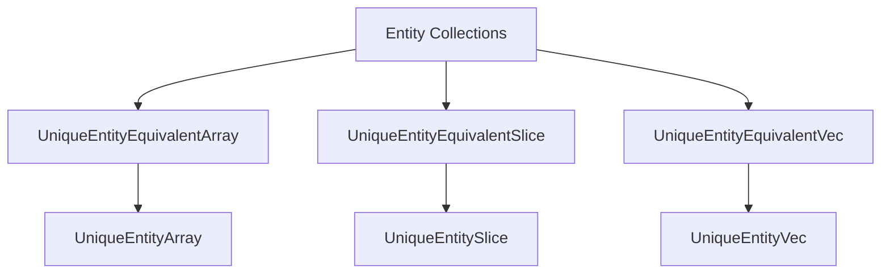

+++
title = "#18695 use entity set collections type aliases instead of defaults"
date = "2025-04-03T00:00:00"
draft = false
template = "pull_request_page.html"
in_search_index = true

[taxonomies]
list_display = ["show"]

[extra]
current_language = "en"
available_languages = {"en" = { name = "English", url = "/pull_request/bevy/2025-04/pr-18695-en-20250403" }, "zh-cn" = { name = "中文", url = "/pull_request/bevy/2025-04/pr-18695-zh-cn-20250403" }}
labels = ["A-ECS", "C-Usability", "D-Straightforward"]
+++

# #18695 use entity set collections type aliases instead of defaults

## Basic Information
- **Title**: use entity set collections type aliases instead of defaults
- **PR Link**: https://github.com/bevyengine/bevy/pull/18695
- **Author**: Victoronz
- **Status**: MERGED
- **Labels**: `A-ECS`, `C-Usability`, `S-Ready-For-Final-Review`, `D-Straightforward`
- **Created**: 2025-04-03T01:20:50Z
- **Merged**: Not merged
- **Merged By**: N/A

## Description Translation
# Objective

Newest installment of the #16547 series.

In #18319 we introduced `Entity` defaults to accomodate the most common use case for these types, however that resulted in the switch of the `T` and `N` generics of `UniqueEntityArray`.
Swapping generics might be somewhat acceptable for `UniqueEntityArray`, it is not at all acceptable for map and set types, which we would make generic over `T: EntityEquivalent` in #18408.

Leaving these defaults in place would result in a glaring inconsistency between these set collections and the others.

Additionally, the current standard in the engine is for "entity" to mean `Entity`. APIs could be changed to accept `EntityEquivalent`, however that is a separate and contentious discussion.

## Solution

Name these set collections `UniqueEntityEquivalent*`, and retain the `UniqueEntity*` name for an alias of the `Entity` case.
While more verbose, this allows for all generics to be in proper order, full consistency between all set types*, and the "entity" name to be restricted to `Entity`.
On top of that, `UniqueEntity*` now always have 1 generic less, when previously this was not enforced for the default case.

*`UniqueEntityIter<I: Iterator<T: EntityEquivalent>>` is the sole exception to this. Aliases are unable to enforce bounds (`lazy_type_alias` is needed for this), so for this type, doing this split would be a mere suggestion, and in no way enforced.
Iterator types are rarely ever named, and this specific one is intended to be aliased when it sees more use, like we do for the corresponding set collection iterators.
Furthermore, the `EntityEquivalent` precursor `Borrow<Entity>` was used exactly because of such iterator bounds!
Because of that, we leave it as is.

While no migration guide for 0.15 users, for those that upgrade from main:
`UniqueEntityVec<T>` -> `UniqueEntityEquivalentVec<T>`
`UniqueEntitySlice<T>` -> `UniqueEntityEquivalentSlice<T>`
`UniqueEntityArray<N, T>` -> `UniqueEntityEquivalentArray<T, N>`

## The Story of This Pull Request

The PR addresses a naming inconsistency in Bevy's ECS entity collection types that emerged from previous changes to generic parameters. The core issue stemmed from how generic type parameters were ordered in collection types like `UniqueEntityArray`, which became problematic when preparing to introduce more generic entity-equivalent types.

Previously, #18319 adjusted `UniqueEntityArray` to use `Entity` as a default type parameter, swapping the order of its generics from `<N, T>` to `<T, N>`. While this worked for arrays, it created an inconsistency pattern that would become untenable when introducing similar collection types (like maps and sets) that needed to support generic `EntityEquivalent` types. The team recognized that maintaining consistent generics ordering across all collection types was crucial for API clarity and developer ergonomics.

The solution restructures the naming scheme to clearly separate the common `Entity` case from generic `EntityEquivalent` scenarios. By renaming the base types to `UniqueEntityEquivalent*` and creating type aliases for the `Entity` specialization, the PR achieves three key goals:

1. Preserves natural generics ordering (`<T, N>` instead of `<N, T>`)
2. Maintains consistent naming across all entity collection types
3. Reduces cognitive load by keeping the common `Entity` case shorter

For example, the base array type becomes:
```rust
pub struct UniqueEntityEquivalentArray<T: EntityEquivalent, const N: usize>([T; N]);
```
With a type alias for the common case:
```rust
pub type UniqueEntityArray<const N: usize> = UniqueEntityEquivalentArray<Entity, N>;
```

This approach required updating 25+ type references across the codebase while maintaining backward compatibility through type aliases. The exception was `UniqueEntityIter`, which couldn't be properly aliased due to Rust's type system limitations around iterator bounds.

The changes particularly impacted three core areas:
1. **Collection Definitions**: Renamed structs and adjusted generics in array/slice/vec implementations
2. **Type Aliases**: Added clear aliases for the common `Entity` case
3. **API Surface**: Updated method signatures in query systems to use new types

A key technical decision was maintaining the `UniqueEntity*` prefix for the type aliases rather than creating completely new names. This preserves discoverability while making the more flexible `EntityEquivalent` variants explicitly opt-in through their longer names.

## Visual Representation



## Key Files Changed

### `crates/bevy_ecs/src/entity/unique_array.rs`
**Change**: Renamed base type and adjusted generics order
```rust
// Before:
pub struct UniqueEntityArray<T: EntityEquivalent, const N: usize>([T; N]);

// After:
pub struct UniqueEntityEquivalentArray<T: EntityEquivalent, const N: usize>([T; N]);
pub type UniqueEntityArray<const N: usize> = UniqueEntityEquivalentArray<Entity, N>;
```
**Purpose**: Establishes proper generics ordering for arrays while maintaining common case

### `crates/bevy_ecs/src/entity/unique_slice.rs`
**Change**: Restructured slice type hierarchy
```rust
// Before:
pub struct UniqueEntitySlice<T: EntityEquivalent>([T]);

// After:
pub struct UniqueEntityEquivalentSlice<T: EntityEquivalent>([T]);
pub type UniqueEntitySlice = UniqueEntityEquivalentSlice<Entity>;
```
**Impact**: Aligns slice types with new naming convention

### `crates/bevy_ecs/src/query/par_iter.rs`
**Change**: Updated type references in parallel iteration
```rust
// Before:
use super::{Entity, UniqueEntityVec};

// After:
use super::{Entity, UniqueEntityEquivalentVec};
```
**Reason**: Maintains type consistency across query systems

### `crates/bevy_ecs/src/entity/mod.rs`
**Change**: Re-exported aliases
```rust
// Added exports:
pub use unique_array::UniqueEntityArray;
pub use unique_slice::UniqueEntitySlice;
pub use unique_vec::UniqueEntityVec;
```
**Purpose**: Preserves existing public API while exposing new types

## Further Reading

1. [Rust Type Aliases RFC](https://github.com/rust-lang/rfcs/blob/master/text/2338-type-alias-enum-variants.md)
2. [Bevy ECS Entities Documentation](https://bevyengine.org/learn/book/next/ecs/entities/)
3. [Generic Type Parameter Ordering Best Practices](https://rust-lang.github.io/api-guidelines/naming.html#generic-type-parameters-are-ordered-by-increasing-restriction-c-generic)