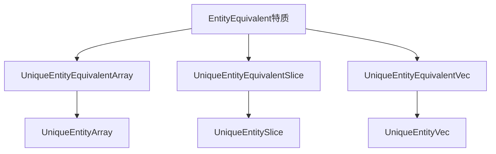

+++
title = "#18695 use entity set collections type aliases instead of defaults"
date = "2025-04-03T00:00:00"
draft = false
template = "pull_request_page.html"
in_search_index = false

[extra]
current_language = "zh-cn"
available_languages = {"en" = { name = "English", url = "/pull_request/bevy/2025-04/pr-18695-en-20250403" }, "zh-cn" = { name = "中文", url = "/pull_request/bevy/2025-04/pr-18695-zh-cn-20250403" }}
+++

# #18695 use entity set collections type aliases instead of defaults

## Basic Information
- **标题**: use entity set collections type aliases instead of defaults
- **PR链接**: https://github.com/bevyengine/bevy/pull/18695
- **作者**: Victoronz
- **状态**: MERGED
- **标签**: `A-ECS`, `C-Usability`, `S-Ready-For-Final-Review`, `D-Straightforward`
- **创建时间**: 2025-04-03T01:20:50Z
- **合并时间**: Not merged
- **合并者**: N/A

## 描述翻译
### 目标
作为#16547系列的最新进展，在#18319中我们引入了`Entity`默认类型来适配最常见的使用场景，但这导致`UniqueEntityArray`的泛型参数`T`和`N`顺序被交换。虽然这种交换对于`UniqueEntityArray`尚可接受，但对于后续计划在#18408中要实现的`T: EntityEquivalent`泛型映射和集合类型来说是完全不可接受的。

保留这些默认设置会导致这些集合类型与其他类型之间存在明显的不一致性。此外，当前引擎中的标准是"entity"特指`Entity`类型，虽然API可以改为接受`EntityEquivalent`，但这是另一个需要单独讨论的议题。

### 解决方案
将这些集合类型命名为`UniqueEntityEquivalent*`，并保留`UniqueEntity*`作为`Entity`特化版本的别名。这种方式虽然增加了名称长度，但保证了：
1. 所有泛型参数顺序正确
2. 所有集合类型之间保持完全一致
3. "entity"名称专用于`Entity`类型

同时，`UniqueEntity*`别名现在始终少一个泛型参数，这增强了类型系统的严谨性。对于迭代器类型`UniqueEntityIter`，由于技术限制无法通过别名强制类型约束，故保持原状。

迁移指南（针对从main分支升级）：
- `UniqueEntityVec<T>` → `UniqueEntityEquivalentVec<T>`
- `UniqueEntitySlice<T>` → `UniqueEntityEquivalentSlice<T>` 
- `UniqueEntityArray<N, T>` → `UniqueEntityEquivalentArray<T, N>`

## PR技术分析

### 问题背景与解决动因
在ECS模块的持续演进中，开发团队需要为实体集合类型引入更灵活的泛型支持。之前的实现通过类型默认值快速适配了`Entity`类型，但破坏了泛型参数的逻辑顺序（将容量参数`N`置于类型参数`T`之前）。这种设计在扩展到其他集合类型时会产生API不一致问题，特别是当需要支持`EntityEquivalent`特质时。

### 技术实现方案
核心方案是通过类型别名重构来实现两个目标：
1. **保持向后兼容**：保留原始类型名称作为`Entity`特化版本的别名
2. **统一泛型顺序**：新类型名称遵循`<T, N>`的泛型顺序规范

以`UniqueEntityArray`为例：
```rust
// 重构前
pub struct UniqueEntityArray<T, const N: usize>(...);

// 重构后
pub struct UniqueEntityEquivalentArray<T: EntityEquivalent, const N: usize>(...);
pub type UniqueEntityArray<const N: usize> = UniqueEntityEquivalentArray<Entity, N>;
```

### 关键代码变更
#### 集合类型定义重构
```rust
// crates/bevy_ecs/src/entity/unique_array.rs
// Before:
pub struct UniqueEntityArray<T, const N: usize>(...);

// After:
pub struct UniqueEntityEquivalentArray<T: EntityEquivalent, const N: usize>(...);
pub type UniqueEntityArray<const N: usize> = UniqueEntityEquivalentArray<Entity, N>;
```

#### 类型别名导出
```rust
// crates/bevy_ecs/src/entity/mod.rs
// 导出重构后的类型关系
pub use unique_array::{UniqueEntityArray, UniqueEntityEquivalentArray};
pub use unique_slice::{UniqueEntityEquivalentSlice, UniqueEntitySlice};
pub use unique_vec::{UniqueEntityEquivalentVec, UniqueEntityVec};
```

#### 查询系统适配
```rust
// crates/bevy_ecs/src/query/par_iter.rs
// 使用新的类型名称
use super::{QueryData, QueryFilter, QueryItem, QueryState, ReadOnlyQueryData};
use crate::entity::{EntityEquivalent, UniqueEntityEquivalentVec};
```

### 技术洞察
1. **类型系统设计**：通过`EntityEquivalent`特质实现编译时约束，确保集合元素的可比性和哈希一致性
2. **零成本抽象**：新类型使用`repr(transparent)`保证内存布局与底层类型一致，避免运行时开销
3. **API兼容策略**：类型别名机制在保持原有API的同时实现内部重构，最小化用户代码改动

### 影响分析
1. **代码可维护性**：统一了所有实体集合类型的泛型参数顺序，降低认知负担
2. **类型安全性**：通过`EntityEquivalent`特质约束，防止非实体类型被误用
3. **扩展性**：为未来支持更多`EntityEquivalent`实现类型奠定基础

## 可视化架构



## 关键文件变更

### crates/bevy_ecs/src/entity/unique_array.rs
1. **变更内容**：重构核心数组类型定义，添加类型别名
2. **代码示例**：
```rust
// 新类型定义
#[derive(Clone, Copy, Debug, Hash, PartialEq, Eq, PartialOrd, Ord)]
pub struct UniqueEntityEquivalentArray<T: EntityEquivalent, const N: usize>([T; N]);

// 类型别名
pub type UniqueEntityArray<const N: usize> = UniqueEntityEquivalentArray<Entity, N>;
```

### crates/bevy_ecs/src/entity/unique_slice.rs
1. **变更内容**：切片类型重构，保持与数组类型的一致性
2. **代码示例**：
```rust
#[repr(transparent)]
#[derive(Debug, Hash, PartialEq, Eq, PartialOrd, Ord)]
pub struct UniqueEntityEquivalentSlice<T: EntityEquivalent>([T]);

pub type UniqueEntitySlice = UniqueEntityEquivalentSlice<Entity>;
```

### crates/bevy_ecs/src/query/state.rs
1. **变更内容**：更新查询系统对实体集合类型的引用
2. **代码示例**：
```rust
use crate::entity::{Entity, EntityEquivalent, EntitySet, UniqueEntityArray};

#[cfg(all(not(target_arch = "wasm32"), feature = "multi_threaded"))]
use crate::entity::UniqueEntityEquivalentSlice;
```

## 延伸阅读
1. [Rust类型别名文档](https://doc.rust-lang.org/book/ch19-04-advanced-types.html#type-aliases-create-type-synonyms)
2. [Bevy ECS架构指南](https://bevy-cheatbook.github.io/programming/ecs-intro.html)
3. [泛型编程最佳实践](https://rust-lang.github.io/api-guidelines/future-proofing.html)