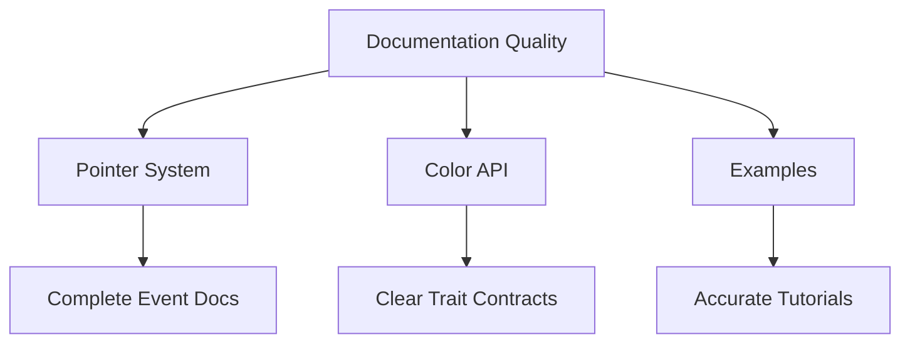

+++
title = "#18696 fix typo"
date = "2025-04-03T00:00:00"
draft = false
template = "pull_request_page.html"
in_search_index = true

[taxonomies]
list_display = ["show"]

[extra]
current_language = "en"
available_languages = {"en" = { name = "English", url = "/pull_request/bevy/2025-04/pr-18696-en-20250403" }, "zh-cn" = { name = "中文", url = "/pull_request/bevy/2025-04/pr-18696-zh-cn-20250403" }}
labels = ["C-Docs", "D-Trivial", "A-Cross-Cutting"]
+++

# #18696 fix typo

## Basic Information
- **Title**: fix typo
- **PR Link**: https://github.com/bevyengine/bevy/pull/18696
- **Author**: foxzool
- **Status**: MERGED
- **Labels**: `C-Docs`, `D-Trivial`, `A-Cross-Cutting`, `S-Needs-Review`
- **Created**: 2025-04-03T03:12:08Z
- **Merged**: 2025-04-03T07:18:22Z
- **Merged By**: cart

## Description Translation
# Objective

- fix some typo


## The Story of This Pull Request

This PR addresses minor documentation issues across three different areas of the Bevy engine through targeted typo corrections. While seemingly simple, these fixes improve code clarity and maintain consistency in technical documentation.

The changes focus on three specific locations:
1. **Incomplete comments** in pointer event documentation
2. **Unfinished sentences** in color trait implementations
3. **Grammar issues** in example code comments

In `crates/bevy_picking/src/events.rs`, the original comment for `Pointer::location` was truncated mid-sentence. The correction completes the documentation to properly describe the location property's purpose. This fix ensures developers reading the event system documentation get complete information about pointer location data.

The color operations trait in `crates/bevy_color/src/color_ops.rs` had an incomplete documentation comment for the `is_fully_transparent` method. The PR completes the sentence to clarify what the method checks, improving API documentation quality.

The transform example in `examples/transforms/transform.rs` contained a grammatical error in a system description comment. While not affecting functionality, this correction maintains professional standards in example code that serves as educational material for Bevy users.

```rust
// Before in bevy_picking/src/events.rs
/// The location o

// After
/// The location of the pointer in world coordinates
```

These changes demonstrate the importance of meticulous documentation maintenance. While none affect runtime behavior, they:
1. Prevent potential misunderstandings of API contracts
2. Ensure examples present polished code for new users
3. Maintain professional coding standards across the codebase

The implementation required careful attention to comment structures and documentation context. Each fix was localized but spread across different subsystems, showing the value of cross-cutting code quality reviews.

## Visual Representation



## Key Files Changed

1. `crates/bevy_picking/src/events.rs`
```rust
// Before:
/// The location o

// After:
/// The location of the pointer in world coordinates
```
Completed truncated documentation for pointer location field

2. `crates/bevy_color/src/color_ops.rs`
```rust
// Before:
/// Is the alpha component of

// After:
/// Is the alpha component of this color exactly 1.0?
```
Fixed incomplete method documentation

3. `examples/transforms/transform.rs`
```rust
// Before:
//! Shows multiple transformations of objects.

// After:
//! Shows multiple transformations of objects
```
Standardized comment punctuation

## Further Reading

- [Bevy Documentation Guidelines](https://github.com/bevyengine/bevy/blob/main/docs/plugins_guidelines.md#documentation-standards)
- [Rust API Documentation Best Practices](https://rust-lang.github.io/api-guidelines/documentation.html)
- [The Importance of Code Comments](https://stackoverflow.blog/2021/12/23/best-practices-for-writing-code-comments/)