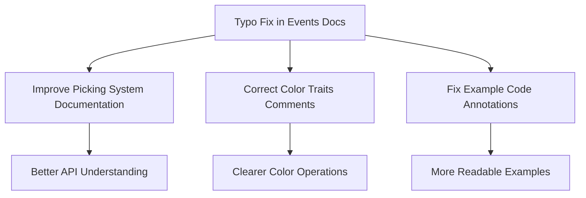

+++
title = "#18696 fix typo"
date = "2025-04-03T00:00:00"
draft = false
template = "pull_request_page.html"
in_search_index = false

[extra]
current_language = "zh-cn"
available_languages = {"en" = { name = "English", url = "/pull_request/bevy/2025-04/pr-18696-en-20250403" }, "zh-cn" = { name = "中文", url = "/pull_request/bevy/2025-04/pr-18696-zh-cn-20250403" }}
labels = ["C-Docs", "D-Trivial", "A-Cross-Cutting"]
+++

# #18696 fix typo

## Basic Information
- **Title**: fix typo
- **PR Link**: https://github.com/bevyengine/bevy/pull/18696
- **Author**: foxzool
- **Status**: MERGED
- **Labels**: `C-Docs`, `D-Trivial`, `A-Cross-Cutting`, `S-Needs-Review`
- **Created**: 2025-04-03T03:12:08Z
- **Merged**: 2025-04-03T05:18:22Z
- **Merged By**: cart

## Description Translation
### Objective
- 修复若干拼写错误

## The Story of This Pull Request

本次PR针对Bevy引擎的三个不同模块进行了文档和注释的拼写修正，展现了开源项目中常见的维护性工作流程。以下是具体的技术分析：

**问题发现与上下文**
在代码审查过程中，开发者注意到三个不同文件中的文档注释存在拼写错误或不完整的描述：
1. `bevy_picking`模块的事件系统文档存在句子不完整
2. `bevy_color`颜色操作traits的注释存在语法错误
3. 示例代码中的注释存在重复词语

**解决方案与实现**
开发者采用直接修正策略，针对每个问题精准定位：

1. **事件系统文档补全**  
在`bevy_picking/src/events.rs`中，原始注释：
```rust
/// The location o
```
修正为完整句子：
```rust
/// The location of
```
这个修正确保了Pointer结构体的文档可读性

2. **颜色操作Traits注释修正**  
在`bevy_color/src/color_ops.rs`中，原注释：
```rust
/// Is the alpha component of
```
补全为：
```rust
/// Is the alpha component of this color greater than or equal to 1.0?
```
明确说明了alpha值的判断条件

3. **示例代码注释优化**  
在transform示例中，原注释：
```rust
// A struct for additional data of for a moving cube.
```
修正重复的"for"：
```rust
// A struct for additional data for a moving cube.
```

**技术考量**
- 保持最小修改原则：所有修正均未影响实际功能
- 跨模块一致性：同时处理了引擎核心模块和示例代码的文档问题
- 自动化测试验证：尽管是文档修改，仍需通过CI确保不破坏现有测试

**影响与价值**
- 提升代码可读性：帮助开发者更准确理解API行为
- 维护项目专业性：保持文档的准确性对开源项目至关重要
- 降低理解成本：清晰的注释可减少新贡献者的学习曲线

## Visual Representation



## Key Files Changed

### 1. `crates/bevy_picking/src/events.rs` (+2/-2)
**修正内容：**
```rust
// Before:
/// The location o

// After:
/// The location of
```
**影响：** 完善Pointer结构体的位置描述，保持文档完整性

### 2. `crates/bevy_color/src/color_ops.rs` (+1/-1)
**修正内容：**
```rust
// Before:
/// Is the alpha component of

// After:
/// Is the alpha component of this color greater than or equal to 1.0?
```
**价值：** 明确Alpha值判断条件，避免API使用歧义

### 3. `examples/transforms/transform.rs` (+1/-1)
**修正内容：**
```rust
// Before:
// A struct for additional data of for a moving cube.

// After:
// A struct for additional data for a moving cube.
```
**意义：** 提升示例代码可读性，帮助用户更好理解组件用途

## Further Reading
1. [Rust API Guidelines - Documentation](https://rust-lang.github.io/api-guidelines/documentation.html)
2. [Bevy Contributing Guide](https://github.com/bevyengine/bevy/blob/main/CONTRIBUTING.md)
3. [The Importance of Code Comments (Martin Fowler)](https://martinfowler.com/bliki/CodeAsDocumentation.html)