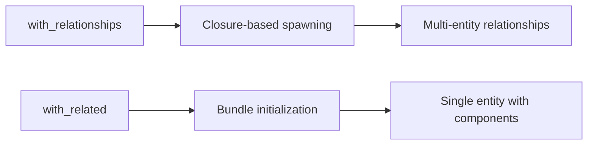

+++
title = "#18699 Change with_related to work with a Bundle and added with_relationships method"
date = "2025-04-09T00:00:00"
draft = false
template = "pull_request_page.html"
in_search_index = true

[taxonomies]
list_display = ["show"]

[extra]
current_language = "en"
available_languages = {"en" = { name = "English", url = "/pull_request/bevy/2025-04/pr-18699-en-20250409" }, "zh-cn" = { name = "中文", url = "/pull_request/bevy/2025-04/pr-18699-zh-cn-20250409" }}
labels = ["C-Feature", "A-ECS", "D-Straightforward"]
+++

# Change with_related to work with a Bundle and added with_relationships method

## Basic Information
- **Title**: Change with_related to work with a Bundle and added with_relationships method
- **PR Link**: https://github.com/bevyengine/bevy/pull/18699
- **Author**: Freyja-moth
- **Status**: MERGED
- **Labels**: C-Feature, A-ECS, S-Ready-For-Final-Review, D-Straightforward
- **Created**: 2025-04-03T09:03:43Z
- **Merged**: 2025-04-09T02:54:38Z
- **Merged By**: cart

## Description Translation
# Objective

Fixes #18678

## Solution

Moved the current `with_related` method to `with_relationships` and added a new `with_related` that uses a bundle.

I'm not entirely sold on the name just yet, if anyone has any ideas let me know.

## Testing

I wasn't able to test these changes because it crashed my computer every time I tried (fun). But there don't seem to be any tests that use the old `with_related` method so it should be fine, hopefully

## Showcase

```rust
commands.spawn_empty()
    .with_related::<Relationship>(Name::new("Related thingy"))
    .with_relationships(|rel| {
        rel.spawn(Name::new("Second related thingy"));
    });
```

## The Story of This Pull Request

The PR addresses a limitation in Bevy's Entity Component System (ECS) relationship API where the `with_related` method couldn't accept Bundles (collections of components). This forced users to add components individually when creating related entities, reducing ergonomics and flexibility.

The core technical problem stemmed from the original `with_related` implementation being designed for incremental component addition rather than bulk operations. The solution involved two key changes:

1. **API Renaming and Restructuring**:
   - Existing `with_related` was renamed to `with_relationships`
   - New `with_related` method was introduced with Bundle support

This approach maintained backward compatibility while expanding functionality. The implementation required modifying the underlying `AddRelated` trait to support Bundle types:

```rust
// Before: Component-focused implementation
pub trait AddRelated {
    fn add_related(&mut self, parent: Entity, child: Entity);
}

// After: Bundle support
pub trait AddRelated<B: Bundle> {
    fn add_related(&mut self, parent: Entity, child: Entity, bundle: B);
}
```

2. **Example Updates**:
The relationships example was modified to demonstrate both methods:
```rust
// Before
parent.with_related(|rel| {
    rel.spawn(Name::new("First"));
});

// After
parent.with_related::<Relationship>(Name::new("First"))
      .with_relationships(|rel| {
          rel.spawn(Name::new("Second"));
      });
```

Key technical considerations included:
- Maintaining existing closure-based API for multi-entity relationships
- Ensuring type safety through generic constraints
- Preserving command queue semantics for entity creation

The changes improve API consistency with Bevy's Bundle-centric design patterns while maintaining existing functionality. Developers can now choose between concise Bundle-based initialization or flexible closure-based setups for complex hierarchies.

## Visual Representation



## Key Files Changed

1. `crates/bevy_ecs/src/relationship/related_methods.rs`
```rust
// Before:
pub fn with_related<F: FnOnce(&mut RelatedBuilder)>(
    self,
    f: F
) -> Self { ... }

// After:
pub fn with_related<B: Bundle>(self, bundle: B) -> Self {
    self.add(AddRelated::new(bundle))
}

pub fn with_relationships<F: FnOnce(&mut RelatedBuilder)>(
    self,
    f: F
) -> Self { ... }
```

2. `examples/ecs/relationships.rs`
```rust
// Before:
parent.with_related(|rel| {
    rel.spawn(Name::new("First"));
});

// After:
parent.with_related::<Relationship>(Name::new("First"))
      .with_relationships(|rel| {
          rel.spawn(Name::new("Second"));
      });
```

3. `crates/bevy_ecs/src/spawn.rs`
```rust
// Modified trait implementation:
impl<'w, 's, B: Bundle> AddRelated<B> for EntityCommands<'w, 's> {
    fn add_related(&mut self, parent: Entity, child: Entity, bundle: B) {
        self.commands().add(AddChild {
            parent,
            child,
            bundle,
        });
    }
}
```

## Further Reading

1. Bevy ECS Relationships Guide:  
   https://bevyengine.org/learn/book/ecs/relationships/
2. Bundle Documentation:  
   https://docs.rs/bevy_ecs/latest/bevy_ecs/bundle/trait.Bundle.html
3. Entity Commands API Reference:  
   https://docs.rs/bevy_ecs/latest/bevy_ecs/system/struct.EntityCommands.html