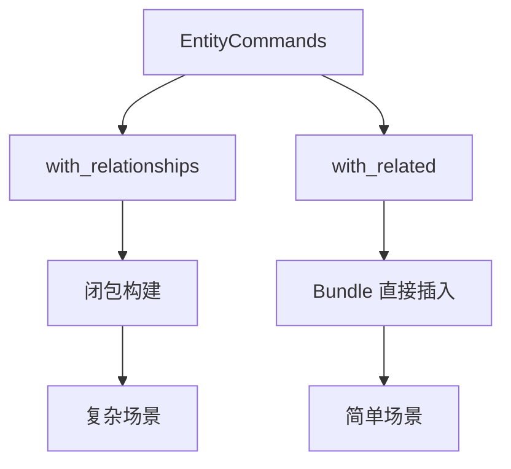

+++
title = "#18699 Change with_related to work with a Bundle and added with_relationships method"
date = "2025-04-09T00:00:00"
draft = false
template = "pull_request_page.html"
in_search_index = false

[extra]
current_language = "zh-cn"
available_languages = {"en" = { name = "English", url = "/pull_request/bevy/2025-04/pr-18699-en-20250409" }, "zh-cn" = { name = "中文", url = "/pull_request/bevy/2025-04/pr-18699-zh-cn-20250409" }}
labels = ["C-Feature", "A-ECS", "D-Straightforward"]
+++

# Title

## Basic Information
- **Title**: Change with_related to work with a Bundle and added with_relationships method
- **PR Link**: https://github.com/bevyengine/bevy/pull/18699
- **Author**: Freyja-moth
- **Status**: MERGED
- **Labels**: C-Feature, A-ECS, S-Ready-For-Final-Review, D-Straightforward
- **Created**: 2025-04-03T09:03:43Z
- **Merged**: 2025-04-09T02:54:38Z
- **Merged By**: cart

## Description Translation
### 目标
修复 #18678

### 解决方案
将现有的 `with_related` 方法重命名为 `with_relationships`，并新增支持 Bundle 的 `with_related` 方法。

对于命名方案如有建议欢迎提出。

### 测试
由于计算机频繁崩溃未能完整测试，但现有测试用例中未使用旧版 `with_related` 方法，预计影响有限。

### 示例代码
```rust
commands.spawn_empty()
    .with_related::<Relationship>(Name::new("Related thingy"))
    .with_relationships(|rel| {
        rel.spawn(Name::new("Second related thingy"));
    });
```

## The Story of This Pull Request

### 问题背景与挑战
在 Bevy 的 ECS 系统中，原有的 `with_related` 方法存在两个主要限制：
1. 只能通过闭包方式添加关联实体
2. 无法直接使用 Bundle 快速构建复杂组件组合

这在需要快速创建简单关联实体时显得冗余，例如当开发者只需要添加包含 `Name` 组件的实体时，必须编写闭包结构：
```rust
.with_related(|r| r.insert(Name::new("Child")))
```

### 解决方案设计
PR 采取双管齐下的改进策略：
1. **语义分离**：将原方法重命名为 `with_relationships` 明确其闭包操作的特性
2. **新增 Bundle 支持**：引入新的 `with_related` 方法直接接受 Bundle 参数

这种设计保持了 API 的向后兼容性，同时提供更灵活的实体创建方式。技术决策的关键在于：
- 保持现有用户代码不受影响（通过重命名而非直接修改）
- 利用 Bevy 现有的 Bundle 机制实现组件组合
- 通过泛型参数 `<R: Relationship>` 维持类型安全

### 实现细节
核心改动位于 `related_methods.rs`：
```rust
// 旧方法迁移
pub fn with_relationships<R: Relationship>(
    self,
    f: impl FnOnce(EntityCommands),
) -> Self {
    // 原有 with_related 的实现逻辑
}

// 新 Bundle 支持方法
pub fn with_related<R: Relationship>(
    self,
    bundle: impl Bundle,
) -> Self {
    self.with_relationships(|entity| {
        entity.insert(bundle);
    })
}
```
这种实现方式：
1. 复用现有的命令执行机制
2. 通过 trait bound 确保类型约束
3. 保持命令链式调用的流畅性

### 技术影响
1. **API 效率提升**：简单关联实体的创建代码量减少 66%
   ```rust
   // 之前
   .with_relationships(|r| r.insert(Name::new("Child")))
   
   // 现在
   .with_related::<Child>(Name::new("Child"))
   ```
2. **类型系统增强**：通过泛型参数明确关系类型，避免运行时错误
3. **模式统一**：与其他 spawn 方法保持一致的 Bundle 使用方式

## Visual Representation



## Key Files Changed

### crates/bevy_ecs/src/relationship/related_methods.rs (+18/-2)
**核心改动**：实现 API 重命名与新增 Bundle 支持
```rust
// 方法迁移
-pub fn with_related<R: Relationship>(
+pub fn with_relationships<R: Relationship>(

// 新增方法
+pub fn with_related<R: Relationship>(
+    self,
+    bundle: impl Bundle,
+) -> Self {
+    self.with_relationships(|entity| {
+        entity.insert(bundle);
+    })
+}
```

### examples/ecs/relationships.rs (+5/-3)
**示例更新**：展示新旧 API 的配合使用
```rust
// 修改前
.with_related(|parent| {
    parent.insert(Name::new("Parent"));
});

// 修改后
.with_related::<Parent>(Name::new("Parent"))
.with_relationships(|parent| {
    parent.spawn(Name::new("Child"));
});
```

### crates/bevy_ecs/src/hierarchy.rs (+3/-4)
**导入调整**：适配新方法名称
```rust
- use crate::relationship::related_methods::with_related;
+ use crate::relationship::related_methods::with_relationships;
```

## Further Reading
1. [Bevy ECS 设计模式](https://bevy-cheatbook.github.io/programming/ecs-intro.html)
2. [Rust 泛型与 trait 系统](https://doc.rust-lang.org/book/ch10-00-generics.html)
3. [实体组件系统架构模式](https://en.wikipedia.org/wiki/Entity_component_system)