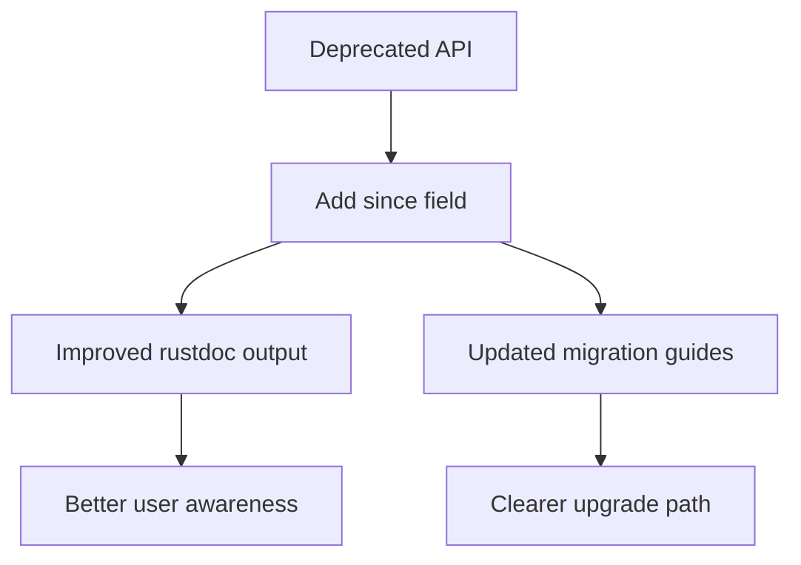

+++
title = "#18702 Add `#[deprecated(since = \"0.16.0\", ...)]` to items missing it"
date = "2025-04-03T00:00:00"
draft = false
template = "pull_request_page.html"
in_search_index = true

[taxonomies]
list_display = ["show"]

[extra]
current_language = "en"
available_languages = {"en" = { name = "English", url = "/pull_request/bevy/2025-04/pr-18702-en-20250403" }, "zh-cn" = { name = "中文", url = "/pull_request/bevy/2025-04/pr-18702-zh-cn-20250403" }}
labels = ["C-Docs", "D-Trivial", "A-Cross-Cutting"]
+++

# #18702 Add `#[deprecated(since = "0.16.0", ...)]` to items missing it

## Basic Information
- **Title**: Add `#[deprecated(since = "0.16.0", ...)]` to items missing it
- **PR Link**: https://github.com/bevyengine/bevy/pull/18702
- **Author**: BD103
- **Status**: MERGED
- **Labels**: `C-Docs`, `D-Trivial`, `S-Ready-For-Final-Review`, `A-Cross-Cutting`
- **Created**: 2025-04-03T14:51:12Z
- **Merged**: Not merged
- **Merged By**: N/A

## Description Translation
# Objective

- The `#[deprecated]` attributes supports a `since` field, which documents in which version an item was deprecated. This field is visible in `rustdoc`.
- We inconsistently use `since` throughout the project.

For an example of what `since` renders as, take a look at `ChildOf::get()`:

```rust
/// The parent entity of this child entity.
#[deprecated(since = "0.16.0", note = "Use child_of.parent() instead")]
#[inline]
pub fn get(&self) -> Entity {
    self.0
}
```


## Solution

- Add `since = "0.16.0"` to all `#[deprecated]` attributes that do not already use it.
- Add an example of deprecating a struct with the `since` field in the migration guide document.

I would appreciate if this could be included in 0.16's release, as its a low-risk documentation improvement that is valuable for the release, but I'd understand if this was cut.

## Testing

You can use `cargo doc` to inspect the rendered form of `#[deprecated(since = "0.16.0", ...)]`.

## The Story of This Pull Request

The PR addresses a documentation consistency issue in the Bevy engine related to deprecation notices. While Bevy already used Rust's `#[deprecated]` attribute for marking obsolete APIs, many instances lacked the `since` field that specifies the version when deprecation occurred. This field is crucial for users to understand how recently an API was deprecated and plan their migration accordingly.

The author identified two main problems:
1. Existing deprecation notices without `since` fields provided incomplete information
2. No clear example in migration guides demonstrating proper deprecation syntax

The solution involved a systematic update across multiple crates to add missing `since` parameters to deprecated items. For example, in `bevy_ecs`'s query system:

```rust
// Before:
#[deprecated(note = "Use `Query::get_many` instead.")]
pub fn get_many<const N: usize>(...) { ... }

// After:
#[deprecated(since = "0.16.0", note = "Use `Query::get_many` instead.")]
pub fn get_many<const N: usize>(...) { ... }
```

This change ensures rustdoc output clearly shows both the deprecation version and migration instructions. The PR also updated the migration guide documentation to demonstrate proper usage:

```markdown
## Example: Deprecating a struct

```rust
#[deprecated(
    since = "0.16.0",
    note = "Use `NewStruct` instead. See migration guide for details."
)]
struct OldStruct;
```

These changes improve API documentation consistency without affecting runtime behavior. The cross-cutting nature required modifications in multiple subsystems:
- Asset handling (`bevy_asset`)
- ECS core (`bevy_ecs`)
- Documentation guidelines

Key technical considerations included:
1. Maintaining exact version numbers for future reference
2. Preserving existing migration notes while adding version context
3. Ensuring doc comments remained compatible with rustdoc formatting
4. Updating examples to establish patterns for future deprecations

The implementation required careful auditing of all `#[deprecated]` attributes across the codebase. While mechanically simple, the changes have significant maintainability benefits by establishing consistent documentation practices.

## Visual Representation



## Key Files Changed

1. **crates/bevy_ecs/src/system/query.rs** (+10/-4)
- Added `since` parameters to deprecated query methods
- Example change:
```rust
// Before:
#[deprecated(note = "Use `DebugCheckedUnwrap` instead.")]

// After:
#[deprecated(since = "0.16.0", note = "Use `DebugCheckedUnwrap` instead.")]
```

2. **crates/bevy_asset/src/handle.rs** (+4/-1)
- Updated handle-related deprecations with version info
- Example:
```rust
#[deprecated(since = "0.16.0", note = "Use `Handle::id` instead")]
```

3. **release-content/migration_guides.md** (+5/-0)
- Added struct deprecation example
- Demonstrated proper use of both `since` and `note` fields

4. **crates/bevy_ecs/src/entity/mod.rs** (+3/-0)
- Enhanced entity-related deprecation notices:
```rust
#[deprecated(since = "0.16.0", note = "Use `EntityHashSet` instead")]
```

5. **crates/bevy_ecs/src/world/mod.rs** (+2/-0)
- Updated world API deprecations:
```rust
#[deprecated(since = "0.16.0", note = "Use `entity_mut` instead")]
```

## Further Reading

- [Rust Deprecated Attribute Documentation](https://doc.rust-lang.org/reference/attributes/diagnostics.html#the-deprecated-attribute)
- [Bevy Migration Guides](https://bevyengine.org/learn/migration-guides/)
- [rustdoc Output Formatting](https://doc.rust-lang.org/rustdoc/how-to-write-documentation.html)