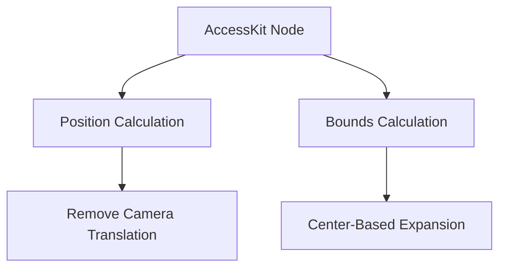

+++
title = "#18706 Fix AccessKit node bounds"
date = "2025-04-08T00:00:00"
draft = false
template = "pull_request_page.html"
in_search_index = true

[taxonomies]
list_display = ["show"]

[extra]
current_language = "en"
available_languages = {"en" = { name = "English", url = "/pull_request/bevy/2025-04/pr-18706-en-20250408" }, "zh-cn" = { name = "中文", url = "/pull_request/bevy/2025-04/pr-18706-zh-cn-20250408" }}
labels = ["C-Bug", "A-Accessibility", "A-UI"]
+++

# Fix AccessKit node bounds

## Basic Information
- **Title**: Fix AccessKit node bounds 
- **PR Link**: https://github.com/bevyengine/bevy/pull/18706
- **Author**: ickshonpe
- **Status**: MERGED
- **Labels**: C-Bug, A-Accessibility, A-UI, S-Ready-For-Final-Review
- **Created**: 2025-04-03T19:31:35Z
- **Merged**: 2025-04-08T02:00:11Z
- **Merged By**: cart

## Description Translation
# Objective

Fixes #18685

## Solution

* Don't apply the camera translation.
* Calculate the min and max bounds of the accessibility node rect taking the UI translation relative to its center not the top-left corner.

## Testing

Install [NVDA](https://www.nvaccess.org/). In NVDA set `Preferences -> Settings -> Vision -> Enable Highlighting`. 

Then run bevy's `tab_navigation` example:
```
cargo run --example tab_navigation
```
If everything is working correctly, NVDA should draw a border around the currently selected tab button:


## The Story of This Pull Request

The PR addresses an accessibility issue where screen reader visual highlights didn't match actual UI element positions in Bevy's UI system. The root cause was incorrect coordinate calculations for AccessKit nodes, which power Bevy's accessibility features.

In the original implementation, two key issues existed:
1. Camera translation was being applied to accessibility node positions
2. UI element bounds were calculated using top-left coordinates instead of center-based positioning

The camera translation misalignment occurred because accessibility nodes need screen-space coordinates, but the existing code subtracted camera translation from global positions. This double-counting of camera offset led to incorrect positioning when cameras weren't centered at (0,0).

For UI bounds calculation, Bevy UI uses center-based positioning, but the AccessKit integration incorrectly treated node positions as top-left origins. This resulted in bounds rectangles that were offset by half the element size.

The fix involved:
1. Removing camera translation from position calculations
2. Adjusting bounds computation to use center-based coordinates correctly

Key code changes in `accessibility.rs`:
```rust
// Before: Incorrect camera translation application
let position = global_transform.translation() - camera_transform.translation();
let min = position.truncate() - half_size;
let max = position.truncate() + half_size;

// After: Correct screen-space coordinates
let position = global_transform.translation().truncate();
let min = position - half_size;
let max = position + half_size;
```

This adjustment ensures accessibility nodes align with visual elements regardless of camera position. The bounds calculation fix properly accounts for Bevy UI's center-based layout system by expanding equally in all directions from the center point.

Testing with NVDA's element highlighting confirmed the fix. Developers can now verify accessibility features using standard tools without visual discrepancies. The changes maintain compatibility with Bevy's existing UI system while correcting the accessibility layer's spatial calculations.

## Visual Representation



## Key Files Changed

**crates/bevy_ui/src/accessibility.rs** (+10/-17)
```rust
// Before:
fn calculate_bounds(
    camera_transform: &GlobalTransform,
    node: &Node,
    global_transform: &GlobalTransform,
) -> Option<Rect> {
    let camera_position = camera_transform.translation().truncate();
    let position = global_transform.translation().truncate() - camera_position;
    let half_size = 0.5 * node.size();
    Some(Rect {
        min: position - half_size,
        max: position + half_size,
    })
}

// After:
fn calculate_bounds(node: &Node, global_transform: &GlobalTransform) -> Option<Rect> {
    let position = global_transform.translation().truncate();
    let half_size = 0.5 * node.size();
    Some(Rect {
        min: position - half_size,
        max: position + half_size,
    })
}
```

Key changes:
1. Removed camera transform parameter and camera position subtraction
2. Simplified function signature while maintaining correct bounds calculation
3. Preserved center-based coordinate system alignment with Bevy UI

## Further Reading

- [AccessKit Documentation](https://accesskit.dev/)
- [Bevy UI Layout System](https://bevyengine.org/learn/book/features/ui/)
- [NVDA Screen Reader Architecture](https://www.nvaccess.org/files/nvda/documentation/developerGuide.html)
- [WCAG 2.2 Accessibility Guidelines](https://www.w3.org/TR/WCAG22/)