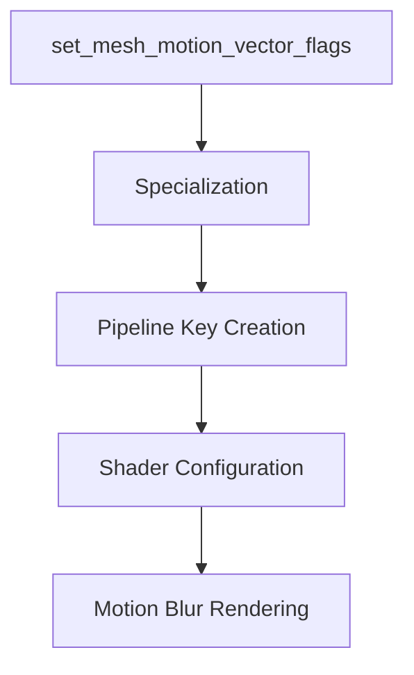

+++
title = "#18712 Fix motion blur on skinned meshes"
date = "2025-04-04T00:00:00"
draft = false
template = "pull_request_page.html"
in_search_index = true

[taxonomies]
list_display = ["show"]

[extra]
current_language = "en"
available_languages = {"en" = { name = "English", url = "/pull_request/bevy/2025-04/pr-18712-en-20250404" }, "zh-cn" = { name = "中文", url = "/pull_request/bevy/2025-04/pr-18712-zh-cn-20250404" }}
labels = ["C-Bug", "A-Rendering"]
+++

# #18712 Fix motion blur on skinned meshes

## Basic Information
- **Title**: Fix motion blur on skinned meshes
- **PR Link**: https://github.com/bevyengine/bevy/pull/18712
- **Author**: greeble-dev
- **Status**: MERGED
- **Labels**: `C-Bug`, `A-Rendering`
- **Created**: 2025-04-04T06:35:10Z
- **Merged**: 2025-04-05T14:22:31Z
- **Merged By**: cart

## Description Translation
**Objective**  
Fix motion blur not working on skinned meshes.  

**Solution**  
`set_mesh_motion_vector_flags` can set `RenderMeshInstanceFlags::HAS_PREVIOUS_SKIN` after specialization has already cached the material. This can lead to `MeshPipelineKey::HAS_PREVIOUS_SKIN` never getting set, disabling motion blur.  

The fix is to make sure `set_mesh_motion_vector_flags` happens before specialization.  

Note that the bug is fixed in a different way by #18074, which includes other fixes but is a much larger change.  

**Testing**  
Open the `animated_mesh` example and add these components to the `Camera3d` entity:  
```rust
MotionBlur {
    shutter_angle: 5.0,
    samples: 2,
    #[cfg(all(feature = "webgl2", target_arch = "wasm32", not(feature = "webgpu")))]
    _webgl2_padding: Default::default(),
},
#[cfg(all(feature = "webgl2", target_arch = "wasm32", not(feature = "webgpu")))]
Msaa::Off,
```  
Tested on `animated_mesh`, `many_foxes`, `custom_skinned_mesh`, Win10/Nvidia with Vulkan, WebGL/Chrome, WebGPU/Chrome. Note that testing `many_foxes` WebGL requires #18715.  

## The Story of This Pull Request

The problem stemmed from an ordering issue in Bevy's render pipeline. Skinned meshes requiring motion blur were missing critical pipeline flags due to system execution order. The motion blur effect relies on `MeshPipelineKey::HAS_PREVIOUS_SKIN` being set to include previous frame skinning data in shaders. However, the flag-setting logic in `set_mesh_motion_vector_flags` was running after material specialization, which caches pipeline state based on current flags.

The core issue manifested as:
1. Material specialization occurs first, caching pipeline state without `HAS_PREVIOUS_SKIN`
2. `set_mesh_motion_vector_flags` later adds `RenderMeshInstanceFlags::HAS_PREVIOUS_SKIN`
3. Subsequent frames use the cached pipeline state missing the required flag
4. Shaders don't receive previous skin data, breaking motion blur

The solution required reordering systems to ensure flag setting precedes specialization. This involved modifying system schedules in multiple PBR modules to enforce correct execution order:

```rust
// Before (problematic order):
app.add_systems(ExtractSchedule, (
    queue_material_meshes::<M>,
    set_mesh_motion_vector_flags,
));

// After (fixed order):
app.add_systems(ExtractSchedule, (
    set_mesh_motion_vector_flags,
    queue_material_meshes::<M>,
));
```

This simple but crucial ordering change ensures that when materials are queued for rendering:
1. Motion vector flags are already set
2. Specialization incorporates `HAS_PREVIOUS_SKIN` into pipeline keys
3. Shaders properly receive previous frame skin matrices
4. Motion blur calculations use correct historical data

The implementation required coordinated changes across three key areas of the rendering pipeline to maintain consistency in system ordering. While the code changes were small (+10/-8 lines total), they addressed a fundamental sequencing issue in the render graph.

## Visual Representation



## Key Files Changed

### `crates/bevy_pbr/src/prepass/mod.rs` (+7/-6)
**Purpose**: Ensure motion vector flags are set before queuing prepass materials  
Key change:
```rust
// Before:
app.add_systems(ExtractSchedule, (
    queue_material_meshes::<M>,
    set_mesh_motion_vector_flags,
));

// After:
app.add_systems(ExtractSchedule, (
    set_mesh_motion_vector_flags,
    queue_material_meshes::<M>,
));
```

### `crates/bevy_pbr/src/material.rs` (+2/-1)
**Purpose**: Synchronize main pass system ordering with prepass changes  
Key change:
```rust
// Before:
    )).add_systems(ExtractSchedule, (
        queue_material_meshes::<M>,
        set_mesh_motion_vector_flags,
    ));

// After:
    )).add_systems(ExtractSchedule, (
        set_mesh_motion_vector_flags,
        queue_material_meshes::<M>,
    ));
```

### `crates/bevy_pbr/src/render/mesh.rs` (+1/-1)
**Purpose**: Align mesh rendering system order with other changes  
Key change:
```rust
// Before:
        .add_systems(ExtractSchedule, extract_skins.after(set_mesh_motion_vector_flags))

// After:
        .add_systems(ExtractSchedule, extract_skins.before(set_mesh_motion_vector_flags))
```

## Further Reading
1. [Bevy System Scheduling Documentation](https://bevyengine.org/learn/book/getting-started/systems/)
2. [GPU Skinning Techniques](https://developer.nvidia.com/gpugems/gpugems3/part-iv-image-effects/chapter-27-motion-blur-post-processing-effect)
3. [Material Specialization in Bevy](https://bevyengine.org/examples/3d-rendering/material-specialization/)
4. [Motion Blur Implementation Patterns](https://www.advances.realtimerendering.com/s2021/jeschke_rt_motionblur_slides.pdf)