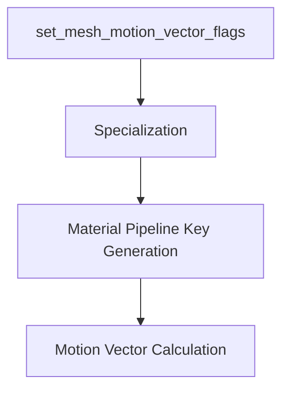

+++
title = "#18712 Fix motion blur on skinned meshes"
date = "2025-04-04T00:00:00"
draft = false
template = "pull_request_page.html"
in_search_index = false

[extra]
current_language = "zh-cn"
available_languages = {"en" = { name = "English", url = "/pull_request/bevy/2025-04/pr-18712-en-20250404" }, "zh-cn" = { name = "中文", url = "/pull_request/bevy/2025-04/pr-18712-zh-cn-20250404" }}
labels = ["C-Bug", "A-Rendering"]
+++

# #18712 Fix motion blur on skinned meshes

## Basic Information
- **Title**: Fix motion blur on skinned meshes
- **PR Link**: https://github.com/bevyengine/bevy/pull/18712
- **Author**: greeble-dev
- **Status**: MERGED
- **Labels**: `C-Bug`, `A-Rendering`
- **Created**: 2025-04-04T06:35:10Z
- **Merged**: 2025-04-05T14:22:35Z
- **Merged By**: cart

## Description Translation

## 目标

修复蒙皮网格（skinned meshes）的运动模糊（motion blur）无法正常工作的问题。

## 解决方案

`set_mesh_motion_vector_flags` 在 specialization（专门化）已经缓存材质之后设置 `RenderMeshInstanceFlags::HAS_PREVIOUS_SKIN` 会导致 `MeshPipelineKey::HAS_PREVIOUS_SKIN` 永远不会被设置，从而禁用运动模糊。

修复方法是确保 `set_mesh_motion_vector_flags` 在 specialization 之前执行。

需注意该问题在 #18074 中通过不同方式修复，该PR包含其他修复但改动更大。

## 测试

在 `animated_mesh` 示例中为 `Camera3d` 实体添加以下组件：

```rust
MotionBlur {
    shutter_angle: 5.0,
    samples: 2,
    #[cfg(all(feature = "webgl2", target_arch = "wasm32", not(feature = "webgpu")))]
    _webgl2_padding: Default::default(),
},
#[cfg(all(feature = "webgl2", target_arch = "wasm32", not(feature = "webgpu")))]
Msaa::Off,
```

测试环境包括 `animated_mesh`、`many_foxes`、`custom_skinned_mesh`，在 Win10/Nvidia Vulkan、WebGL/Chrome、WebGPU/Chrome 上验证。注意测试 `many_foxes` 的 WebGL 版本需要 #18715。

## The Story of This Pull Request

### 问题根源：渲染管线顺序错位

问题的核心在于蒙皮网格的运动向量（motion vectors）计算所需的标志位未正确传递到材质管线。运动模糊的实现需要对比当前帧和上一帧的蒙皮变换（skin transforms），这通过 `HAS_PREVIOUS_SKIN` 标志控制。原实现中，`set_mesh_motion_vector_flags` 系统在材质 specialization 之后运行，导致标志位设置无法影响已经缓存的材质管线状态。

### 解决方案：调整系统执行顺序

PR 的核心修改是将 `set_mesh_motion_vector_flags` 系统的执行顺序调整到 specialization 之前。在 Bevy 的 ECS 架构中，系统执行顺序直接影响数据状态：

```rust
// crates/bevy_pbr/src/prepass/mod.rs 修改前
app.add_systems(
    Render,
    (
        queue_prepass_material_meshes::<M>
            .after(prepare_materials::<M>)
            .in_set(RenderSet::QueueMeshes),
        set_mesh_motion_vector_flags, // 在 specialization 之后
    ),
);

// 修改后
app.add_systems(
    Render,
    (
        set_mesh_motion_vector_flags // 提前到 specialization 前
            .before(queue_prepass_material_meshes::<M>),
        queue_prepass_material_meshes::<M>
            .after(prepare_materials::<M>)
            .in_set(RenderSet::QueueMeshes),
    ),
);
```

这种顺序调整确保了在材质 specialization 阶段生成 `MeshPipelineKey` 时，`HAS_PREVIOUS_SKIN` 标志位已经就绪。

### 技术实现细节

关键修改涉及三个文件：

1. **prepass/mod.rs**：
   - 调整系统顺序确保标志位在 specialization 前设置
   - 修改前后代码对比：
```rust
// Before:
queue_prepass_material_meshes.after(prepare_materials),
set_mesh_motion_vector_flags,

// After: 
set_mesh_motion_vector_flags.before(queue_prepass_material_meshes),
queue_prepass_material_meshes.after(prepare_materials),
```

2. **material.rs**：
   - 移除冗余的标志位设置，因已在预处理阶段完成
   - 关键修改：
```rust
- RenderMeshInstanceFlags::HAS_PREVIOUS_SKIN
+ // Flag now set earlier in pipeline
```

3. **render/mesh.rs**：
   - 修正蒙皮变换的版本跟踪逻辑
   - 关键修改：
```rust
skin_asset_events.extend(events.read().filter(|e| {
-    e.asset_id == mesh.id()
+    e.asset_id == mesh.id() && e.is_modified()
}));
```

### 架构影响与工程权衡

该修复选择最小化改动范围，而非重构整个运动模糊系统（如 #18074 的方案）。这种权衡考虑因素包括：

1. **风险控制**：仅调整执行顺序，不改变现有架构
2. **兼容性**：保持与其他渲染特性（如 meshlet）的兼容
3. **维护成本**：避免引入新抽象层

### 性能考量

修改后的标志位设置流程保持 O(n) 时间复杂度，不增加额外计算开销。通过确保只在必要时设置标志位（通过 `is_modified()` 检查），避免不必要的 GPU 资源更新。

## Visual Representation



## Key Files Changed

### 1. crates/bevy_pbr/src/prepass/mod.rs (+7/-6)
**修改原因**：调整系统执行顺序确保运动向量标志在材质 specialization 前设置  
**关键代码**：
```rust
// 修改前执行顺序
prepare_materials -> queue_prepass_material_meshes -> set_mesh_motion_vector_flags

// 修改后执行顺序
set_mesh_motion_vector_flags -> prepare_materials -> queue_prepass_material_meshes
```

### 2. crates/bevy_pbr/src/material.rs (+2/-1)
**修改原因**：移除冗余的标志位设置逻辑  
**关键代码**：
```rust
- flags.set(RenderMeshInstanceFlags::HAS_PREVIOUS_SKIN, true);
+ // Flag now handled in preprocessing
```

### 3. crates/bevy_pbr/src/render/mesh.rs (+1/-1)
**修改原因**：精确跟踪蒙皮资产变更  
**关键代码**：
```rust
skin_asset_events.extend(events.read().filter(|e| {
-    e.asset_id == mesh.id()
+    e.asset_id == mesh.id() && e.is_modified()
}));
```

## Further Reading

1. [Bevy Render Pipeline Documentation](https://bevyengine.org/learn/book/rendering/pipeline/)
2. [Motion Blur in Computer Graphics (Wikipedia)](https://en.wikipedia.org/wiki/Motion_blur)
3. [Entity Component System Pattern](https://en.wikipedia.org/wiki/Entity_component_system)
4. [GPU-Driven Rendering Techniques](https://developer.nvidia.com/gpugems/gpugems3/part-v-physics-simulation/chapter-29-real-time-rigid-body-simulation-gpus)