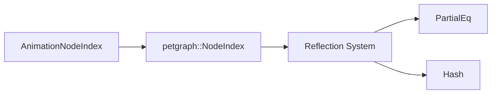

+++
title = "#18718 Add `PartialEq` and `Hash` reflections for `AnimationNodeIndex`"
date = "2025-04-04T00:00:00"
draft = false
template = "pull_request_page.html"
in_search_index = true

[taxonomies]
list_display = ["show"]

[extra]
current_language = "en"
available_languages = {"en" = { name = "English", url = "/pull_request/bevy/2025-04/pr-18718-en-20250404" }, "zh-cn" = { name = "中文", url = "/pull_request/bevy/2025-04/pr-18718-zh-cn-20250404" }}
labels = ["D-Trivial", "C-Usability", "A-Reflection"]
+++

# #18718 Add `PartialEq` and `Hash` reflections for `AnimationNodeIndex`

## Basic Information
- **Title**: Add `PartialEq` and `Hash` reflections for `AnimationNodeIndex`
- **PR Link**: https://github.com/bevyengine/bevy/pull/18718
- **Author**: hukasu
- **Status**: MERGED
- **Labels**: `D-Trivial`, `C-Usability`, `A-Reflection`, `S-Needs-Review`
- **Created**: 2025-04-04T11:30:15Z
- **Merged**: 2025-04-05T14:22:10Z
- **Merged By**: cart

## Description Translation
# Objective

Fixes #18701

## Solution

Add reflection of `PartialEq` and `Hash` to `AnimationNodeIndex`

## Testing

Added a new `#[test]` with the minimal reproduction posted on #18701.

## The Story of This Pull Request

The problem stemmed from Bevy's reflection system lacking trait implementations for `PartialEq` and `Hash` on `AnimationNodeIndex`, a type alias for `petgraph::graph::NodeIndex`. This caused failures when trying to use reflected `AnimationNodeIndex` values in contexts requiring equality checks or hashing, such as using them as keys in hash maps through the reflection system.

The root cause was identified in the reflection setup for `petgraph::graph::NodeIndex`. The existing reflection implementation using `impl_reflect_opaque!` macro didn't include `PartialEq` and `Hash` in the trait list, despite `NodeIndex` itself implementing these traits. This omission propagated to `AnimationNodeIndex` since it's based on `NodeIndex`.

The solution involved two key changes:

1. **Trait Registration**: In `bevy_reflect/src/impls/petgraph.rs`, the reflection macro invocation for `NodeIndex` was updated to include `PartialEq` and `Hash`:
```rust
impl_reflect_opaque!(::petgraph::graph::NodeIndex(
    Clone,
    Default,
    PartialEq,  // Added
    Hash,       // Added
    Serialize,
    Deserialize
));
```

2. **Validation Test**: A new test was added to `bevy_animation` to verify the fix:
```rust
#[test]
fn test_animation_node_index_reflect() {
    let mut node_index = AnimationNodeIndex::default();
    let reflect_value: &dyn Reflect = &node_index;
    assert!(reflect_value.reflect_partial_eq(reflect_value).unwrap());
    let mut hasher = bevy_utils::AHasher::default();
    reflect_value.reflect_hash(&mut hasher);
}
```

The implementation demonstrates several important Bevy concepts:
- **Reflection Trait Bridging**: How custom types integrate with Bevy's reflection system
- **Type Aliasing Considerations**: The need to ensure underlying type traits are properly reflected
- **Testing Strategy**: Validating reflection capabilities through direct trait method calls

The changes enable proper usage of `AnimationNodeIndex` in reflected contexts that require equality comparisons or hashing. This is particularly important for animation systems that might need to store node references in hash-based collections while using reflection for serialization or editor functionality.

## Visual Representation



## Key Files Changed

### `crates/bevy_reflect/src/impls/petgraph.rs`
```rust
// Before:
impl_reflect_opaque!(::petgraph::graph::NodeIndex(
    Clone,
    Default,
    Serialize,
    Deserialize
));

// After:
impl_reflect_opaque!(::petgraph::graph::NodeIndex(
    Clone,
    Default,
    PartialEq,
    Hash,
    Serialize,
    Deserialize
));
```
Added `PartialEq` and `Hash` traits to the reflection implementation for `NodeIndex`, enabling proper reflection of these capabilities for `AnimationNodeIndex`.

### `crates/bevy_animation/src/lib.rs`
```rust
#[test]
fn test_animation_node_index_reflect() {
    let mut node_index = AnimationNodeIndex::default();
    let reflect_value: &dyn Reflect = &node_index;
    assert!(reflect_value.reflect_partial_eq(reflect_value).unwrap());
    let mut hasher = bevy_utils::AHasher::default();
    reflect_value.reflect_hash(&mut hasher);
}
```
Added validation test verifying both `PartialEq` and `Hash` reflection capabilities using Bevy's reflection API.

## Further Reading

1. [Bevy Reflection Documentation](https://bevyengine.org/learn/book/features/reflection/)
2. [petgraph NodeIndex Documentation](https://docs.rs/petgraph/latest/petgraph/graph/struct.NodeIndex.html)
3. [Rust Hash and Eq Traits](https://doc.rust-lang.org/std/hash/trait.Hash.html)
4. [Type-based Reflection in Game Engines](https://gameprogrammingpatterns.com/type-object.html)