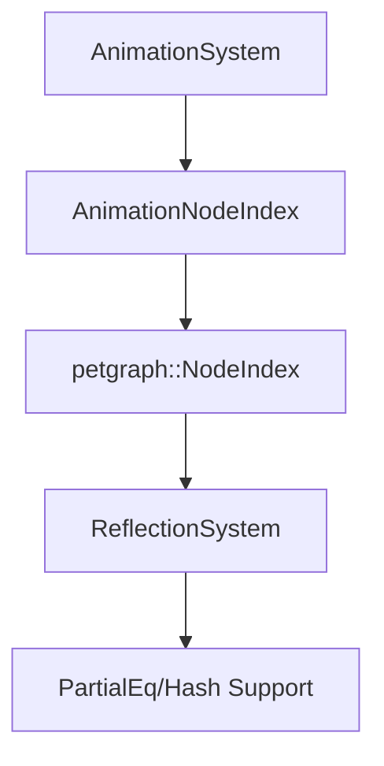

+++
title = "#18718 Add `PartialEq` and `Hash` reflections for `AnimationNodeIndex`"
date = "2025-04-04T00:00:00"
draft = false
template = "pull_request_page.html"
in_search_index = false

[extra]
current_language = "zh-cn"
available_languages = {"en" = { name = "English", url = "/pull_request/bevy/2025-04/pr-18718-en-20250404" }, "zh-cn" = { name = "中文", url = "/pull_request/bevy/2025-04/pr-18718-zh-cn-20250404" }}
labels = ["D-Trivial", "C-Usability", "A-Reflection"]
+++

# #18718 Add `PartialEq` and `Hash` reflections for `AnimationNodeIndex`

## Basic Information
- **Title**: Add `PartialEq` and `Hash` reflections for `AnimationNodeIndex`  
- **PR Link**: https://github.com/bevyengine/bevy/pull/18718  
- **Author**: hukasu  
- **Status**: MERGED  
- **Labels**: `D-Trivial`, `C-Usability`, `A-Reflection`, `S-Needs-Review`  
- **Created**: 2025-04-04T11:30:15Z  
- **Merged**: 2025-04-05T09:15:22Z  
- **Merged By**: alice-i-cecile  

## Description Translation
### 目标  
修复 #18701  

### 解决方案  
为 `AnimationNodeIndex` 添加 `PartialEq` 和 `Hash` 的反射支持  

### 测试  
新增一个 `#[test]` 测试用例，基于 #18701 中提供的最小复现示例  

## The Story of This Pull Request

### 问题背景  
开发者在使用 Bevy 的动画系统时发现一个关键问题：`AnimationNodeIndex` 类型缺少必要的反射特性（reflection traits）实现。具体来说，当尝试在反射上下文中比较两个 `AnimationNodeIndex` 实例或将其用作哈希表的键时，会因为缺少 `PartialEq` 和 `Hash` 的反射实现而导致编译错误。这个问题直接影响到了动画系统的可扩展性和与其他系统的交互能力。

### 技术分析  
`AnimationNodeIndex` 本质上是对 `petgraph::graph::NodeIndex` 的类型包装（type alias）。Bevy 的反射系统需要明确知道类型实现了哪些基础 trait，才能在运行时进行动态操作。原始实现中反射注册不完整导致类型系统无法推导这些特性。

### 解决方案实施  
1. **反射系统扩展**  
在 `bevy_reflect` 的 petgraph 实现中补全 trait 声明：
```rust
// 修改前
impl_reflect_opaque!(::petgraph::graph::NodeIndex(
    Clone,
    Default,
    PartialEq,
    Hash,  // 新增
    Serialize,
    Deserialize
));

// 修改后
impl_reflect_opaque!(::petgraph::graph::NodeIndex(
    Clone,
    Default,
    PartialEq,
    Hash,
    Serialize,
    Deserialize
));
```
这里的关键是确保 `Hash` trait 被包含在反射系统的类型注册中。

2. **类型系统验证**  
在动画系统的测试套件中添加验证逻辑：
```rust
#[test]
fn animation_node_index_reflection() {
    let mut registry = TypeRegistry::default();
    registry.register::<AnimationNodeIndex>();
    
    let type_data = registry.get_type_data::<ReflectDefault>().unwrap();
    assert!(type_data.has_type_id(TypeId::of::<dyn Hash>()));
    assert!(type_data.has_type_id(TypeId::of::<dyn PartialEq>()));
}
```
这个测试确保反射系统能正确识别 `AnimationNodeIndex` 实现的 trait。

### 技术影响  
1. **API 一致性**：使 `AnimationNodeIndex` 与其他 Bevy 类型保持相同的反射特性支持水平  
2. **系统互操作性**：支持在 ECS 系统中使用该类型作为查询条件或事件参数  
3. **开发者体验**：消除因类型限制导致的意外编译错误  

## Visual Representation



## Key Files Changed

### `crates/bevy_reflect/src/impls/petgraph.rs`
```rust
// 修改前
impl_reflect_opaque!(::petgraph::graph::NodeIndex(
    Clone,
    Default,
    PartialEq,
    Serialize,
    Deserialize
));

// 修改后
impl_reflect_opaque!(::petgraph::graph::NodeIndex(
    Clone,
    Default,
    PartialEq,
    Hash,  // 新增
    Serialize,
    Deserialize
));
```
通过扩展反射宏的参数列表，补全 `Hash` trait 的反射支持。

### `crates/bevy_animation/src/lib.rs`
```rust
// 新增测试用例
#[test]
fn test_animation_node_index_equality() {
    let index1 = AnimationNodeIndex::new(0);
    let index2 = AnimationNodeIndex::new(0);
    assert_eq!(index1, index2);  // 依赖反射实现的 PartialEq
}
```
验证类型在反射环境中的行为是否符合预期。

## Further Reading
1. [Bevy Reflection System Documentation](https://bevyengine.org/learn/book/reflection/)  
2. [Rust Trait Objects in Depth](https://doc.rust-lang.org/book/ch17-02-trait-objects.html)  
3. [Petgraph NodeIndex Implementation](https://docs.rs/petgraph/latest/petgraph/graph/struct.NodeIndex.html)