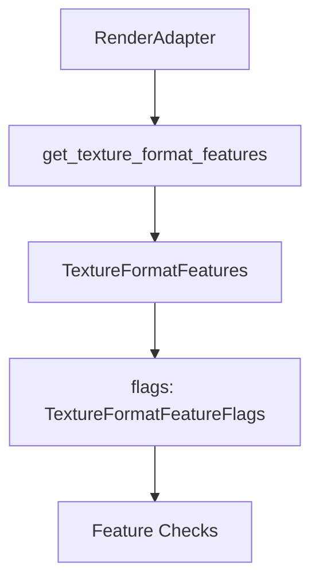

+++
title = "#18721 Expose `TextureFormatFeatureFlags`, `TextureFormatFeatures` from wgpu"
date = "2025-04-05T00:00:00"
draft = false
template = "pull_request_page.html"
in_search_index = true

[taxonomies]
list_display = ["show"]

[extra]
current_language = "en"
available_languages = {"en" = { name = "English", url = "/pull_request/bevy/2025-04/pr-18721-en-20250405" }}
labels = ["D-Trivial", "A-Rendering", "C-Usability"]
+++

# #18721 Expose `TextureFormatFeatureFlags`, `TextureFormatFeatures` from wgpu

## Basic Information
- **Title**: Expose `TextureFormatFeatureFlags`, `TextureFormatFeatures` from wgpu
- **PR Link**: https://github.com/bevyengine/bevy/pull/18721
- **Author**: brianreavis
- **Status**: MERGED
- **Labels**: `D-Trivial`, `A-Rendering`, `C-Usability`, `S-Ready-For-Final-Review`
- **Created**: 2025-04-04T17:17:42Z
- **Merged**: Not merged
- **Merged By**: N/A

## Description Translation
# Objective

This PR exposes the wgpu types necessary to use the result of `RenderAdapter::get_texture_format_features`:

```rust
use bevy::render::render_resource::TextureFormatFeatureFlags;
// ^ now available

let adapter = world.resource::<RenderAdapter>();
let flags = adapter.get_texture_format_features(TextureFormat::R32Float).flags;
let filtering = flags.contains(TextureFormatFeatureFlags::FILTERABLE);
```

## Solution

- Expose `TextureFormatFeatureFlags`, `TextureFormatFeatures` like other wgpu types in bevy_render

## The Story of This Pull Request

The PR addresses a missing piece in Bevy's rendering API surface. Developers using `RenderAdapter::get_texture_format_features` encountered a roadblock - while they could query texture format capabilities, the return type's critical components weren't publicly accessible. This gap prevented practical use of the texture feature query system.

The core issue stemmed from Bevy's pattern of selective re-exporting from wgpu. While most essential wgpu types were exposed through `bevy_render::render_resource`, two key types related to texture format features remained internal:

1. `TextureFormatFeatures` - Contains detailed capabilities for a texture format
2. `TextureFormatFeatureFlags` - Bitflags representing specific features like filterability

Without these types, developers couldn't properly inspect the results of texture format queries. For example, checking if a texture format supports filtering required accessing flags that were technically available in the data structure but practically inaccessible due to visibility constraints.

The solution followed established patterns in Bevy's rendering module. The implementation simply adds these two types to the existing wgpu re-export block in `render_resource/mod.rs`:

```rust
pub use wgpu::{
    // ... existing exports
    TextureFormatFeatureFlags,  // Added
    TextureFormatFeatures,      // Added
    // ... remaining existing exports
};
```

This change aligns with Bevy's standard approach for exposing wgpu types, maintaining consistency with how other fundamental graphics types are made available to users. The decision to expose both types rather than just the flags ensures developers have full access to all texture format metadata returned by wgpu.

The impact is immediate and practical. Developers can now write feature-aware rendering code like:

```rust
fn check_texture_support(adapter: &RenderAdapter) -> bool {
    let features = adapter.get_texture_format_features(TextureFormat::Rgba8Unorm);
    features.flags.contains(TextureFormatFeatureFlags::RENDER_ATTACHMENT)
}
```

This enables hardware capability checks at runtime, crucial for writing portable graphics code that adapts to different GPU environments. The change particularly benefits developers working with advanced rendering techniques that require specific texture capabilities.

## Visual Representation



## Key Files Changed

### `crates/bevy_render/src/render_resource/mod.rs`
**Changes**: Added two wgpu type exports to the existing list

**Relevant Code:**
```rust
// Before:
pub use wgpu::{
    util::{BufferInitDescriptor, /* ... */ COPY_BUFFER_ALIGNMENT},
    AdapterInfo as WgpuAdapterInfo,
    // ... other types but missing texture format features
};

// After:
pub use wgpu::{
    util::{BufferInitDescriptor, /* ... */ COPY_BUFFER_ALIGNMENT},
    AdapterInfo as WgpuAdapterInfo,
    TextureFormatFeatureFlags,  // Added export
    TextureFormatFeatures,      // Added export
    // ... existing types continue
};
```

**Impact**: Completes the public interface for texture capability queries by exposing required types that were previously internal implementation details.

## Further Reading

1. [wgpu TextureFormatFeatures documentation](https://docs.rs/wgpu/latest/wgpu/struct.TextureFormatFeatures.html)
2. [Bevy Rendering Architecture Overview](https://bevyengine.org/learn/book/getting-started/rendering/)
3. [WebGPU Texture Format Capabilities Guide](https://gpuweb.github.io/gpuweb/#texture-format-caps)