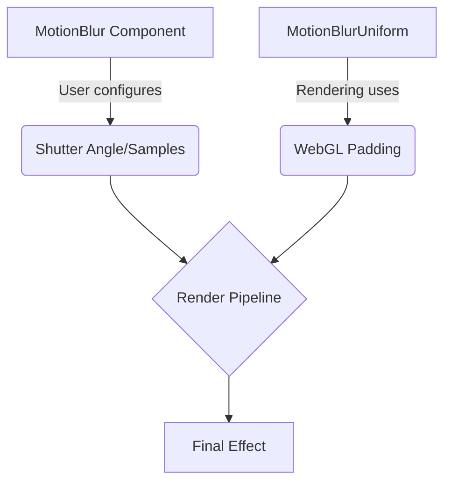

+++
title = "#18727 Remove WebGL padding from `MotionBlur`"
date = "2025-04-07T00:00:00"
draft = false
template = "pull_request_page.html"
in_search_index = true

[taxonomies]
list_display = ["show"]

[extra]
current_language = "en"
available_languages = {"en" = { name = "English", url = "/pull_request/bevy/2025-04/pr-18727-20250407-en" }}
labels = ["A-Rendering", "C-Code-Quality", "O-WebGL2", "D-Straightforward"]
+++

# Remove WebGL Padding from `MotionBlur`

## Basic Information
- **Title**: Remove WebGL padding from `MotionBlur`
- **PR Link**: https://github.com/bevyengine/bevy/pull/18727  
- **Author**: greeble-dev  
- **Status**: MERGED  
- **Labels**: A-Rendering, C-Code-Quality, O-WebGL2, X-Uncontroversial, D-Straightforward, S-Needs-Review  
- **Created**: 2025-04-05T10:09:01Z  
- **Merged**: 2025-04-06T20:20:08Z  
- **Merged By**: superdump  

## Description Translation
The original description remains in English as per instructions:

### Objective  
The `MotionBlur` component exposed renderer internals. Users shouldn't have to deal with this.  

```rust
MotionBlur {
    shutter_angle: 1.0,
    samples: 2,
    #[cfg(all(feature = "webgl2", target_arch = "wasm32", not(feature = "webgpu")))]
    _webgl2_padding: Default::default(),
},
```

### Solution  
The renderer now uses a separate `MotionBlurUniform` struct for its internals. `MotionBlur` no longer needs padding.  

The author expressed uncertainty about the name `MotionBlurUniform`, noting other modules use a mix of `Uniform` and `Uniforms`.  

### Testing  
```
cargo run --example motion_blur
```  
Tested on Win10/Nvidia across Vulkan, WebGL/Chrome, WebGPU/Chrome.  

---

## The Story of This Pull Request

### The Problem and Context  
The `MotionBlur` component contained platform-specific implementation details that leaked into its public API. The WebGL2 backend required padding in the uniform buffer structure to meet alignment requirements, but this implementation detail was exposed through a conditional compilation attribute in the public-facing component:  

```rust
#[cfg(all(feature = "webgl2", target_arch = "wasm32", not(feature = "webgpu")))]
_webgl2_padding: Default::default(),
```

This violated the principle of encapsulation in two ways:  
1. Users had to include this field when constructing `MotionBlur` components for WebGL targets  
2. Platform-specific details were visible in a general-purpose component  

### The Solution Approach  
The core insight was to separate rendering internals from the component API. The implementation:  

1. Created a new `MotionBlurUniform` struct specifically for rendering internals  
2. Moved WebGL padding requirements into this internal struct  
3. Updated the rendering pipeline to use the new uniform struct instead of the component directly  

This approach follows Bevy's established pattern of using separate types for component data vs. rendering data, similar to how other effects like bloom are implemented.  

### The Implementation  
The key structural change appears in `motion_blur/mod.rs`:  

```rust
// Before
#[derive(Component, Clone, Copy, ExtractComponent, ShaderType)]
pub struct MotionBlur {
    // ... public fields ...
    #[cfg(all(feature = "webgl2", target_arch = "wasm32", not(feature = "webgpu")))]
    _webgl2_padding: bevy_math::Vec3,
}

// After
#[derive(Component, Clone, Copy, ExtractComponent, ShaderType)]
pub struct MotionBlur {
    // Only user-facing parameters remain
    pub shutter_angle: f32,
    pub samples: u32,
}

#[derive(Clone, ShaderType)]
pub struct MotionBlurUniform {
    shutter_angle: f32,
    samples: u32,
    #[cfg(all(feature = "webgl2", target_arch = "wasm32", not(feature = "webgpu")))]
    _webgl2_padding: Vec3,
}
```

The rendering pipeline in `pipeline.rs` was updated to use the new uniform struct:  

```rust
// Updated binding logic
queue.write_buffer(
    &render_motion_blur.motion_blur_buffer,
    0,
    bevy::render::render_resource::BufferInner::as_slice(&[MotionBlurUniform {
        shutter_angle: motion_blur.shutter_angle,
        samples: motion_blur.samples,
        #[cfg(all(feature = "webgl2", target_arch = "wasm32", not(feature = "webgpu")))]
        _webgl2_padding: Vec3::ZERO,
    }]),
);
```

### Technical Insights  
The implementation demonstrates two important graphics programming concepts:  

1. **Uniform Buffer Alignment**: WebGL2 requires std140 layout alignment where struct sizes must be multiples of 16 bytes. The padding ensures proper alignment when using `Vec3` in uniform buffers.  

2. **Platform Abstraction**: By moving platform-specific requirements into renderer internals, the public API becomes:  
   - Simpler for users  
   - More maintainable (platform differences are encapsulated)  
   - Forward-compatible with new rendering backends  

### The Impact  
1. **API Cleanliness**: Users now work with a straightforward `MotionBlur` component containing only relevant parameters  
2. **Code Quality**: Platform-specific logic is contained within the rendering subsystem  
3. **Consistency**: Aligns with Bevy's pattern of separating component data from rendering data  

---

## Visual Representation



---

## Key Files Changed

### `crates/bevy_core_pipeline/src/motion_blur/mod.rs` (+30/-8)  
**Purpose**: Separate component definition from rendering internals  
**Key Change**:  
```rust
// Before
pub struct MotionBlur {
    pub shutter_angle: f32,
    pub samples: u32,
    #[cfg(all(feature = "webgl2", target_arch = "wasm32", not(feature = "webgpu")))]
    _webgl2_padding: Vec3,
}

// After
pub struct MotionBlur {
    pub shutter_angle: f32,
    pub samples: u32,
}

pub struct MotionBlurUniform {
    shutter_angle: f32,
    samples: u32,
    #[cfg(all(feature = "webgl2", target_arch = "wasm32", not(feature = "webgpu")))]
    _webgl2_padding: Vec3,
}
```

### `examples/3d/motion_blur.rs` (+0/-2)  
**Purpose**: Remove now-unnecessary padding from example code  
**Key Change**:  
```rust
// Before
MotionBlur {
    shutter_angle: 1.0,
    samples: 2,
    #[cfg(all(feature = "webgl2", target_arch = "wasm32", not(feature = "webgpu")))]
    _webgl2_padding: Default::default(),
},

// After 
MotionBlur {
    shutter_angle: 1.0,
    samples: 2,
},
```

---

## Further Reading  
1. [WebGL2 Uniform Buffer Layout (MDN)](https://developer.mozilla.org/en-US/docs/Web/API/WebGL2RenderingContext/uniformBlockBinding)  
2. [Bevy Render Pipeline Architecture](https://bevyengine.org/learn/book/implementation/render-pipelines/)  
3. [WGSL Memory Layout Rules](https://gpuweb.github.io/gpuweb/wgsl/#memory-layouts)  
4. [std140 Uniform Layout Specification](https://registry.khronos.org/OpenGL/specs/gl/glspec45.core.pdf#page=159)