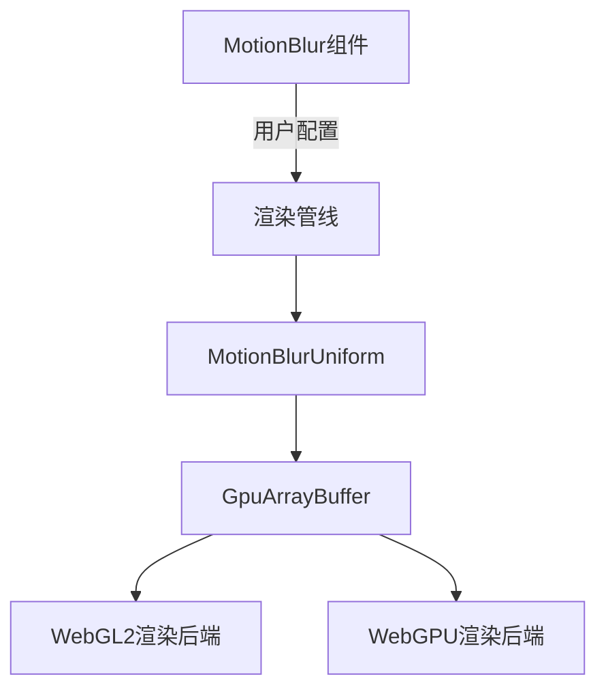

+++
title = "#18727 Remove WebGL padding from `MotionBlur"
date = "2025-04-07T00:00:00"
draft = false
template = "pull_request_page.html"
in_search_index = false

[extra]
current_language = "zh-cn"
available_languages = {"en" = { name = "English", url = "/pull_request/bevy/2025-04/pr-18727-en-20250407" }, "zh-cn" = { name = "中文", url = "/pull_request/bevy/2025-04/pr-18727-zh-cn-20250407" }}
+++

# Remove WebGL padding from `MotionBlur`

## 基本信息
- **标题**: Remove WebGL padding from `MotionBlur`
- **PR链接**: https://github.com/bevyengine/bevy/pull/18727
- **作者**: greeble-dev
- **状态**: 已合并
- **标签**: A-Rendering, C-Code-Quality, O-WebGL2, X-Uncontroversial, D-Straightforward, S-Needs-Review
- **创建时间**: 2025-04-05T10:09:01Z
- **合并时间**: 2025-04-06T20:20:08Z
- **合并者**: superdump

## 描述翻译

### 目标
`MotionBlur` 组件暴露了渲染器内部实现细节，用户不应直接处理这些内容。

```rust
MotionBlur {
    shutter_angle: 1.0,
    samples: 2,
    #[cfg(all(feature = "webgl2", target_arch = "wasm32", not(feature = "webgpu")))]
    _webgl2_padding: Default::default(),
},
```

### 解决方案
渲染器现在使用独立的 `MotionBlurUniform` 结构体来处理内部数据。`MotionBlur` 不再需要填充字段。

对于 `MotionBlurUniform` 的命名存在一定考虑，其他模块中混合使用了 `Uniform` 和 `Uniforms` 两种命名方式。

### 测试
```
cargo run --example motion_blur
```
已在 Win10/Nvidia 平台测试 Vulkan、WebGL/Chrome 和 WebGPU/Chrome 环境。

## PR 技术分析

### 问题背景与解决思路
在 WebGL2 环境下，`MotionBlur` 组件需要添加 `_webgl2_padding` 填充字段来满足内存对齐要求。这个实现细节暴露给用户端代码，导致两个主要问题：

1. **接口污染**：用户需要处理平台特定的内部实现细节
2. **代码冗余**：条件编译指令污染组件定义

```rust
// 原问题代码示例
#[cfg(all(feature = "webgl2", target_arch = "wasm32", not(feature = "webgpu")))]
_webgl2_padding: Default::default(),
```

### 技术实现方案
核心解决方案是将渲染器内部数据与用户接口解耦：

1. **引入 `MotionBlurUniform`**：新建专门用于存储渲染器内部数据（含 padding）的结构体
2. **重构组件结构**：从 `MotionBlur` 移除所有平台特定字段
3. **统一内存管理**：通过 `GpuArrayBuffer` 自动处理内存对齐

关键代码改动在 `mod.rs` 中：
```rust
// 新增 Uniform 结构体
#[derive(Component, ShaderType, Clone)]
pub struct MotionBlurUniform {
    samples: u32,
    shutter_angle: f32,
    #[cfg(all(feature = "webgl2", target_arch = "wasm32", not(feature = "webgpu")))]
    _webgl2_padding: f32,
}

// 用户接口简化为
#[derive(Component, Clone, Copy, Reflect)]
#[reflect(Component)]
pub struct MotionBlur {
    pub shutter_angle: f32,
    pub samples: u32,
}
```

### 架构改进点
1. **关注点分离**：用户配置与渲染数据完全解耦
2. **自动内存对齐**：通过 `GpuArrayBuffer` 的 `push()` 方法自动处理内存布局
3. **跨平台兼容**：平台特定实现细节完全封装在渲染管线内部

```rust
// 更新后的 uniform 数据准备逻辑
let motion_blur_uniform = MotionBlurUniform {
    samples: motion_blur.samples,
    shutter_angle: motion_blur.shutter_angle,
    #[cfg(all(feature = "webgl2", target_arch = "wasm32", not(feature = "webgpu")))]
    _webgl2_padding: 0.0,
};

motion_blur_buffer.push(motion_blur_uniform);
```

### 影响与收益
1. **用户接口净化**：消除平台特定符号和条件编译指令
2. **代码可维护性**：统一管理渲染器内部数据结构
3. **扩展性提升**：为后续 motion blur 效果优化奠定结构基础

## 架构关系图



## 关键文件变更

### `crates/bevy_core_pipeline/src/motion_blur/mod.rs`
```rust
// 新增 Uniform 结构体
#[derive(Component, ShaderType, Clone)]
pub struct MotionBlurUniform {
    samples: u32,
    shutter_angle: f32,
    #[cfg(all(feature = "webgl2", target_arch = "wasm32", not(feature = "webgpu")))]
    _webgl2_padding: f32,
}

// 简化后的用户组件
#[derive(Component, Clone, Copy, Reflect)]
#[reflect(Component)]
pub struct MotionBlur {
    pub shutter_angle: f32,
    pub samples: u32,
}
```

### `examples/3d/motion_blur.rs`
```rust
// 修改前
MotionBlur {
    shutter_angle: 1.0,
    samples: 2,
    #[cfg(all(feature = "webgl2", target_arch = "wasm32", not(feature = "webgpu")))]
    _webgl2_padding: Default::default(),
}

// 修改后
MotionBlur {
    shutter_angle: 1.0,
    samples: 2,
}
```

## 延伸阅读
1. [WebGL2 Uniform Buffer Object 规范](https://www.khronos.org/registry/webgl/specs/latest/2.0/)
2. [WGSL 内存布局规则](https://gpuweb.github.io/gpuweb/wgsl/#memory-layouts)
3. [Bevy ECS 组件设计模式](https://bevyengine.org/learn/book/features/ecs/)
4. [Rust 条件编译最佳实践](https://doc.rust-lang.org/reference/conditional-compilation.html)