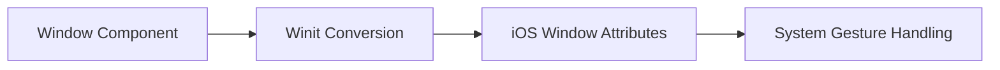

+++
title = "#18729 Expose deferred screen edges setting for ios devices"
date = "2025-04-30T00:00:00"
draft = false
template = "pull_request_page.html"
in_search_index = true

[taxonomies]
list_display = ["show"]

[extra]
current_language = "en"
available_languages = {"en" = { name = "English", url = "/pull_request/bevy/2025-04/pr-18729-en-20250430" }, "zh-cn" = { name = "中文", url = "/pull_request/bevy/2025-04/pr-18729-zh-cn-20250430" }}
labels = ["A-Windowing", "O-iOS", "D-Straightforward"]
+++

# Title: Expose deferred screen edges setting for ios devices

## Basic Information
- **Title**: Expose deferred screen edges setting for ios devices
- **PR Link**: https://github.com/bevyengine/bevy/pull/18729
- **Author**: yonson2
- **Status**: MERGED
- **Labels**: A-Windowing, O-iOS, S-Ready-For-Final-Review, D-Straightforward
- **Created**: 2025-04-05T13:29:01Z
- **Merged**: 2025-04-30T21:47:23Z
- **Merged By**: mockersf

## Description Translation
# Objective

- This just exposes the preferred [screen edges deferring system gestures](https://developer.apple.com/documentation/uikit/uiviewcontroller/preferredscreenedgesdeferringsystemgestures) setting from [winit](https://docs.rs/winit/latest/winit/platform/ios/trait.WindowExtIOS.html#tymethod.set_preferred_screen_edges_deferring_system_gestures), making it accessible in bevy apps.

This setting is useful for ios apps that make use of the screen edges, letting the app have control of the first edge gesture before relegating to the os.

## Testing

- Tested on simulator and on an iPhone Xs

---

## The Story of This Pull Request

### The Problem and Context
iOS applications often need to manage system-level gesture conflicts when using edge-based interactions. The system provides a mechanism to control which screen edges should prioritize application gestures over system gestures through [preferredScreenEdgesDeferringSystemGestures](https://developer.apple.com/documentation/uikit/uiviewcontroller/preferredscreenedgesdeferringsystemgestures). While Bevy's underlying windowing library (winit) already exposed this functionality, it wasn't accessible through Bevy's API, limiting developers' ability to create iOS apps with full edge gesture control.

### The Solution Approach
The implementation followed Bevy's established patterns for platform-specific window properties:
1. Add a new `ScreenEdge` enum mirroring winit's implementation
2. Extend Bevy's Window component with iOS-specific properties
3. Create conversion logic between Bevy and winit types
4. Implement runtime updates through existing window change detection systems

### The Implementation
The core addition is the `preferred_screen_edges_deferring_system_gestures` field in `Window`:

```rust
// crates/bevy_window/src/window.rs
pub struct Window {
    // ...
    pub preferred_screen_edges_deferring_system_gestures: ScreenEdge,
}

#[derive(Default, Debug, Clone, Copy, PartialEq, Eq, Hash, Reflect)]
pub enum ScreenEdge {
    #[default]
    None,
    Top,
    Left,
    Bottom,
    Right,
    All,
}
```

Conversion logic bridges Bevy's abstraction to winit's implementation:

```rust
// crates/bevy_winit/src/converters.rs
#[cfg(target_os = "ios")]
pub(crate) fn convert_screen_edge(edge: ScreenEdge) -> winit::platform::ios::ScreenEdge {
    match edge {
        ScreenEdge::None => winit::platform::ios::ScreenEdge::NONE,
        // ... other variants
    }
}
```

The window update system handles runtime changes:

```rust
// crates/bevy_winit/src/system.rs
if window.preferred_screen_edges_deferring_system_gestures != cache.window.preferred_screen_edges_deferring_system_gestures {
    let preferred_edge = convert_screen_edge(window.preferred_screen_edges_deferring_system_gestures);
    winit_window.set_preferred_screen_edges_deferring_system_gestures(preferred_edge);
}
```

### Technical Insights
The implementation leverages Bevy's existing platform-specific property handling:
1. **Type Mirroring**: The `ScreenEdge` enum replicates winit's structure while maintaining Bevy's style conventions
2. **Change Detection**: Uses Bevy's window change detection system to apply runtime updates
3. **Platform Gating**: All iOS-specific code is properly `#[cfg(target_os = "ios")]` guarded
4. **Example Integration**: Updated mobile example demonstrates practical usage:

```rust
// examples/mobile/src/lib.rs
Window {
    preferred_screen_edges_deferring_system_gestures: ScreenEdge::Bottom,
    ..default()
}
```

### The Impact
This change enables Bevy iOS applications to:
- Prevent system gesture interference at specified screen edges
- Create full-screen experiences without unexpected gesture conflicts
- Dynamically adjust gesture priorities during runtime

The implementation maintains Bevy's cross-platform design principles while properly isolating iOS-specific functionality.

## Visual Representation



## Key Files Changed

1. `crates/bevy_window/src/window.rs`
   - Added `ScreenEdge` enum and window property
   - Enabled iOS apps to declare preferred gesture edges
   ```rust
   pub preferred_screen_edges_deferring_system_gestures: ScreenEdge,
   ```

2. `crates/bevy_winit/src/converters.rs`
   - Implemented type conversion between Bevy and winit screen edges
   ```rust
   pub(crate) fn convert_screen_edge(edge: ScreenEdge) -> ... 
   ```

3. `crates/bevy_winit/src/system.rs`
   - Integrated change detection for gesture edge preferences
   ```rust
   if window.preferred_screen_edges_deferring_system_gestures != ...
   ```

4. `crates/bevy_winit/src/winit_windows.rs`
   - Applied setting during iOS window creation
   ```rust
   .with_preferred_screen_edges_deferring_system_gestures(preferred_edge)
   ```

5. `examples/mobile/src/lib.rs`
   - Demonstrated usage in Bevy's mobile example
   ```rust
   preferred_screen_edges_deferring_system_gestures: ScreenEdge::Bottom
   ```

## Further Reading
- [Apple UIKit Documentation: preferredScreenEdgesDeferringSystemGestures](https://developer.apple.com/documentation/uikit/uiviewcontroller/preferredscreenedgesdeferringsystemgestures)
- [Winit iOS Window Extensions](https://docs.rs/winit/latest/winit/platform/ios/trait.WindowExtIOS.html)
- [Bevy Window Component Documentation](https://docs.rs/bevy_window/latest/bevy_window/struct.Window.html)

# Full Code Diff
(See original PR for full diff contents)