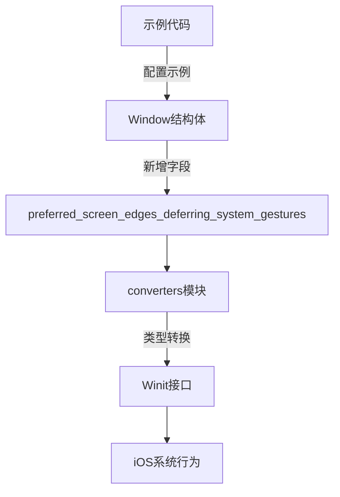

+++
title = "#18729 Expose deferred screen edges setting for ios devices"
date = "2025-04-30T00:00:00"
draft = false
template = "pull_request_page.html"
in_search_index = false

[extra]
current_language = "zh-cn"
available_languages = {"en" = { name = "English", url = "/pull_request/bevy/2025-04/pr-18729-en-20250430" }, "zh-cn" = { name = "中文", url = "/pull_request/bevy/2025-04/pr-18729-zh-cn-20250430" }}
labels = ["A-Windowing", "O-iOS", "D-Straightforward"]
+++

# Title: Expose deferred screen edges setting for ios devices

## Basic Information
- **Title**: Expose deferred screen edges setting for ios devices
- **PR Link**: https://github.com/bevyengine/bevy/pull/18729
- **Author**: yonson2
- **Status**: MERGED
- **Labels**: A-Windowing, O-iOS, S-Ready-For-Final-Review, D-Straightforward
- **Created**: 2025-04-05T13:29:01Z
- **Merged**: 2025-04-30T21:47:23Z
- **Merged By**: mockersf

## Description Translation
该PR目标是将iOS平台特有的[屏幕边缘手势延迟系统](https://developer.apple.com/documentation/uikit/uiviewcontroller/preferredscreenedgesdeferringsystemgestures)设置从[winit](https://docs.rs/winit/latest/winit/platform/ios/trait.WindowExtIOS.html#tymethod.set_preferred_screen_edges_deferring_system_gestures)暴露到Bevy应用中。

该设置对于需要使用屏幕边缘的iOS应用非常有用，允许应用在系统接管前优先处理边缘手势。

测试已在模拟器和iPhone Xs上完成。

## The Story of This Pull Request

### 问题背景与需求
iOS系统在屏幕边缘提供了系统级手势操作（如返回主屏或控制中心），但这些手势可能与应用的交互需求冲突。对于需要边缘交互的游戏或应用，开发者需要控制手势处理的优先级。Winit已通过[WindowExtIOS](https://docs.rs/winit/latest/winit/platform/ios/trait.WindowExtIOS.html)接口提供了`preferred_screen_edges_deferring_system_gestures`设置，但Bevy尚未将其暴露给开发者。

### 技术方案选择
该PR采用直接桥接策略：
1. 在Bevy Window模块中添加对应的配置项
2. 创建屏幕边缘枚举类型实现类型转换
3. 在窗口创建和更新时同步配置到Winit

关键决策点在于保持与其他iOS特有属性（如`prefers_home_indicator_hidden`）一致的实现模式，确保API设计的一致性。

### 具体实现解析
#### 新增ScreenEdge枚举类型
```rust
#[derive(Default, Debug, Clone, Copy, PartialEq, Eq, Hash, Reflect)]
pub enum ScreenEdge {
    #[default]
    None,
    Top,
    Left,
    Bottom,
    Right,
    All,
}
```
该枚举直接对应Winit的[ScreenEdge](https://docs.rs/winit/latest/winit/platform/ios/struct.ScreenEdge.html)实现，确保类型转换的简单可靠。

#### 窗口属性扩展
在Window结构体中新增配置项：
```rust
pub struct Window {
    // ...
    pub preferred_screen_edges_deferring_system_gestures: ScreenEdge,
}
```
默认值设为`ScreenEdge::None`，保持向后兼容性。

#### 类型转换实现
```rust
#[cfg(target_os = "ios")]
pub(crate) fn convert_screen_edge(edge: ScreenEdge) -> winit::platform::ios::ScreenEdge {
    match edge {
        ScreenEdge::None => winit::platform::ios::ScreenEdge::NONE,
        // ...其他分支匹配
    }
}
```
该转换函数确保Bevy类型与Winit类型的无缝对接，通过模式匹配实现类型安全转换。

#### 窗口创建与更新
在窗口创建时应用初始配置：
```rust
winit_window_attributes = winit_window_attributes
    .with_preferred_screen_edges_deferring_system_gestures(preferred_edge);
```
在窗口更新系统中添加配置同步：
```rust
if window.preferred_screen_edges_deferring_system_gestures != cache.window.preferred_screen_edges_deferring_system_gestures {
    let preferred_edge = convert_screen_edge(...);
    winit_window.set_preferred_screen_edges_deferring_system_gestures(preferred_edge);
}
```
该实现保证了配置的动态更新能力。

### 技术影响与最佳实践
1. **平台特性隔离**：通过`#[cfg(target_os = "ios")]`条件编译确保不影响其他平台
2. **API扩展模式**：延续了Bevy窗口属性扩展的现有模式，降低学习成本
3. **测试验证**：在真实设备（iPhone Xs）和模拟器上验证保证了功能可靠性

示例代码更新展示了典型使用场景：
```rust
Window {
    preferred_screen_edges_deferring_system_gestures: ScreenEdge::Bottom,
    ..default()
}
```
开发者可以通过指定边缘方向（如Bottom）来保留该区域的手势处理优先权。

## Visual Representation



## Key Files Changed

### `crates/bevy_window/src/window.rs`
1. 新增`ScreenEdge`枚举类型定义
2. 在Window结构体中添加`preferred_screen_edges_deferring_system_gestures`字段
3. 更新默认实现包含新字段

```rust
// 新增枚举定义
#[derive(Default, Debug, Clone, Copy, PartialEq, Eq, Hash, Reflect)]
pub enum ScreenEdge {
    #[default]
    None,
    // ...其他变体
}

// Window结构体扩展
pub struct Window {
    // ...
    pub preferred_screen_edges_deferring_system_gestures: ScreenEdge,
}
```

### `crates/bevy_winit/src/converters.rs`
1. 新增iOS平台专用的类型转换函数

```rust
#[cfg(target_os = "ios")]
pub(crate) fn convert_screen_edge(edge: ScreenEdge) -> winit::platform::ios::ScreenEdge {
    // 模式匹配转换逻辑
}
```

### `examples/mobile/src/lib.rs`
1. 更新移动端示例展示新功能用法

```rust
Window {
    preferred_screen_edges_deferring_system_gestures: ScreenEdge::Bottom,
    ..default()
}
```

## Further Reading
1. [Apple官方文档 - preferredScreenEdgesDeferringSystemGestures](https://developer.apple.com/documentation/uikit/uiviewcontroller/2887512-preferredscreenedgesdeferringsys)
2. [Winit iOS平台特性文档](https://docs.rs/winit/latest/winit/platform/ios/trait.WindowExtIOS.html)
3. [Bevy窗口系统设计指南](https://bevyengine.org/learn/book/getting-started/windows/)