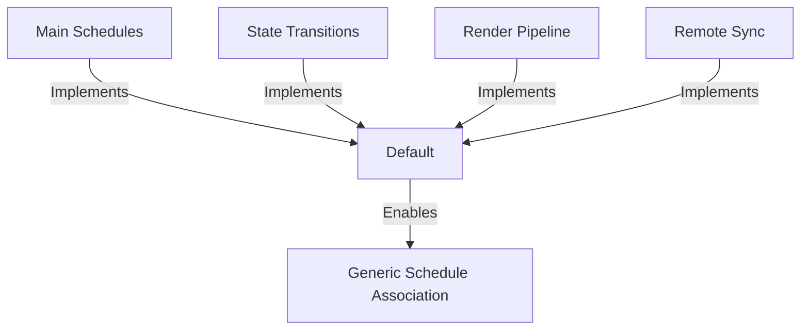

+++
title = "#18731 Add `Default` for all schedule labels"
date = "2025-04-07T00:00:00"
draft = false
template = "pull_request_page.html"
in_search_index = true

[taxonomies]
list_display = ["show"]

[extra]
current_language = "en"
available_languages = {"en" = { name = "English", url = "/pull_request/bevy/2025-04/pr-18731-en-20250407" }, "zh-cn" = { name = "中文", url = "/pull_request/bevy/2025-04/pr-18731-zh-cn-20250407" }}
labels = ["D-Trivial", "C-Usability", "A-App"]
+++

# Add `Default` for all schedule labels

## Basic Information
- **Title**: Add `Default` for all schedule labels
- **PR Link**: https://github.com/bevyengine/bevy/pull/18731
- **Author**: Shatur
- **Status**: MERGED
- **Labels**: D-Trivial, C-Usability, S-Ready-For-Final-Review, A-App
- **Created**: 2025-04-05T19:01:01Z
- **Merged**: 2025-04-06T17:03:57Z
- **Merged By**: alice-i-cecile

## Description Translation
# Objective

In `bevy_enhanced_input`, I'm trying to associate `Actions` with a schedule. I can do this via an associated type on a trait, but there's no way to construct the associated label except by requiring a `Default` implementation. However, Bevy labels don't implement `Default`.

## Solution

Add `Default` to all built-in labels. I think it should be useful in general.

## The Story of This Pull Request

The developer encountered a friction point while working with Bevy's schedule labels in the `bevy_enhanced_input` module. Their goal was to associate input actions with specific schedules using trait-associated types, but hit a roadblock - schedule labels lacked `Default` implementations required for generic trait implementations.

This limitation became apparent when trying to write code like:

```rust
trait ActionSchedule {
    type Label: ScheduleLabel + Default;
    
    fn schedule_label() -> Self::Label {
        Self::Label::default()
    }
}
```

Without `Default` on schedule labels, this pattern couldn't be used with Bevy's built-in labels. The core issue stemmed from schedule labels being marker types (unit structs) that didn't explicitly implement `Default`, despite having trivial initialization requirements.

The solution focused on systematically adding `Default` implementations across Bevy's scheduling infrastructure. For unit structs serving as schedule labels, this simply required adding `derive(Default)` to their definitions. The changes followed a consistent pattern across multiple crates:

```rust
// Before
#[derive(ScheduleLabel, Debug, Clone, Copy, Hash, Eq, PartialEq)]
pub struct Main;

// After
#[derive(ScheduleLabel, Debug, Clone, Copy, Hash, Eq, PartialEq, Default)]
pub struct Main;
```

This implementation strategy was effective because:
1. Unit structs naturally support zero-argument initialization
2. `Default` derivation matches existing trait derivations (Debug, Clone, etc)
3. Maintains consistency across Bevy's label types
4. Requires no runtime changes or performance impacts

The changes affected multiple scheduling subsystems:
- Main app schedules (`Main`, `Startup`, etc)
- State transition schedules
- Render pipeline schedules
- Remote entity synchronization schedules

By implementing `Default` for these fundamental labels, the PR eliminated a unnecessary friction point for developers building on Bevy's scheduling system. This particularly benefits:
- Generic trait implementations requiring default labels
- Plugin authors creating schedule-driven features
- Code that programmatically constructs schedule hierarchies

## Visual Representation



## Key Files Changed

1. **crates/bevy_app/src/main_schedule.rs** (+17/-17)
```rust
// Before
#[derive(ScheduleLabel, Debug, Clone, Copy, Hash, Eq, PartialEq)]
struct Main;

// After
#[derive(ScheduleLabel, Debug, Clone, Copy, Hash, Eq, PartialEq, Default)]
struct Main;
```
Added `Default` to core app schedules including `Main`, `Startup`, and their ordering types. This forms the foundation for Bevy's main execution flow.

2. **crates/bevy_state/src/state/transitions.rs** (+4/-4)
```rust
// Before
#[derive(ScheduleLabel, Clone, Debug, PartialEq, Eq, Hash)]
pub struct StateTransition;

// After
#[derive(ScheduleLabel, Clone, Debug, PartialEq, Eq, Hash, Default)]
pub struct StateTransition;
```
Enabled default state transition scheduling for state management.

3. **crates/bevy_render/src/lib.rs** (+2/-2)
```rust
// Before
#[derive(ScheduleLabel, Clone, Debug, Hash, PartialEq, Eq)]
pub struct ExtractSchedule;

// After
#[derive(ScheduleLabel, Clone, Debug, Hash, PartialEq, Eq, Default)]
pub struct ExtractSchedule;
```
Extended to render pipeline scheduling, supporting graphics resource preparation.

4. **crates/bevy_remote/src/lib.rs** (+1/-1)
```rust
// Before
#[derive(ScheduleLabel, Clone, Debug, Hash, PartialEq, Eq)]
struct RemoteSync;

// After 
#[derive(ScheduleLabel, Clone, Debug, Hash, PartialEq, Eq, Default)]
struct RemoteSync;
```
Completed the pattern for distributed entity synchronization.

## Further Reading

1. [Rust Default trait documentation](https://doc.rust-lang.org/std/default/trait.Default.html)
2. [Bevy Schedules and Labels](https://bevyengine.org/learn/book/next/programming/schedules/)
3. [Deriving Traits in Rust](https://doc.rust-lang.org/book/appendix-03-derivable-traits.html)
4. [Generic Programming in Rust](https://doc.rust-lang.org/book/ch10-01-syntax.html)