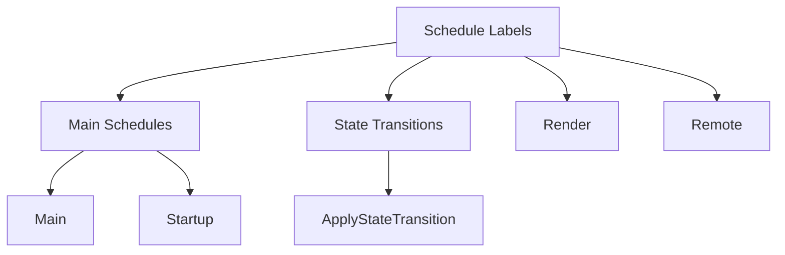

+++
title = "#18731 Add `Default` for all schedule labels"
date = "2025-04-07T00:00:00"
draft = false
template = "pull_request_page.html"
in_search_index = false

[extra]
current_language = "zh-cn"
available_languages = {"en" = { name = "English", url = "/pull_request/bevy/2025-04/pr-18731-en-20250407" }, "zh-cn" = { name = "中文", url = "/pull_request/bevy/2025-04/pr-18731-zh-cn-20250407" }}
labels = ["D-Trivial", "C-Usability", "A-App"]
+++

# Add `Default` for all schedule labels

## Basic Information
- **Title**: Add `Default` for all schedule labels
- **PR Link**: https://github.com/bevyengine/bevy/pull/18731
- **Author**: Shatur
- **Status**: MERGED
- **Labels**: D-Trivial, C-Usability, S-Ready-For-Final-Review, A-App
- **Created**: 2025-04-05T19:01:01Z
- **Merged**: 2025-04-06T17:03:57Z
- **Merged By**: alice-i-cecile

## Description Translation
### 目标

在`bevy_enhanced_input`中，我尝试将`Actions`与调度计划（schedule）关联。可以通过trait的关联类型实现，但无法构造关联标签（label），除非要求`Default`实现。然而Bevy的标签未实现`Default`。

### 解决方案

为所有内置标签添加`Default`实现。这个改动在通用场景下会有帮助。

## The Story of This Pull Request

### 问题背景与挑战
开发者在扩展`bevy_enhanced_input`时遇到一个具体的技术限制：需要将自定义的`Actions`类型与Bevy的调度系统集成。Bevy使用类型化的调度标签（Schedule Label）来组织执行流程，但这些标签类型缺少`Default`实现，导致无法通过需要默认构造的泛型约束来创建关联。

核心问题表现为：
```rust
// 伪代码示意
trait ActionSet {
    type ScheduleLabel: ScheduleLabel;
    
    fn schedule(&self) -> Schedule {
        Schedule::new(Self::ScheduleLabel::default()) // 需要Default实现
    }
}
```
没有`Default`实现意味着开发者无法直接通过标准方式构造调度标签，限制了框架的扩展性。

### 解决方案与实现
PR采用直接有效的方式解决：为所有Bevy内置的调度标签类型添加`#[derive(Default)]`。这是合理的工程决策，因为：
1. 调度标签本质上是零成本类型标记（zero-sized types）
2. 默认构造对这些标记类型来说是安全且符合预期的
3. 不需要改变现有类型的行为或功能

具体实现涉及四个关键模块的修改：

**1. 主调度标签（Main Schedule）**
```rust
// crates/bevy_app/src/main_schedule.rs
#[derive(ScheduleLabel, Clone, Debug, PartialEq, Eq, Hash, Default)]
pub struct Main;

#[derive(ScheduleLabel, Clone, Debug, PartialEq, Eq, Hash, Default)]
pub struct PreStartup;

#[derive(ScheduleLabel, Clone, Debug, PartialEq, Eq, Hash, Default)]
pub struct Startup;
```
每个调度标签类型新增`Default`派生，保持原有trait继承结构。

**2. 状态转换调度**
```rust
// crates/bevy_state/src/state/transitions.rs
#[derive(ScheduleLabel, Clone, Debug, PartialEq, Eq, Hash, Default)]
pub struct ApplyStateTransition<S: States>(PhantomData<S>);
```
泛型状态类型使用`PhantomData`保持类型安全，同时获得默认构造能力。

**3. 渲染与远程调度**
```rust
// crates/bevy_render/src/lib.rs
#[derive(ScheduleLabel, Clone, Debug, PartialEq, Eq, Hash, Default)]
pub struct Render;

// crates/bevy_remote/src/lib.rs 
#[derive(ScheduleLabel, Clone, Debug, PartialEq, Eq, Hash, Default)]
pub struct Remote;
```
跨模块统一实现模式，保持框架内部一致性。

### 技术影响与改进
该改动带来的直接好处包括：
1. **扩展性增强**：允许第三方库通过`Default`约束创建自定义调度标签
2. **API一致性**：统一所有内置标签的行为模式
3. **开发体验提升**：减少需要手动实现trait的样板代码

潜在的技术考量：
- 零成本抽象：派生`Default`不会增加运行时开销
- 前向兼容：不影响现有用户代码，纯扩展性修改
- 类型系统一致性：所有调度标签现在共享相同的trait组合

## Visual Representation



## Key Files Changed

### 1. crates/bevy_app/src/main_schedule.rs (+17/-17)
**修改内容**：
- 为`Main`, `PreStartup`, `Startup`, `PostStartup`等主调度标签添加`Default`实现

**代码片段**：
```rust
// Before:
#[derive(ScheduleLabel, Clone, Debug, PartialEq, Eq, Hash)]
pub struct Main;

// After:
#[derive(ScheduleLabel, Clone, Debug, PartialEq, Eq, Hash, Default)]
pub struct Main;
```

### 2. crates/bevy_state/src/state/transitions.rs (+4/-4)
**修改内容**：
- 状态转换调度标签`ApplyStateTransition`添加默认实现

**代码片段**：
```rust
#[derive(ScheduleLabel, Clone, Debug, PartialEq, Eq, Hash, Default)]
pub struct ApplyStateTransition<S: States>(PhantomData<S>);
```

### 3. crates/bevy_render/src/lib.rs (+2/-2)
**修改内容**：
- 渲染调度标签`Render`实现Default

**代码片段**：
```rust
#[derive(ScheduleLabel, Clone, Debug, PartialEq, Eq, Hash, Default)]
pub struct Render;
```

### 4. crates/bevy_remote/src/lib.rs (+1/-1)
**修改内容**：
- 远程调度标签`Remote`添加Default实现

**代码片段**：
```rust
#[derive(ScheduleLabel, Clone, Debug, PartialEq, Eq, Hash, Default)]
pub struct Remote;
```

## Further Reading
1. [Rust的Default trait官方文档](https://doc.rust-lang.org/std/default/trait.Default.html)
2. [Bevy调度系统设计](https://bevyengine.org/learn/book/getting-started/schedules/)
3. [类型标记模式（Type Marker Pattern）实践](https://www.lpalmieri.com/posts/2020-05-27-zero-cost-abstractions-in-rust-a-tour-of-tagless-final/)
4. [Bevy状态管理机制](https://bevyengine.org/learn/book/getting-started/states/)