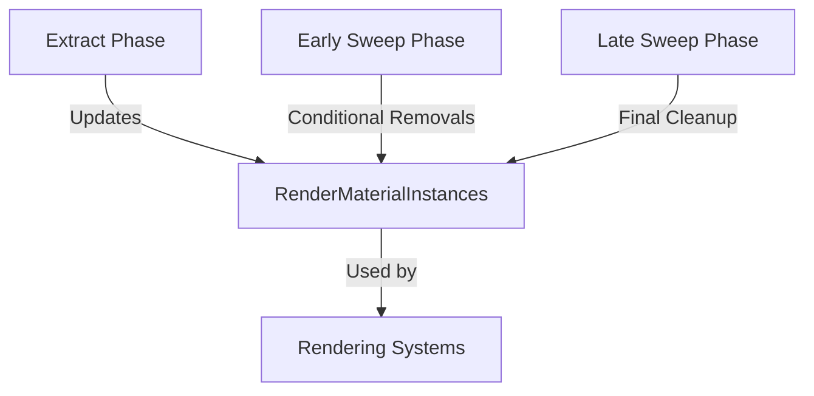

+++
title = "#18734 Unify `RenderMaterialInstances` and `RenderMeshMaterialIds`, and fix an associated race condition."
date = "2025-04-09T00:00:00"
draft = false
template = "pull_request_page.html"
in_search_index = true

[taxonomies]
list_display = ["show"]

[extra]
current_language = "en"
available_languages = {"en" = { name = "English", url = "/pull_request/bevy/2025-04/pr-18734-en-20250409" }, "zh-cn" = { name = "中文", url = "/pull_request/bevy/2025-04/pr-18734-zh-cn-20250409" }}
labels = ["C-Bug", "A-Rendering"]
+++

# Title

## Basic Information
- **Title**: Unify `RenderMaterialInstances` and `RenderMeshMaterialIds`, and fix an associated race condition.
- **PR Link**: https://github.com/bevyengine/bevy/pull/18734
- **Author**: pcwalton
- **Status**: MERGED
- **Labels**: C-Bug, A-Rendering, S-Ready-For-Final-Review
- **Created**: 2025-04-06T03:13:41Z
- **Merged**: 2025-04-09T21:51:25Z
- **Merged By**: superdump

## Description Translation
Currently, `RenderMaterialInstances` and `RenderMeshMaterialIds` are very similar render-world resources: the former maps main world meshes to typed material asset IDs, and the latter maps main world meshes to untyped material asset IDs. This is needlessly-complex and wasteful, so this patch unifies the two in favor of a single untyped `RenderMaterialInstances` resource.

This patch also fixes a subtle issue that could cause mesh materials to be incorrect if a `MeshMaterial3d<A>` was removed and replaced with a `MeshMaterial3d<B>` material in the same frame. The problematic pattern looks like:

1. `extract_mesh_materials<B>` runs and, seeing the `Changed<MeshMaterial3d<B>>` condition, adds an entry mapping the mesh to the new material to the untyped `RenderMeshMaterialIds`.

2. `extract_mesh_materials<A>` runs and, seeing that the entity is present in `RemovedComponents<MeshMaterial3d<A>>`, removes the entry from `RenderMeshMaterialIds`.

3. The material slot is now empty, and the mesh will show up as whatever material happens to be in slot 0 in the material data slab.

This commit fixes the issue by splitting out `extract_mesh_materials` into *three* phases: *extraction*, *early sweeping*, and *late sweeping*, which run in that order:

1. The *extraction* system, which runs for each material, updates `RenderMaterialInstances` records whenever `MeshMaterial3d` components change, and updates a change tick so that the following system will know not to remove it.

2. The *early sweeping* system, which runs for each material, processes entities present in `RemovedComponents<MeshMaterial3d>` and removes each such entity's record from `RenderMeshInstances` only if the extraction system didn't update it this frame. This system runs after *all* extraction systems have completed, fixing the race condition.

3. The *late sweeping* system, which runs only once regardless of the number of materials in the scene, processes entities present in `RemovedComponents<ViewVisibility>` and, as in the early sweeping phase, removes each such entity's record from `RenderMeshInstances` only if the extraction system didn't update it this frame. At the end, the late sweeping system updates the change tick.

Because this pattern happens relatively frequently, I think this PR should land for 0.16.

## The Story of This Pull Request

The PR addresses two interconnected issues in Bevy's material system: redundant data structures and a race condition during material replacement. The original implementation maintained two parallel resources (`RenderMaterialInstances` and `RenderMeshMaterialIds`) that served similar purposes but with different type constraints. This duplication added unnecessary complexity and memory overhead to the rendering pipeline.

The more critical issue emerged when replacing materials within the same frame. The existing extraction system's ordering could lead to a scenario where a material replacement would temporarily leave a mesh without valid material data, causing visual artifacts. This occurred because different material systems could interfere with each other's updates when handling component removals and additions.

The solution involved three key architectural changes:

1. **Resource Unification**:
```rust
// Before: Two separate resources
struct RenderMaterialInstances<M: Material3d>(HashMap<Entity, RenderMaterial3dInstance<M>>);
struct RenderMeshMaterialIds(HashMap<Entity, AssetId<MeshMaterial3d>>>);

// After: Single unified resource
struct RenderMaterialInstances(HashMap<Entity, AssetId<MeshMaterial3d>>>);
```
By removing the generic type parameter from `RenderMaterialInstances`, the implementation could handle all material types through a single untyped resource, eliminating the need for `RenderMeshMaterialIds`.

2. **Phased Extraction System**:
The extraction process was restructured into three distinct phases to prevent race conditions:
```rust
// Extraction phase (per-material)
fn extract_mesh_materials<M: Material3d>(
    mut extracted: Local<ExtractedMaterials>,
    mut render_material_instances: ResMut<RenderMaterialInstances>,
    // ...
) {
    // Update material instances and track changes
}

// Early sweep phase (per-material)
fn early_sweep_mesh_materials<M: Material3d>(
    mut render_material_instances: ResMut<RenderMaterialInstances>,
    removed: RemovedComponents<MeshMaterial3d<M>>,
    // ...
) {
    // Remove entries only if not updated this frame
}

// Late sweep phase (global)
fn late_sweep_mesh_materials(
    mut render_material_instances: ResMut<RenderMaterialInstances>,
    removed: RemovedComponents<ViewVisibility>,
    // ...
) {
    // Final cleanup and tick update
}
```
This phased approach ensures that all material updates complete before any removals are processed, using a change tick to track recent modifications.

3. **Change Tracking Mechanism**:
The implementation introduced precise change tracking through a `LAST_CHANGE_TICK` constant:
```rust
const LAST_CHANGE_TICK: &str = "RenderMaterialInstances::last_change_tick";

fn extract_mesh_materials<M: Material3d>(
    // ...
) {
    let last_change_tick = world.last_change_tick();
    render_material_instances
        .meta
        .insert(LAST_CHANGE_TICK, last_change_tick);
}
```
This allows subsequent systems to determine if an entry was recently modified before considering it for removal.

The changes significantly simplify the material management system while making it more robust against frame-level race conditions. By unifying the resource types and restructuring the update sequence, the implementation reduces memory overhead and eliminates a class of subtle rendering bugs that could occur during material replacements.

## Visual Representation



## Key Files Changed

1. `crates/bevy_pbr/src/material.rs` (+143/-38)
- Unified material instance storage
- Implemented three-phase extraction system
- Added change tracking metadata

Key modification:
```rust
// Before: Generic typed storage
pub struct RenderMaterialInstances<M: Material3d>(HashMap<Entity, RenderMaterial3dInstance<M>>);

// After: Unified untyped storage
pub struct RenderMaterialInstances {
    pub instances: HashMap<Entity, AssetId<MeshMaterial3d>>,
    pub meta: HashMap<String, u32>,
}
```

2. `crates/bevy_pbr/src/render/mesh.rs` (+4/-35)
- Removed references to old RenderMeshMaterialIds
- Updated material lookup to use unified resource

3. `crates/bevy_pbr/src/meshlet/instance_manager.rs` (+15/-13)
- Adapted meshlet system to use unified material instances
- Updated instance preparation logic

4. `crates/bevy_pbr/src/meshlet/material_pipeline_prepare.rs` (+16/-6)
- Modified material binding to work with new instance format
- Updated buffer preparation code

5. `crates/bevy_pbr/src/render/light.rs` (+15/-6)
- Adjusted light rendering to use updated material references
- Fixed material ID lookups in lighting passes

## Further Reading

1. [Bevy ECS System Ordering Documentation](https://bevyengine.org/learn/book/getting-started/ecs/#system-ordering)
2. [Material System Architecture in Bevy](https://bevy-cheatbook.github.io/features/materials.html)
3. [Entity Component System Patterns](https://gameprogrammingpatterns.com/component.html)
4. [Rendering Pipeline Synchronization Techniques](https://vkguide.dev/docs/gpudriven/compute_pipeline/)