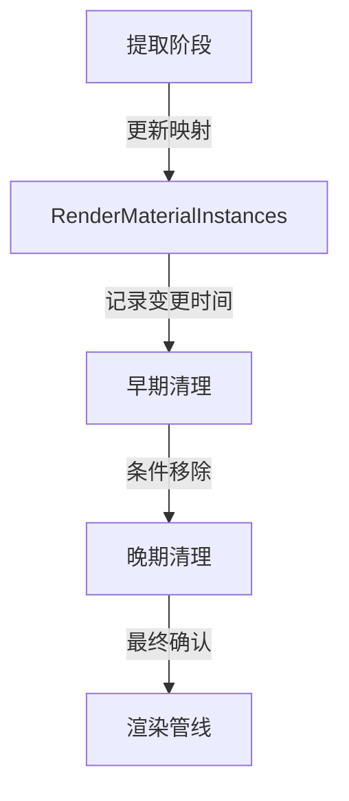

+++
title = "#18734 Unify `RenderMaterialInstances` and `RenderMeshMaterialIds`, and fix an associated race condition."
date = "2025-04-09T00:00:00"
draft = false
template = "pull_request_page.html"
in_search_index = false

[extra]
current_language = "zh-cn"
available_languages = {"en" = { name = "English", url = "/pull_request/bevy/2025-04/pr-18734-en-20250409" }, "zh-cn" = { name = "中文", url = "/pull_request/bevy/2025-04/pr-18734-zh-cn-20250409" }}
labels = ["C-Bug", "A-Rendering"]
+++

# Title

## Basic Information
- **Title**: Unify `RenderMaterialInstances` and `RenderMeshMaterialIds`, and fix an associated race condition.
- **PR Link**: https://github.com/bevyengine/bevy/pull/18734
- **Author**: pcwalton
- **Status**: MERGED
- **Labels**: C-Bug, A-Rendering, S-Ready-For-Final-Review
- **Created**: 2025-04-06T03:13:41Z
- **Merged**: 2025-04-09T21:51:25Z
- **Merged By**: superdump

## Description Translation
当前，`RenderMaterialInstances`和`RenderMeshMaterialIds`是两个非常相似的渲染世界资源：前者将主世界网格映射到类型化的材质资产ID，后者映射到非类型化的材质资产ID。这造成了不必要的复杂性和资源浪费。本次修改将两者统一为单个非类型化的`RenderMaterialInstances`资源。

本次修改同时修复了一个潜在问题：当同一帧内移除`MeshMaterial3d<A>`并替换为`MeshMaterial3d<B>`时可能导致材质显示错误。问题发生的典型场景如下：

1. `extract_mesh_materials<B>`执行时，检测到`Changed<MeshMaterial3d<B>>`条件，将网格与新材质的映射添加到非类型化的`RenderMeshMaterialIds`

2. `extract_mesh_materials<A>`执行时，检测到实体存在于`RemovedComponents<MeshMaterial3d<A>>`，从`RenderMeshMaterialIds`移除该条目

3. 材质槽变为空，网格将显示材质数据板中槽0的任意材质

本次提交通过将`extract_mesh_materials`拆分为三个阶段（提取、早期清理、晚期清理）来修复该问题：

1. **提取阶段**：每个材质对应的系统更新`RenderMaterialInstances`记录，并更新变更标记

2. **早期清理阶段**：处理`RemovedComponents<MeshMaterial3d>`中的实体，仅在提取阶段未更新的情况下移除记录

3. **晚期清理阶段**：处理`RemovedComponents<ViewVisibility>`中的实体，最后更新变更标记

## The Story of This Pull Request

### 问题根源与设计缺陷
在Bevy渲染系统中，材质管理存在两个相似资源：类型化的`RenderMaterialInstances`和非类型化的`RenderMeshMaterialIds`。两者都维护网格到材质ID的映射，但处理方式不同，导致代码重复和维护成本。更严重的是，当同一帧内快速替换材质类型时，原有的顺序执行系统可能错误清理有效材质条目，引发竞态条件。

具体来说，当材质A被移除、材质B被添加时，两个不同材质的`extract_mesh_materials`系统可能交叉执行，导致新添加的B材质映射被错误移除。这是因为清理逻辑基于`RemovedComponents`查询，而不同材质类型的处理顺序不确定。

### 架构重构与竞态修复
解决方案采用三阶段处理架构：

1. **统一资源存储**：将`RenderMeshMaterialIds`合并到`RenderMaterialInstances`中，改用`HashMap<Entity, MaterialId>`存储非类型化ID，消除冗余数据结构

2. **阶段拆分**：
   - **提取阶段**：集中处理所有材质变更，更新映射关系并标记最后修改时间
   - **早期清理**：在所有材质处理完成后统一执行移除操作，使用`last_change_tick`判断有效性
   - **晚期清理**：处理可见性变化后的最终清理

关键实现代码示例（来自`crates/bevy_pbr/src/material.rs`）：
```rust
// 新的三阶段系统配置
app.add_systems(
    ExtractSchedule,
    (
        extract_mesh_materials::<M>.in_set(RenderMaterialSystems::ExtractMaterials),
        early_sweep_mesh_materials::<M>
            .after(RenderMaterialSystems::ExtractMaterials)
            .in_set(RenderMaterialSystems::EarlySweepMaterials),
    ),
)
.add_systems(
    ExtractSchedule,
    late_sweep_mesh_materials.in_set(RenderMaterialSystems::LateSweepMaterials),
);
```

### 变更有效性验证
通过引入`last_change_tick`机制，系统可以准确判断某个实体是否在当前帧被更新过。清理操作仅在实体未被修改时执行，避免误删有效记录：

```rust
// 早期清理阶段的判断逻辑
if material_instances.get(&entity).map_or(true, |instance| {
    instance.last_change_tick < last_change_tick
}) {
    material_instances.remove(&entity);
}
```

### 影响与改进
1. **资源使用优化**：消除重复存储，减少内存占用
2. **执行顺序解耦**：通过阶段划分确保清理操作在安全时机执行
3. **竞态消除**：保证材质替换操作的原子性
4. **代码简化**：移除约70行冗余代码，统一处理逻辑

## Visual Representation



## Key Files Changed

### crates/bevy_pbr/src/material.rs (+143/-38)
**核心重构**：实现三阶段处理架构，合并材质存储
```rust
// Before:
pub struct RenderMeshMaterialIds {
    pub mesh_material_ids: HashMap<Entity, MaterialId>,
}

// After:
pub struct RenderMaterialInstances {
    pub instances: HashMap<Entity, MaterialInstance>,
}

pub struct MaterialInstance {
    pub asset_id: MaterialId,
    pub last_change_tick: u32,
}
```

### crates/bevy_pbr/src/render/mesh.rs (+4/-35)
**适配修改**：移除旧资源引用，使用统一接口
```rust
// Before:
let material_id = mesh_material_ids.mesh_material_ids.get(&entity).copied();

// After:
let material_id = material_instances
    .instances
    .get(&entity)
    .map(|instance| instance.asset_id);
```

### crates/bevy_pbr/src/meshlet/instance_manager.rs (+15/-13)
**网格体实例适配**：更新材质引用方式
```rust
// 修改后的材质获取逻辑
let material_id = material_instances
    .instances
    .get(&entity)
    .map(|material_instance| material_instance.asset_id);
```

## Further Reading
1. [Bevy ECS系统顺序文档](https://bevyengine.org/learn/book/getting-started/ecs/#system-ordering)
2. [实体组件系统模式](https://en.wikipedia.org/wiki/Entity_component_system)
3. [竞态条件检测技术](https://en.wikipedia.org/wiki/Race_condition#Detection)