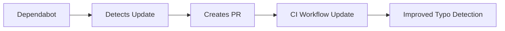

+++
title = "#18744 Bump crate-ci/typos from 1.31.0 to 1.31.1"
date = "2025-04-07T00:00:00"
draft = false
template = "pull_request_page.html"
in_search_index = true

[taxonomies]
list_display = ["show"]

[extra]
current_language = "en"
available_languages = {"en" = { name = "English", url = "/pull_request/bevy/2025-04/pr-18744-en-20250407" }, "zh-cn" = { name = "中文", url = "/pull_request/bevy/2025-04/pr-18744-zh-cn-20250407" }}
labels = ["D-Trivial", "C-Dependencies"]
+++

# Bump crate-ci/typos from 1.31.0 to 1.31.1

## Basic Information
- **Title**: Bump crate-ci/typos from 1.31.0 to 1.31.1
- **PR Link**: https://github.com/bevyengine/bevy/pull/18744
- **Author**: app/dependabot
- **Status**: MERGED
- **Labels**: D-Trivial, C-Dependencies, S-Ready-For-Final-Review
- **Created**: 2025-04-07T06:52:59Z
- **Merged**: 2025-04-07T16:32:52Z
- **Merged By**: mockersf

## Description Translation
Bumps [crate-ci/typos](https://github.com/crate-ci/typos) from 1.31.0 to 1.31.1.
<details>
<summary>Release notes</summary>
<p><em>Sourced from <a href="https://github.com/crate-ci/typos/releases">crate-ci/typos's releases</a>.</em></p>
<blockquote>
<h2>v1.31.1</h2>
<h2>[1.31.1] - 2025-03-31</h2>
<h3>Fixes</h3>
<ul>
<li><em>(dict)</em> Also correct <code>typ</code> to <code>type</code></li>
</ul>
</blockquote>
</details>
<details>
<summary>Changelog</summary>
<p><em>Sourced from <a href="https://github.com/crate-ci/typos/blob/master/CHANGELOG.md">crate-ci/typos's changelog</a>.</em></p>
<blockquote>
<h2>[1.31.1] - 2025-03-31</h2>
<h3>Fixes</h3>
<ul>
<li><em>(dict)</em> Also correct <code>typ</code> to <code>type</code></li>
</ul>
</blockquote>
</details>
<details>
<summary>Commits</summary>
<ul>
<li><a href="https://github.com/crate-ci/typos/commit/b1a1ef3893ff35ade0cfa71523852a49bfd05d19"><code>b1a1ef3</code></a> chore: Release</li>
<li><a href="https://github.com/crate-ci/typos/commit/9c8a2c384f9b92ac5e7166040a1571141e271e7a"><code>9c8a2c3</code></a> docs: Update changelog</li>
<li><a href="https://github.com/crate-ci/typos/commit/12195d75fea9498ad83cb8d85e357a986e90fb7e"><code>12195d7</code></a> Merge pull request <a href="https://redirect.github.com/crate-ci/typos/issues/1267">#1267</a> from epage/type</li>
<li><a href="https://github.com/crate-ci/typos/commit/d4dbe5f77bde37609ce3424df4a713a61f87ad2b"><code>d4dbe5f</code></a> fix(dict): Also correct typ to type</li>
<li>See full diff in <a href="https://github.com/crate-ci/typos/compare/v1.31.0...v1.31.1">compare view</a></li>
</ul>
</details>
<br />


[](https://docs.github.com/en/github/managing-security-vulnerabilities/about-dependabot-security-updates#about-compatibility-scores)

Dependabot will resolve any conflicts with this PR as long as you don't alter it yourself. You can also trigger a rebase manually by commenting `@dependabot rebase`.

[//]: # (dependabot-automerge-start)
[//]: # (dependabot-automerge-end)

---

<details>
<summary>Dependabot commands and options</summary>
<br />

You can trigger Dependabot actions by commenting on this PR:
- `@dependabot rebase` will rebase this PR
- `@dependabot recreate` will recreate this PR, overwriting any edits that have been made to it
- `@dependabot merge` will merge this PR after your CI passes on it
- `@dependabot squash and merge` will squash and merge this PR after your CI passes on it
- `@dependabot cancel merge` will cancel a previously requested merge and block automerging
- `@dependabot reopen` will reopen this PR if it is closed
- `@dependabot close` will close this PR and stop Dependabot recreating it. You can achieve the same result by closing it manually
- `@dependabot show <dependency name> ignore conditions` will show all of the ignore conditions of the specified dependency
- `@dependabot ignore this major version` will close this PR and stop Dependabot creating any more for this major version (unless you reopen the PR or upgrade to it yourself)
- `@dependabot ignore this minor version` will close this PR and stop Dependabot creating any more for this minor version (unless you reopen the PR or upgrade to it yourself)
- `@dependabot ignore this dependency` will close this PR and stop Dependabot creating any more for this dependency (unless you reopen the PR or upgrade to it yourself)


</details>

## The Story of This Pull Request

This dependency update focuses on maintaining code quality through automated tooling. The Bevy project uses crate-ci/typos as part of its CI pipeline to catch spelling mistakes in the codebase. Version 1.31.1 of typos introduced a specific dictionary fix where it now detects and corrects the common misspelling "typ" to "type".

The update was automated through GitHub's Dependabot, which monitors dependency versions and creates PRs when updates are available. The trivial nature of this change (a patch version bump with a single dictionary entry) allowed for straightforward integration. The compatibility score of 100 indicated no breaking changes, making this a low-risk update.

The primary technical consideration was ensuring the spelling checker stays current with the latest pattern recognitions. While seemingly minor, consistent typo detection helps maintain professional code quality and prevents documentation errors. The update process demonstrates Bevy's commitment to automated code quality checks and timely dependency management.

## Visual Representation



## Key Files Changed

### .github/workflows/ci.yml (+1/-1)
**Purpose**: Update typos-action version in CI pipeline

```yaml
# Before:
- uses: crate-ci/typos@v1.31.0

# After:
- uses: crate-ci/typos@v1.31.1
```

This single-line change updates the version reference in GitHub Actions configuration, activating the new typo detection rules in all subsequent CI runs.

## Further Reading
1. [typos documentation](https://github.com/crate-ci/typos) - Understand the spelling checker's capabilities
2. [GitHub Actions workflow syntax](https://docs.github.com/en/actions/using-workflows/workflow-syntax-for-github-actions) - Learn how CI pipelines are configured
3. [Dependabot version updates](https://docs.github.com/en/code-security/dependabot/dependabot-version-updates) - Automate dependency management in your projects