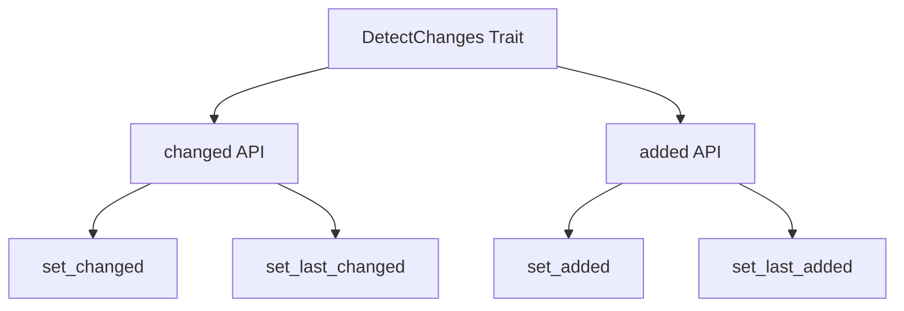

+++
title = "#18746 Expose the added tick for change detection, both getting and setting."
date = "2025-04-08T00:00:00"
draft = false
template = "pull_request_page.html"
in_search_index = false

[extra]
current_language = "zh-cn"
available_languages = {"en" = { name = "English", url = "/pull_request/bevy/2025-04/pr-18746-en-20250408" }, "zh-cn" = { name = "中文", url = "/pull_request/bevy/2025-04/pr-18746-zh-cn-20250408" }}
labels = ["C-Feature", "D-Trivial", "A-ECS"]
+++

# Expose the added tick for change detection, both getting and setting.

## Basic Information
- **Title**: Expose the added tick for change detection, both getting and setting.
- **PR Link**: https://github.com/bevyengine/bevy/pull/18746
- **Author**: moonheart08
- **Status**: MERGED
- **Labels**: C-Feature, D-Trivial, A-ECS, S-Ready-For-Review
- **Created**: 2025-04-07T08:55:54Z
- **Merged**: 2025-04-08T21:33:11Z
- **Merged By**: alice-i-cecile

## Description Translation
该PR的目标是允许查看和设置变更检测数据的added tick，从而实现以下操作：
- 检查值自首次添加后是否被修改
- 无需进行remove/insert操作即可重置状态（原地返回默认值）

解决方案是新增与现有`changed` API对应的函数：
```rust
fn added(&self) -> Tick
fn set_added(&mut self) 
fn set_last_added(&mut self, last_added: Tick)
```

相关讨论见Discord：https://canary.discord.com/channels/691052431525675048/749335865876021248/1358718892465193060

## The Story of This Pull Request

### 问题背景与需求
在Bevy ECS的变更检测系统中，组件状态的跟踪依赖于两个关键tick：
1. 组件添加时的`added` tick
2. 最后变更时的`changed` tick 

现有API（如`changed()`）允许查询和操作变更状态，但缺乏对添加状态的同等控制。这导致开发者无法实现某些优化场景，比如：
- 检测组件是否自添加后从未修改
- 原地重置组件到初始状态而无需重新创建实体

### 解决方案设计
通过对称性设计扩展现有API，新增三个方法：
```rust
// 获取添加时的tick
pub fn added(&self) -> Tick

// 将添加tick设置为当前系统tick
pub fn set_added(&mut self)

// 显式设置最后添加tick
pub fn set_last_added(&mut self, last_added: Tick)
```
这种设计保持了与现有`changed` API的一致性：
```rust
// 现有changed API
pub fn changed(&self) -> Tick
pub fn set_changed(&mut self)
pub fn set_last_changed(&mut self, last_changed: Tick)
```

### 实现细节
在`DetectChanges` trait中新增方法实现，操作内部的`Ticks`结构：
```rust
// crates/bevy_ecs/src/change_detection.rs
pub fn added(&self) -> Tick {
    self.ticks().added
}

pub fn set_added(&mut self) {
    let ticks = self.ticks_mut();
    assert!(
        ticks.added.is_older_than(ticks.last_change_tick),
        "set_added: added tick must be older than last change tick"
    );
    ticks.added = Tick::new(ticks.last_change_tick);
}

pub fn set_last_added(&mut self, last_added: Tick) {
    let ticks = self.ticks_mut();
    assert!(
        last_added.is_older_than(ticks.last_change_tick),
        "set_last_added: last_added tick must be older than last change tick"
    );
    ticks.added = last_added;
}
```
关键实现要点：
1. 保持tick顺序约束：添加tick必须早于最后变更tick
2. 通过`ticks()`和`ticks_mut()`方法安全访问内部状态
3. 使用断言确保tick关系有效性

### 技术影响
1. **状态管理优化**：允许更精细的组件生命周期控制
2. **性能优化**：避免不必要的实体重建操作
3. **API对称性**：完善变更检测API体系，提高一致性

典型使用场景示例：
```rust
// 检查组件是否保持初始状态
if component.added() == component.changed() {
    // 自添加后未修改
}

// 重置组件到初始状态
component.set_added();
```

## Visual Representation



## Key Files Changed

### crates/bevy_ecs/src/change_detection.rs (+60/-0)
**修改目的**：为变更检测系统添加added tick的访问控制

核心代码片段：
```rust
// 新增方法实现
pub fn added(&self) -> Tick {
    self.ticks().added
}

pub fn set_added(&mut self) {
    let ticks = self.ticks_mut();
    assert!(
        ticks.added.is_older_than(ticks.last_change_tick),
        "set_added: added tick must be older than last change tick"
    );
    ticks.added = Tick::new(ticks.last_change_tick);
}

pub fn set_last_added(&mut self, last_added: Tick) {
    let ticks = self.ticks_mut();
    assert!(
        last_added.is_older_than(ticks.last_change_tick),
        "set_last_added: last_added tick must be older than last change tick"
    );
    ticks.added = last_added;
}
```

## Further Reading
1. Bevy ECS Change Detection文档：https://bevyengine.org/learn/book/implementation/change-detection/
2. Rust trait设计模式：https://rust-unofficial.github.io/patterns/patterns/behavioural/newtype.html
3. 系统tick机制详解：https://ratysz.github.io/article/scheduling-1/