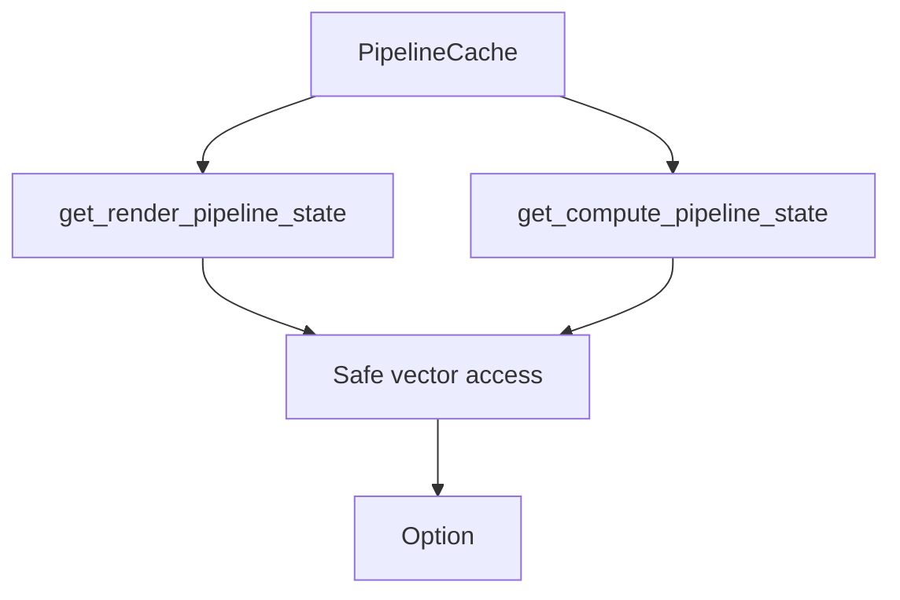

+++
title = "#18752 Fix `get_render_pipeline_state` / `get_compute_pipeline_state` panic"
date = "2025-04-09T00:00:00"
draft = false
template = "pull_request_page.html"
in_search_index = true

[taxonomies]
list_display = ["show"]

[extra]
current_language = "en"
available_languages = {"en" = { name = "English", url = "/pull_request/bevy/2025-04/pr-18752-en-20250409" }, "zh-cn" = { name = "中文", url = "/pull_request/bevy/2025-04/pr-18752-zh-cn-20250409" }}
labels = ["C-Bug", "D-Trivial", "A-Rendering", "P-Crash"]
+++

# Fix `get_render_pipeline_state` / `get_compute_pipeline_state` panic

## Basic Information
- **Title**: Fix `get_render_pipeline_state` / `get_compute_pipeline_state` panic
- **PR Link**: https://github.com/bevyengine/bevy/pull/18752
- **Author**: brianreavis
- **Status**: MERGED
- **Labels**: C-Bug, D-Trivial, A-Rendering, P-Crash, S-Ready-For-Final-Review
- **Created**: 2025-04-07T17:26:03Z
- **Merged**: 2025-04-09T17:15:51Z
- **Merged By**: alice-i-cecile

## Description Translation
This fixes a panic that occurs if one calls `PipelineCache::get_render_pipeline_state(id)` or `PipelineCache::get_compute_pipeline_state(id)` with a queued pipeline id that has not yet been processed by `PipelineCache::process_queue()`.

```
thread 'Compute Task Pool (0)' panicked at [...]/bevy/crates/bevy_render/src/render_resource/pipeline_cache.rs:611:24:
index out of bounds: the len is 0 but the index is 20
note: run with `RUST_BACKTRACE=1` environment variable to display a backtrace
```

## The Story of This Pull Request

### The Problem and Context
The pipeline cache system in Bevy handles asynchronous pipeline compilation through a queue processing system. When requesting pipeline states using `get_render_pipeline_state` or `get_compute_pipeline_state`, developers could encounter a panic if they queried a pipeline ID that was queued but not yet processed. This occurred because the implementation used direct vector indexing without checking if the pipeline had actually been added to the cache.

The panic manifested as an index-out-of-bounds error when accessing the `render_pipelines` or `compute_pipelines` vectors. This violated Rust's memory safety guarantees and could crash applications that queried pipeline states too early in the compilation process.

### The Solution Approach
The fix required changing the vector access pattern from direct indexing to using safe `get` methods. This approach:
1. Avoids panics through bounds checking
2. Maintains the existing API contract by returning `Option<PipelineState>`
3. Preserves performance with minimal overhead

The key insight was recognizing that pipeline IDs might reference entries not yet present in the vectors due to asynchronous processing. The solution leverages Rust's standard library features for safe collection access.

### The Implementation
The critical changes occurred in `pipeline_cache.rs`, modifying how pipeline states are retrieved:

```rust
// Before (vulnerable to panic):
self.render_pipelines[id.0].state

// After (safe access):
self.render_pipelines.get(id.0).and_then(|p| p.state)
```

This pattern was applied consistently to both render and compute pipeline state getters. The `get` method returns an `Option<&Pipeline>`, and `and_then` safely unwraps the nested `Option<PipelineState>`.

### Technical Insights
The implementation demonstrates three important Rust patterns:
1. **Defensive Indexing**: Using `Vec::get` instead of direct indexing prevents panics from invalid indices
2. **Option Chaining**: `and_then` efficiently handles nested optional values
3. **Zero-Cost Abstraction**: The safety checks incur no additional heap allocations

The change maintains O(1) access time while adding bounds checking. In practice, this has negligible performance impact since pipeline state queries are typically not hot code paths.

### The Impact
This fix:
- Eliminates a potential crash scenario
- Makes pipeline state querying robust against timing issues in async processing
- Maintains backward compatibility with existing code using these APIs

Developers can now safely query pipeline states without worrying about explicit synchronization with the queue processing system. The change also sets a better example for safe collection access patterns in the codebase.

## Visual Representation



## Key Files Changed

### `crates/bevy_render/src/render_resource/pipeline_cache.rs` (+16/-4)
**Purpose**: Fix out-of-bounds access in pipeline state queries

Before (vulnerable code):
```rust
pub fn get_render_pipeline_state(&self, id: CachedRenderPipelineId) -> Option<PipelineState> {
    self.render_pipelines[id.0].state
}

pub fn get_compute_pipeline_state(&self, id: CachedComputePipelineId) -> Option<PipelineState> {
    self.compute_pipelines[id.0].state
}
```

After (fixed implementation):
```rust
pub fn get_render_pipeline_state(&self, id: CachedRenderPipelineId) -> Option<PipelineState> {
    self.render_pipelines.get(id.0).and_then(|p| p.state)
}

pub fn get_compute_pipeline_state(&self, id: CachedComputePipelineId) -> Option<PipelineState> {
    self.compute_pipelines.get(id.0).and_then(|p| p.state)
}
```

The changes replace direct indexing with safe `get` access and use `and_then` to handle both the vector bounds check and the nested Option in the pipeline state.

## Further Reading
1. [Rust Vec::get documentation](https://doc.rust-lang.org/std/vec/struct.Vec.html#method.get)
2. [Option::and_then usage patterns](https://doc.rust-lang.org/std/option/enum.Option.html#method.and_then)
3. [Bevy Pipeline Caching Guide](https://bevyengine.org/learn/book/features/pipeline-caching/) (Official documentation)
4. [Rust Error Handling: Panic vs Result](https://doc.rust-lang.org/book/ch09-00-error-handling.html)