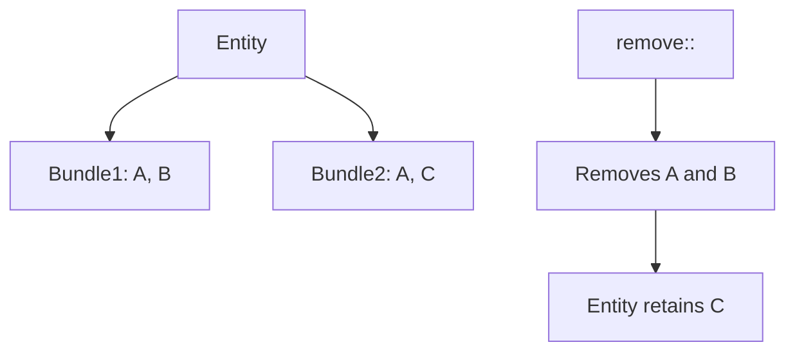

+++
title = "#18754 Clarified Docs for Bundle Removal Commands"
date = "2025-04-07T00:00:00"
draft = false
template = "pull_request_page.html"
in_search_index = true

[taxonomies]
list_display = ["show"]

[extra]
current_language = "en"
available_languages = {"en" = { name = "English", url = "/pull_request/bevy/2025-04/pr-18754-en-20250407" }, "zh-cn" = { name = "中文", url = "/pull_request/bevy/2025-04/pr-18754-zh-cn-20250407" }}
labels = ["C-Docs", "D-Trivial", "A-ECS"]
+++

# Title: Clarified Docs for Bundle Removal Commands

## Basic Information
- **Title**: clarified docs for bundle removal commands  
- **PR Link**: https://github.com/bevyengine/bevy/pull/18754  
- **Author**: Jaso333  
- **Status**: MERGED  
- **Labels**: C-Docs, D-Trivial, A-ECS, S-Ready-For-Final-Review  
- **Created**: 2025-04-07T22:13:39Z  
- **Merged**: 2025-04-07T23:00:35Z  
- **Merged By**: alice-i-cecile  

## Description Translation
# Objective  
Clarify information in the docs about the bundle removal commands.  

## Solution  
Added information about how the intersection of components are removed.  

## The Story of This Pull Request

### The Documentation Gap
The PR addresses a documentation clarity issue in Bevy's Entity Component System (ECS) commands. Users working with `Commands::remove` and `Commands::remove_sub` bundle removal methods lacked explicit documentation about how these operations handle components that exist in multiple bundles. This could lead to unexpected behavior where developers might assume bundle removal only affects components unique to that bundle.

### Precision Through Documentation
The solution focuses on enhancing documentation clarity without changing code behavior. The key addition explains that removal operations affect all components in the specified bundle, regardless of whether those components exist in other bundles attached to the same entity. This clarifies that component removal works through intersection rather than exclusive bundle membership.

### Implementation Details
The changes center around doc comments for the `remove` method in `Commands`:

```rust
// crates/bevy_ecs/src/system/commands/mod.rs
/// Removes all components in `bundle` from the entity.
///
/// If the entity has components that are members of other bundles, those components will
/// also be removed. For example, if an entity has two bundles: `Bundle1 { foo: A, bar: B }`
/// and `Bundle2 { foo: A, baz: C }`, calling `remove::<Bundle1>` will remove both `A` and `B`,
/// but not `C`.
pub fn remove<T: Bundle>(&mut self, entity: Entity) -> &mut Self {
    self.add_command(RemoveBundle::<T>::new(entity));
    self
}
```

This addition explicitly states that:
1. Removal operates on component membership rather than bundle boundaries
2. Components shared across bundles will still be removed
3. The scope is limited to components in the specified bundle

### Technical Impact
These documentation improvements:
1. Prevent potential misuse of bundle removal commands
2. Clarify edge cases for component intersection scenarios
3. Help developers anticipate side effects when working with overlapping bundles

The changes maintain backward compatibility while improving API discoverability. Developers can now make informed decisions about when to use bundle removal versus individual component removal.

## Visual Representation



## Key Files Changed

### `crates/bevy_ecs/src/system/commands/mod.rs` (+9/-0)
**Change Purpose**:  
Clarify component removal behavior when using bundle removal commands.

**Code Addition**:
```rust
/// If the entity has components that are members of other bundles, those components will
/// also be removed. For example, if an entity has two bundles: `Bundle1 { foo: A, bar: B }`
/// and `Bundle2 { foo: A, baz: C }`, calling `remove::<Bundle1>` will remove both `A` and `B`,
/// but not `C`.
```

**Relation to PR**:  
Directly addresses the core objective by documenting component intersection behavior in bundle removal operations.

## Further Reading
1. [Bevy ECS Introduction](https://bevyengine.org/learn/book/getting-started/ecs/)
2. [Component Bundle Documentation](https://docs.rs/bevy_ecs/latest/bevy_ecs/component/trait.Bundle.html)
3. [Entity Commands API Reference](https://docs.rs/bevy_ecs/latest/bevy_ecs/system/struct.Commands.html)