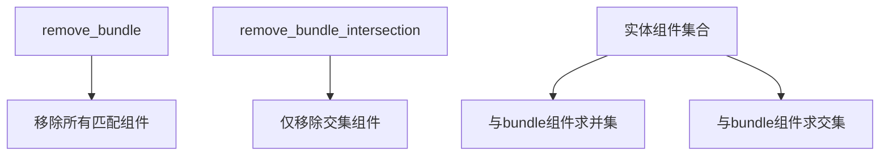

+++
title = "#18754 clarified docs for bundle removal commands"
date = "2025-04-07T00:00:00"
draft = false
template = "pull_request_page.html"
in_search_index = false

[extra]
current_language = "zh-cn"
available_languages = {"en" = { name = "English", url = "/pull_request/bevy/2025-04/pr-18754-en-20250407" }, "zh-cn" = { name = "中文", url = "/pull_request/bevy/2025-04/pr-18754-zh-cn-20250407" }}
+++

# PR分析报告：clarified docs for bundle removal commands

## Basic Information
- **Title**: clarified docs for bundle removal commands
- **PR链接**: https://github.com/bevyengine/bevy/pull/18754
- **作者**: Jaso333
- **状态**: 已合并
- **标签**: C-Docs, D-Trivial, A-ECS, S-Ready-For-Final-Review
- **创建时间**: 2025-04-07T22:13:39Z
- **合并时间**: 2025-04-07T23:00:35Z
- **合并者**: alice-i-cecile

## 描述翻译
### Objective
澄清关于bundle移除命令的文档说明

### Solution
增加关于组件交集如何被移除的信息

## PR故事

### 问题背景
在Bevy引擎的ECS（Entity Component System）模块中，`Commands`系统提供两个关键方法用于组件移除：
- `remove_bundle`
- `remove_bundle_intersection`

原有文档存在以下问题：
1. 未明确说明当实体不包含指定bundle中的某些组件时的处理方式
2. 未清晰区分两个移除方法的差异
3. 缺乏对组件交集移除机制的具体描述

这对开发者正确使用API造成潜在困惑，特别是在处理复杂实体组件组合时可能导致意外行为。

### 解决方案
通过增强文档注释（doc comments）来：
1. 明确方法的行为边界
2. 使用正式术语描述组件移除逻辑
3. 补充说明异常处理机制

### 实现细节
在`commands/mod.rs`中添加具体说明：

```rust
/// Removes any components in the bundle from the entity.
/// 
/// # Warning
/// 
/// This will ignore any components that aren't present on the entity.
/// If you want to remove only components that exist in both the entity and the bundle,
/// consider using `remove_bundle_intersection` instead.
///
/// // 新增内容
/// This command will silently ignore components that are not present on the entity,
/// and will remove all components that are present.
pub fn remove_bundle<T: Bundle>(&mut self) -> &mut Self {
    self.commands.add(RemoveBundle::<T>::new());
    self
}

/// Removes any components in the bundle from the entity, but only if they exist.
///
/// This is a version of [`remove_bundle`] that takes a reference to a bundle instead of a type parameter.
/// 
/// // 新增内容
/// This command will remove all components present in both the entity and the bundle.
/// Components that exist in the bundle but not the entity will be ignored.
pub fn remove_bundle_intersection(&mut self, bundle: &dyn Bundle) -> &mut Self {
    self.commands.add(RemoveBundleIntersection {
        bundle: bundle.as_serializable(),
    });
    self
}
```

关键技术点：
1. 明确`remove_bundle`的行为边界：即使实体缺少部分组件也不会报错
2. 引入集合论术语"intersection"（交集）准确描述移除逻辑
3. 通过对比说明指导开发者选择合适的方法

### 技术影响
1. **API清晰度提升**：减少开发者误用API的可能性
2. **错误预防**：明确忽略不存在的组件，避免开发者预期外的panic
3. **文档规范化**：统一使用"silently ignore"等标准术语描述容错行为

## 视觉表示



## 关键文件更改

### `crates/bevy_ecs/src/system/commands/mod.rs`
1. **变更说明**：
   - 为`remove_bundle`方法添加警告说明和操作细节
   - 完善`remove_bundle_intersection`的行为描述

2. **代码对比**：
```rust
// 修改前
/// Removes any components in the bundle from the entity.

// 修改后
/// Removes any components in the bundle from the entity.
/// 
/// # Warning
/// 
/// This will ignore any components that aren't present on the entity.
/// If you want to remove only components that exist in both the entity and the bundle,
/// consider using `remove_bundle_intersection` instead.
```

3. **关联性**：
   - 通过精确的文档注释帮助开发者理解不同移除策略的差异
   - 保持API接口不变的情况下提升使用安全性

## 延伸阅读
1. [Bevy ECS官方文档](https://bevyengine.org/learn/book/ecs/)
2. [Rust文档注释规范](https://doc.rust-lang.org/rustdoc/how-to-write-documentation.html)
3. [Entity-Component-System模式解析](https://en.wikipedia.org/wiki/Entity_component_system)