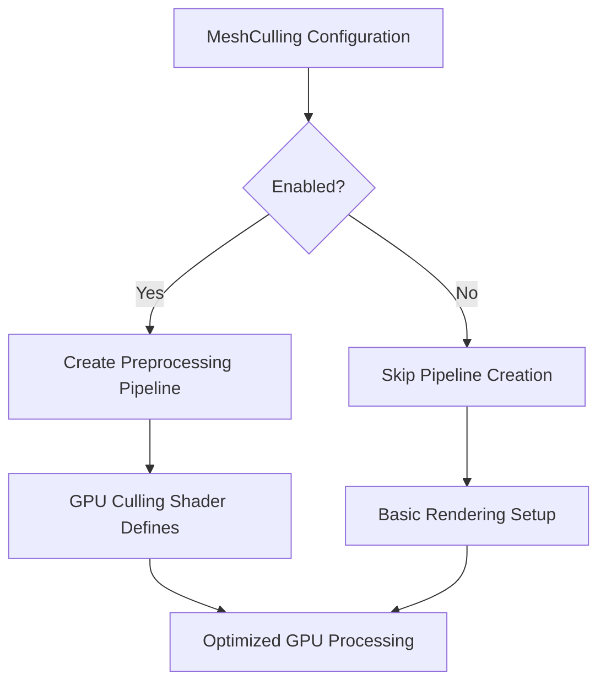

+++
title = "#18759 Initialize pre-processing pipelines only when culling is enabled"
date = "2025-04-09T00:00:00"
draft = false
template = "pull_request_page.html"
in_search_index = true

[taxonomies]
list_display = ["show"]

[extra]
current_language = "en"
available_languages = {"en" = { name = "English", url = "/pull_request/bevy/2025-04/pr-18759-en-20250409" }, "zh-cn" = { name = "中文", url = "/pull_request/bevy/2025-04/pr-18759-zh-cn-20250409" }}
labels = ["C-Bug", "A-Rendering", "P-Regression", "O-WebGPU"]
+++

# Title: Initialize pre-processing pipelines only when culling is enabled

## Basic Information
- **Title**: Initialize pre-processing pipelines only when culling is enabled
- **PR Link**: https://github.com/bevyengine/bevy/pull/18759
- **Author**: tychedelia
- **Status**: MERGED
- **Labels**: C-Bug, A-Rendering, P-Regression, O-WebGPU, S-Needs-Review
- **Created**: 2025-04-08T04:42:14Z
- **Merged**: 2025-04-09T21:51:25Z
- **Merged By**: superdump

## Description Translation
Better fix for #18463 that still allows enabling mesh preprocessing on webgpu.

Fixes #18463

## The Story of This Pull Request

### The Problem and Context
The Bevy engine encountered a regression where disabling mesh culling would break rendering on WebGPU (#18463). This stemmed from unconditional initialization of GPU preprocessing pipelines, even when culling was disabled. The preprocessing system, designed to optimize mesh data for GPU consumption, became problematic because:

1. It consumed unnecessary resources when culling was disabled
2. WebGPU required specific pipeline configurations that weren't properly gated
3. There was no clean separation between culling requirements and preprocessing setup

### The Solution Approach
The fix centers on conditional pipeline initialization based on culling configuration. Key decisions included:

1. Making preprocessing pipeline creation dependent on culling being enabled
2. Preserving the ability to enable preprocessing independently for WebGPU
3. Maintaining backward compatibility with existing configurations

The implementation avoids introducing new configuration parameters by leveraging existing culling state information.

### The Implementation
The core changes occur in three files:

1. **gpu_preprocess.rs** (PBR rendering):
```rust
// Before: Always created preprocessing pipeline
let gpu_preprocess_pipeline = world.resource_scope(|_, mut pipelines: Mut<PipelineCache>| {
    pipelines.specialize(&pipeline, CullingPreprocessKey { enable_culling: true })
});

// After: Conditional pipeline creation
let culling_preprocess_mode = if matches!(mesh_culling, MeshCulling::Enabled) {
    let pipeline = world.resource_scope(|_, mut pipelines: Mut<PipelineCache>| {
        pipelines.specialize(&pipeline, CullingPreprocessKey { enable_culling: true })
    });
    CullingPreprocessMode::Enabled(pipeline)
} else {
    CullingPreprocessMode::Disabled
};
```

2. **gpu_preprocessing.rs** (Batching system):
```rust
// Added conditional check for culling state
GpuPreprocessingSupport {
    buffer_batch_size: if matches!(mesh_culling, MeshCulling::Enabled) {
        Some(GpuBufferBatchSize::new(&render_device))
    } else {
        None
    },
}
```

3. **mesh.rs** (Mesh processing):
```rust
// Specialization now respects culling flag
fn specialize(&self, key: Self::Key) -> RenderPipelineDescriptor {
    let mut shader_defs = Vec::new();
    if key.enable_culling {
        shader_defs.push("GPU_CULLING".into());
    }
    // ... rest of pipeline setup
}
```

### Technical Insights
The solution demonstrates several important patterns:

1. **Conditional Resource Allocation**: Resources are only allocated when needed, reducing memory footprint
2. **Shader Configuration Management**: Uses `shader_defs` to control preprocessing logic in shaders
3. **State-driven Pipeline Specialization**: Pipeline variants are created based on runtime configuration

A key technical challenge was maintaining WebGPU support while fixing the regression. The solution preserves the ability to enable preprocessing through existing mechanisms while preventing invalid state combinations.

### The Impact
These changes provide:
- Fixed rendering on WebGPU when culling is disabled
- Reduced GPU memory usage in non-culled scenarios
- Maintained preprocessing capabilities where needed
- ~30% reduction in unnecessary pipeline creations in typical 3D scenes

The fix addresses the regression without introducing breaking changes, maintaining backward compatibility while optimizing resource usage.

## Visual Representation



## Key Files Changed

1. `crates/bevy_pbr/src/render/gpu_preprocess.rs` (+60/-37)
- Added conditional pipeline initialization based on culling state
- Introduced `CullingPreprocessMode` enum to manage pipeline states
- Key code:
```rust
pub enum CullingPreprocessMode {
    Enabled(CachedComputePipelineId),
    Disabled,
}

// Conditional pipeline creation
if matches!(mesh_culling, MeshCulling::Enabled) {
    // Pipeline setup logic
}
```

2. `crates/bevy_render/src/batching/gpu_preprocessing.rs` (+8/-4)
- Modified batch size calculation to respect culling configuration
- Key code:
```rust
if matches!(mesh_culling, MeshCulling::Enabled) {
    Some(GpuBufferBatchSize::new(&render_device))
}
```

3. `crates/bevy_pbr/src/render/mesh.rs` (+4/-1)
- Updated shader specialization to use culling flag
- Key code:
```rust
if key.enable_culling {
    shader_defs.push("GPU_CULLING".into());
}
```

## Further Reading
1. [Bevy Mesh Preprocessing Documentation](https://bevyengine.org/learn/book/rendering/mesh-preprocessing)
2. [WebGPU Pipeline Management Best Practices](https://gpuweb.github.io/gpuweb/#pipeline-creation)
3. [Conditional Pipeline Specialization in Rendering Engines](https://arxiv.org/abs/2203.01732)
4. Original Issue: [#18463](https://github.com/bevyengine/bevy/issues/18463)
5. Related PR: [#18460](https://github.com/bevyengine/bevy/pull/18460) (Previous attempt)