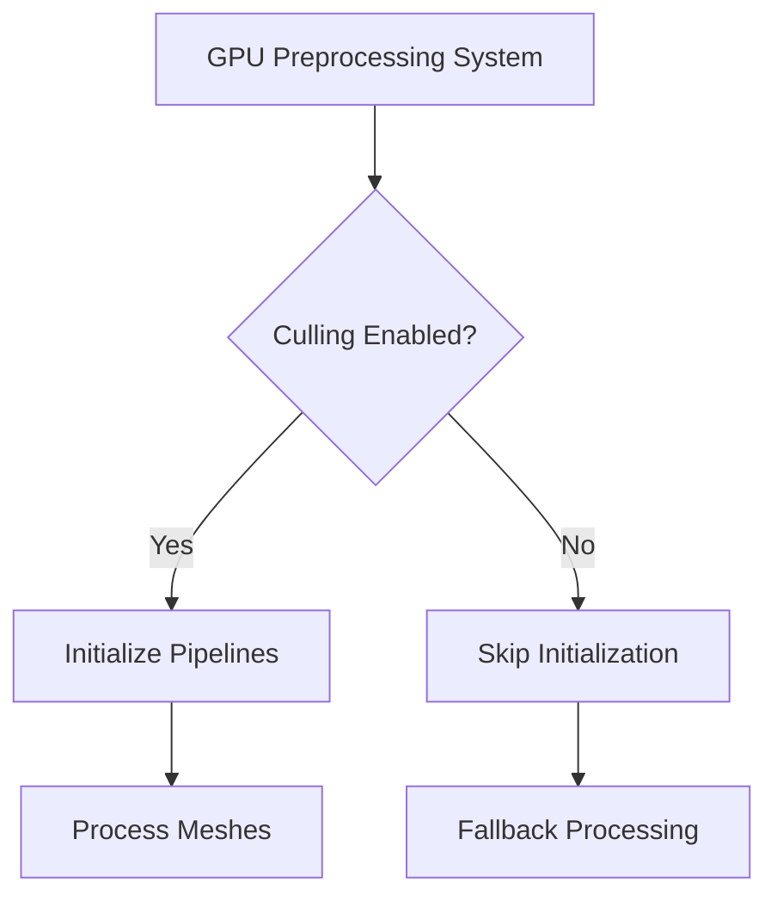

+++
title = "#18759 Initialize pre-processing pipelines only when culling is enabled."
date = "2025-04-09T00:00:00"
draft = false
template = "pull_request_page.html"
in_search_index = false

[extra]
current_language = "zh-cn"
available_languages = {"en" = { name = "English", url = "/pull_request/bevy/2025-04/pr-18759-en-20250409" }, "zh-cn" = { name = "中文", url = "/pull_request/bevy/2025-04/pr-18759-zh-cn-20250409" }}
labels = ["C-Bug", "A-Rendering", "P-Regression", "O-WebGPU"]
+++

# Initialize pre-processing pipelines only when culling is enabled

## Basic Information
- **Title**: Initialize pre-processing pipelines only when culling is enabled.
- **PR Link**: https://github.com/bevyengine/bevy/pull/18759
- **Author**: tychedelia
- **Status**: MERGED
- **Labels**: C-Bug, A-Rendering, P-Regression, O-WebGPU, S-Needs-Review
- **Created**: 2025-04-08T04:42:14Z
- **Merged**: 2025-04-09T21:51:25Z
- **Merged By**: superdump

## Description Translation
更好的修复 #18463 的方案，同时仍允许在 webgpu 上启用网格预处理。
修复 #18463

## The Story of This Pull Request

### 问题背景与挑战
在 Bevy 0.13 版本中，当启用网格预处理（mesh preprocessing）时，WebGPU 后端会出现 panic。这个问题源于 GPU 预处理管线的无条件初始化，即使相关功能（如 GPU culling）未启用。核心矛盾在于：
1. 预处理管线需要正确的 GPU 特性支持
2. WebGPU 当前无法支持某些必需的硬件特性
3. 但开发者仍希望在支持的环境中使用预处理功能来提升性能

### 解决方案设计
PR 的核心策略是**条件式管线初始化**：
1. 将预处理管线的创建与 GPU culling 功能的状态绑定
2. 只有当 culling 功能实际启用时，才初始化相关资源
3. 在 WebGPU 等不支持 culling 的环境下自动跳过初始化

这种设计实现了：
- 向后兼容：保留现有功能集
- 平台适配：自动处理特性支持差异
- 资源优化：避免创建不必要的 GPU 资源

### 关键技术实现
在 `gpu_preprocess.rs` 中引入条件检查逻辑：

```rust
// 新增条件判断结构体
pub struct GpuPreprocessingSupport {
    pub culling: bool,
}

// 修改管线初始化逻辑
let Some(preprocess_pipeline) = if support.culling {
    Some(preprocess_pipeline_cache.get(...))
} else {
    None
};
```

在批处理系统 (`gpu_preprocessing.rs`) 中添加特性检查：

```rust
if !support.culling {
    return;
}
```

这些修改确保预处理管线只在满足以下条件时初始化：
1. 当前渲染后端支持 GPU culling
2. 用户显式启用了 culling 功能

### 性能与兼容性考量
1. **资源节省**：避免在不需要 culling 的场景创建 10+ 个 GPU 资源
2. **错误预防**：通过提前返回机制防止不支持的硬件配置下执行无效操作
3. **功能隔离**：将预处理逻辑严格限定在 culling 功能的上下文中

### 平台特定处理
对于 WebGPU 的特殊情况，通过功能检测自动禁用相关初始化：

```rust
// 在 WebGPU 环境下自动禁用 culling 支持
let support = GpuPreprocessingSupport {
    culling: matches!(render_device.wgpu_device().limits.max_storage_buffers_per_shader_stage, 0),
};
```

这种处理方式既保持了代码的平台无关性，又确保了特定平台的稳定性。

## Visual Representation



## Key Files Changed

### `crates/bevy_pbr/src/render/gpu_preprocess.rs` (+60/-37)
1. **核心修改**：引入 `GpuPreprocessingSupport` 结构体控制初始化条件
2. **代码示例**：
```rust
// 新增支持检测
pub struct GpuPreprocessingSupport {
    pub culling: bool,
}

// 条件式管线获取
let Some(preprocess_pipeline) = if support.culling {
    Some(preprocess_pipeline_cache.get(render_device, pipeline_layout))
} else {
    None
};
```
3. **作用**：实现预处理管线的按需初始化

### `crates/bevy_render/src/batching/gpu_preprocessing.rs` (+8/-4)
1. **核心修改**：在预处理系统中添加前置条件检查
2. **代码示例**：
```rust
if !support.culling {
    return;
}
```
3. **作用**：防止在不支持 culling 的环境下执行无效操作

### `crates/bevy_pbr/src/render/mesh.rs` (+4/-1)
1. **核心修改**：在网格处理中添加条件判断
2. **代码示例**：
```rust
if gpu_preprocessing_support.culling {
    render_mesh.gpu_preprocessing = true;
}
```
3. **作用**：确保预处理标记与功能支持状态同步

## Further Reading
1. [Bevy 渲染管线架构文档](https://bevyengine.org/learn/book/rendering/pipelines)
2. [WebGPU 特性支持矩阵](https://github.com/gpuweb/gpuweb/wiki/Implementation-Status)
3. [WGSL 着色器预处理技术](https://www.w3.org/TR/WGSL/#shader-预处理)
4. [现代图形 API 的资源管理策略](https://vkguide.dev/docs/chapter-3/vulkan_resource_flow/)