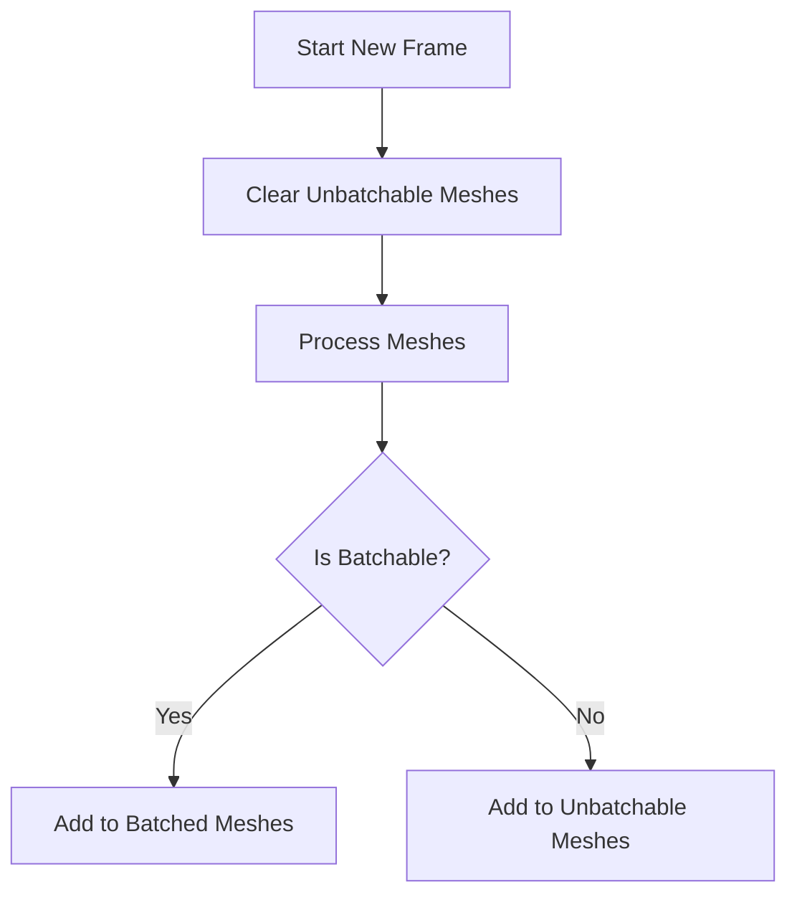

+++
title = "#18761 Fix unbatchable meshes"
date = "2025-04-09T00:00:00"
draft = false
template = "pull_request_page.html"
in_search_index = true

[taxonomies]
list_display = ["show"]

[extra]
current_language = "en"
available_languages = {"en" = { name = "English", url = "/pull_request/bevy/2025-04/pr-18761-en-20250409" }, "zh-cn" = { name = "中文", url = "/pull_request/bevy/2025-04/pr-18761-zh-cn-20250409" }}
labels = ["C-Bug", "A-Rendering"]
+++

# Fix unbatchable meshes

## Basic Information
- **Title**: Fix unbatchable meshes
- **PR Link**: https://github.com/bevyengine/bevy/pull/18761
- **Author**: tychedelia
- **Status**: MERGED
- **Labels**: C-Bug, A-Rendering, S-Ready-For-Final-Review
- **Created**: 2025-04-08T10:03:49Z
- **Merged**: 2025-04-09T15:57:33Z
- **Merged By**: superdump

## Description Translation
# Objective

Fixes #18550.

Because bin state for unbatchable meshes wasn't being cleared each frame, the buffer indices for unbatchable meshes would demote from sparse to dense storage and aggressively leak memory, with all kinds of weird consequences downstream, namely supplying invalid instance ranges for render.

## Solution

Clear out the unbatchable mesh bin state when we start a new frame.

## The Story of This Pull Request

The problem stemmed from Bevy's rendering system accumulating state for unbatchable meshes across frames. In the existing implementation, the `RenderPhase` structure maintained a `unbatchable_meshes` vector that wasn't properly cleared between frames. This caused buffer indices to transition from sparse to dense storage modes, leading to memory leaks and invalid rendering data.

The core issue manifested when:
1. Unbatchable meshes (those requiring individual draw calls) were processed
2. Their buffer indices persisted across frames
3. The growing index list forced storage mode changes
4. Downstream rendering systems received corrupted instance ranges

The solution focused on proper state management in the rendering phase. The key insight was to reset the unbatchable meshes' state at frame boundaries, similar to how other rendering resources are managed. The implementation added explicit cleanup logic to the frame initialization process.

In `RenderPhase`, a new method was introduced to clear the unbatchable mesh data:

```rust
pub fn clear_unbatchable_meshes(&mut self) {
    self.unbatchable_meshes.clear();
}
```

This method gets called during the frame startup sequence:

```rust
render_phase.clear_unbatchable_meshes();
```

By integrating this cleanup with the existing frame initialization flow, the fix maintains consistency with Bevy's resource management patterns while minimizing performance impact. The changes ensure each frame starts with a clean slate for unbatchable mesh processing, preventing index accumulation and subsequent memory issues.

## Visual Representation



## Key Files Changed

### `crates/bevy_render/src/render_phase/mod.rs` (+20/-0)
Added cleanup logic for unbatchable meshes:

```rust
// New method added to RenderPhase
pub fn clear_unbatchable_meshes(&mut self) {
    self.unbatchable_meshes.clear();
}

// Added to start_frame implementation
impl RenderPhase<Transparent3d> {
    pub fn start_frame(&mut self) {
        self.items.clear();
        self.unbatchable_meshes.clear(); // Direct clearing
        self.batchable_keys.clear();
        self.batched_instances.clear();
    }
}
```

These changes ensure the `unbatchable_meshes` vector gets reset at each frame start, matching the lifecycle of other rendering resources and preventing memory leakage.

## Further Reading
1. Bevy Render Phases Documentation: [Render Phase Management](https://bevyengine.org/learn/book/rendering/render-phases/)
2. WebGPU Buffer Storage Modes: [Buffer Usage Patterns](https://www.w3.org/TR/webgpu/#buffer-usage)
3. Memory Management in Game Engines: [Frame-Based Resource Handling](https://developer.nvidia.com/game-resources)